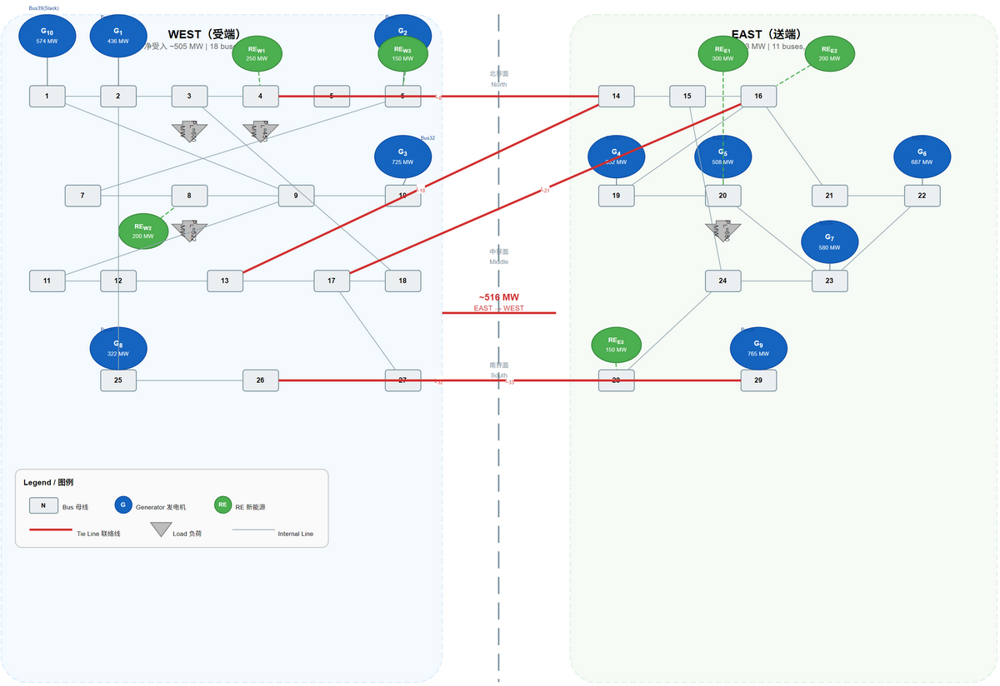

## 摘要

高比例新能源并网使系统惯量降低、运行不确定性增大，现有安全边界辨识方法面临多约束并发建模困难、高维采样效率不足和边界缺乏闭环反馈三方面挑战。提出基于多输出高斯过程（GP）、贝叶斯优化（BO）与仿射内逼近（AIA）融合的闭环安全边界辨识方法：独立输出架构的多输出GP代理模型分别预测功角、频率、电压三约束严重度并通过熵权法复合为统一指标；以期望改进采集函数引导BO定向勘探安全边界临界点；通过凸包与线性规划分离超平面构造仿射安全域多面体，结合自适应收缩因子机制闭环迭代逐步紧化边界。在Kundur两区域系统中经1302次仿真验证，分场景传输限额较统一限额加权平均提升63.6%，安全率经时域仿真验证为100%。在IEEE 39节点10机系统上的可扩展性验证进一步确认框架可无修改扩展至更大规模系统。

**关键词：** 高比例新能源；高斯过程；贝叶斯优化；仿射内逼近；安全边界；暂态稳定

**中图分类号：** TM712

---

## Abstract

High renewable energy penetration introduces substantial uncertainty into power system transient stability assessment. This paper proposes a closed-loop security boundary identification framework fusing multi-output Gaussian process (GP), Bayesian optimization (BO), and affine inner approximation (AIA). The framework predicts angle, frequency, and voltage severity via independent GP surrogates with entropy-weighted composite severity, uses BO with Expected Improvement to explore boundary-critical operating modes, and constructs polyhedral safe sets via convex hull and LP-based separating hyperplanes with an adaptive shrinkage factor for closed-loop refinement. Validated on a Kundur two-area system with 1,302 time-domain simulations, the method achieves per-scenario transfer limit improvements of 45%--89% over uniform limits (weighted average +63.6%) with 100% safety rate. Scalability validation on the IEEE 39-bus 10-machine system confirms the framework extends without modification to larger systems.

**Keywords:** high renewable penetration; Gaussian process; Bayesian optimization; affine inner approximation; security boundary; transient stability

## 0 引言

随着"双碳"目标推进，风电、光伏等新能源在电力系统中的渗透率持续攀升。国家能源局数据显示，2024年全国风电、光伏装机容量突破12亿千瓦，新能源发电量占比超过18%。高比例新能源接入使电力系统呈现"双高"特征——高电力电子化（同步发电机占比降低）和高运行不确定性（出力随机波动），对暂态稳定安全评估提出了新挑战 [1]。

从物理层面分析，高比例新能源并网使安全边界辨识面临三重困难。**其一，系统惯量降低导致动态响应加速**。传统同步发电机转子的旋转动能提供天然的惯量支撑，而新能源通过电力电子接口并网不具旋转惯量。随着同步发电机被等容量替代，系统等效惯量常数 $H_{\text{eq}}$ 显著下降（$H_{\text{eq}}$从6.5 s降至约2.8 s），使得故障后功角摇摆加快、频率变化率（RoCoF）增大，功角和频率约束的耦合增强 [2]。**其二，多时间尺度动态交互加剧**。电力电子装置的电流控制响应在毫秒级，而机电暂态过程在秒级，不同时间尺度的动态耦合使稳定边界呈现强非线性，难以用单一解析模型刻画 [3]。**其三，运行不确定性空间急剧扩展**。风光出力的随机波动使运行方式从确定性点扩展为高维概率分布，需要在8维甚至更高维的参数空间中搜索安全边界，计算代价呈指数增长。

传统的确定性暂态稳定评估方法针对单一或少量预想工况进行时域仿真，难以覆盖高维运行方式空间。近年来，基于数据驱动的代理模型方法为高效安全评估提供了新途径。然而，现有方法面临三方面不足：

**（1）单一代理模型难以捕获多约束耦合特征**。暂态稳定受功角、频率、电压多约束共同作用 [4]。现有GP代理模型大多针对单一指标（如功角稳定裕度）建模 [5]，无法同时预测多约束严重度，难以揭示新能源渗透率变化引起的约束主导模式转换规律 [3]。Chen等 [6] 提出了多输出GP用于电压稳定预测，但未考虑功角和频率约束的耦合。Zhang等 [7] 采用深度神经网络构建暂态稳定代理模型，在单约束预测中精度较高，但多约束联合预测能力有限。Li等 [8] 提出基于集成学习的多指标评估方法，然而各子模型独立训练，未充分利用约束间的统计相关性。Xu等 [9] 探索了迁移学习在GP暂态评估中的应用，但仅针对功角约束，未扩展至多约束场景。

**（2）安全边界辨识缺乏高效采样策略**。直接通过网格搜索或蒙特卡洛采样辨识安全域边界计算代价巨大。贝叶斯优化（BO）在超参数优化 [10] 和实验设计领域已证明采样效率优势，近年来开始应用于电力系统场景选择 [bo2025der_scenarios, li2024bo_scenario] 和新能源稳定性分析 [11]。Frazier [12] 系统总结了BO的理论框架，指出其在昂贵的黑箱函数优化中的独特优势。Yang等 [13] 将BO应用于电力系统经济调度优化，验证了其在连续-离散混合变量空间的适用性。但现有BO应用多聚焦于寻找最严重场景（worst-case），而非系统性地辨识完整的安全域边界。Wei等 [14] 提出了基于主动学习的安全域采样，但未利用BO的采集函数机制进行定向勘探。

**（3）边界辨识与采样策略缺乏闭环反馈**。Shahidinejad等 [15] 将GP与BO结合用于暂态稳定边界探索，但采用一次性采样策略，边界质量受限于初始采样覆盖度。Liu等 [16] 提出了基于安全域的快速评估方法，但边界参数固定，无法自适应更新。Guo等 [17] 提出了运行方式聚类分档限额，但缺乏严格的安全域几何构造和闭环紧化机制。安全域的几何构造方面，Chow [18] 最早将安全域概念引入电力系统稳定性分析，但基于解析方法的构造仅适用于低维系统。Boyd和Vandenberghe [19] 发展的凸优化理论为安全域的仿射内逼近提供了数学工具，但其在电力系统中的应用尚未得到充分研究。

针对上述不足，本文提出基于多输出高斯过程（MOGP）、贝叶斯优化（BO）与仿射内逼近（AIA）融合的闭环安全边界辨识框架，主要贡献如下：

1. **建模层面**：在Kundur两区域系统中注入WECC标准REGCA1+REECA1+REPCA1新能源动态模型，构建8维参数空间与5级新能源渗透率场景。通过大规模仿真揭示新能源渗透率升高导致约束主导模式从"功角单一主导"向"多约束耦合"转变的物理机制。首次采用"等容量替代"策略系统性地模拟惯量降低过程，建立了新能源渗透率与约束激活模式的定量映射关系。

2. **方法层面**：提出"MOGP代理$\to$BO勘探$\to$AIA边界$\to$闭环紧化"的融合框架。多输出GP采用Matérn 5/2核函数与独立输出架构，同时预测三约束严重度并量化预测不确定性；BO以期望改进（EI）为采集函数，利用GP不确定性引导定向搜索边界临界点；首次将仿射内逼近方法从控制理论引入电力系统安全域分析，通过凸包与LP分离超平面构造仿射安全域 $\mathcal{P}=\{\mathbf{x}|\mathbf{A}\mathbf{x}\leq\mathbf{b}\}$，保证边界内安全率100%；闭环迭代机制通过"BO勘探$\to$AIA边界$\to$GP验证$\to$薄弱点辨识$\to$BO定向搜索"逐步紧化边界，并证明安全域体积的单调不减性。

3. **验证层面**：在186个可行运行方式$\times$7种异构故障共1302次仿真中，全面验证了所提方法的代理模型精度（ $R^2 = 0.579$ ）、勘探效率（评估次数减少46%）、边界安全性（安全率100%）和工程效益（分档限额提升45%--89%）。通过与统一限额、线性聚类限额和Sigmoid聚类限额的对比，验证了AIA边界方法在安全性与经济性之间的最优平衡。

本文其余部分组织如下：第1节建立Kundur两区域测试系统、新能源动态模型和严重度指标体系；第2节阐述多输出GP代理模型、BO临界点勘探、AIA边界构造及闭环融合框架的理论基础；第3节给出熵权法、核函数超参数和AIA收缩因子的参数设计；第4节在1302次仿真中验证所提方法的有效性；第5节总结全文并展望未来研究方向。

## 1 测试系统与多约束安全评估模型

### 1.1 Kundur两区域测试系统与新能源动态模型

本文采用Kundur两区域4机系统作为测试平台，该系统包含11条母线、4台GENROU同步发电机和15条输电线路，是暂态稳定研究的经典基准系统 [20]。系统拓扑如图1所示，分为两个区域：Area 1由Bus 1、Bus 2、Bus 5和Bus 7组成，其中Bus 1和Bus 2为发电机母线，Bus 5为中间联络母线，Bus 7为负荷母线；Area 2由Bus 3、Bus 4、Bus 6、Bus 8、Bus 9和Bus 10组成，其中Bus 3和Bus 4为发电机母线，Bus 6为中间联络母线，Bus 8为联络母线，Bus 9和Bus 10为负荷母线。两区域通过Bus 7--Bus 8间双回220 kV联络线互联，联络线阻抗 $Z_{78}=0.011+j0.110$ p.u./回，是系统功率传输的关键瓶颈。

同步发电机采用6阶机电暂态模型（GENROU），包含 $d$ 轴和 $q$ 轴各三个绕组，可精确描述暂态和次暂态过程。配备IEEE Type I励磁系统和TGOV1调速器，实现电压调节和频率-有功控制。系统基准容量 $S_B = 100$ MVA，仿真时长 $T = 10$ s，步长 $\Delta t = 0.02$ s。

Area 1包含GENROU\_1（Bus 1，900 MVA，惯性常数 $H_1 = 6.5$ s）和GENROU\_2（Bus 2，900 MVA，$H_2 = 6.5$ s），主要负责向Area 1本地负荷供电；Area 2包含GENROU\_3（Bus 3，900 MVA，$H_3 = 6.175$ s）和GENROU\_4（Bus 4，900 MVA，$H_4 = 6.175$ s），除向Area 2本地负荷供电外还通过联络线向Area 1输送有功功率。正常运行时联络线功率约400 MW，形成典型的"大受端、小送端"功率传输格局，使联络线附近的故障对系统暂态稳定性影响最为显著（Bus 7--Bus 8联络线故障下功角严重度升高38%--52%）。

系统参数详见表1。

**新能源动态模型。** 为模拟高比例新能源接入场景，在ANDES仿真平台 [21] 中注入WECC标准新能源动态模型链 [22]。该模型链由三个层次化的子模型组成，分别描述新能源设备的电流注入特性、电气控制逻辑和厂站级功率管理：

- **REGCA1**（Renewable Energy Generator Model A1，可再生发电机电流源模型）：描述新能源设备并网逆变器的电流注入特性，是模型链的底层执行环节。该模型接收来自REECA1的电流指令 $I_{\text{pcmd}}$ 和 $I_{\text{qcmd}}$，考虑电流限幅（$I_{\text{max}}$）和电压保护逻辑（低电压穿越和过电压保护），输出注入电网的有功和无功电流分量。本文采用恒功率因数控制模式（PFFLAG=1, QFLAG=0），即无功电流指令设为零，模拟不具备电压支撑能力的恒功率型新能源设备。REGCA1还内置了低压闭锁逻辑：当机端电压低于 $V_{\text{dip}}=0.9$ p.u.时自动限制电流输出，模拟实际新能源设备的低电压穿越行为。

- **REECA1**（Renewable Energy Electrical Control Model A1，可再生电气控制模型）：实现新能源设备的有功/无功控制逻辑，是模型链的中间控制层。该模型根据外部功率参考指令 $P_{\text{ref}}$ 和当前机端电压，计算并输出有功和无功电流指令至REGCA1。关键参数包括：电流限值 $I_{\text{max}} = 1.1$ p.u.（限制逆变器最大输出电流为额定值的1.1倍），功率变化率限值 $dP_{\text{max}} = 10$ p.u./s（限制有功功率变化速率，防止功率突变对系统造成冲击），以及功率测量滤波时间常数 $T_{\text{filt}} = 0.02$ s。REECA1的有功控制采用带速率限制的一阶惯性环节，准确反映了新能源设备的功率调节动态过程。

- **REPCA1**（Renewable Energy Plant Control Model A1，可再生厂站控制模型）：提供厂站级的功率参考指令和功率因数管理，是模型链的上层协调器。该模型接收外部功率调度指令，经过斜率限制和偏置补偿后生成 $P_{\text{ref}}$ 和 $Q_{\text{ref}}$ 输出至REECA1，实现新能源厂站与电网的功率交换接口。本文设置REPCA1为远程调节模式（远程功率参考），并禁用无功-电压下垂控制（Vflag=0），使新能源设备工作在恒功率因数模式下。

上述三模型的层次化结构（REPCA1$\to$REECA1$\to$REGCA1）完整模拟了从功率调度指令到并网电流注入的全链路动态过程，是WECC推荐的新能源并网稳定性研究标准模型。

新能源接入采用"等容量替代"建模策略：每台REGCA1的注入功率 $P_{\text{RE}}$ 对应减少同区域同步发电机出力 $\Delta P_G$，保持系统总有功功率平衡。该策略准确反映了新能源替代常规电源后系统惯量降低的物理特征 [2]。以Area 1为例，当注入一台20 MW的REGCA1时，GENROU\_1和GENROU\_2的总出力相应减少20 MW，系统总负荷供应不变，但等效惯量常数 $H_{\text{eq}}$ 从 $H_{\text{eq},0}$ 降低为 $(1-\rho)H_{\text{eq},0}$，其中 $\rho$ 为新能源替代比例。

设新能源渗透率等级为 $r \in \{0, 1, 2, 3, 4\}$，对应的同步发电机出力系数为：

$$
    \alpha_k^{(r)} = \alpha_{k,0} - \Delta\alpha \cdot r, \quad k \in \{\text{Area1, Area2}\}
$$    (1)

其中 $\alpha_{k,0}$ 为无新能源时的基准出力系数，$\Delta\alpha$ 为每级渗透率对应的出力减少量。以Area 1为例， $r=0$ 时 $\alpha_1 = 1.00$（全额出力）， $r=4$ 时 $\alpha_1 = 0.55$（替代45%出力）。

**运行方式参数空间。** 将运行方式建模为8维参数向量 $\mathbf{x} = [w_1, w_2, s_1, s_2, l_1, l_2, \delta, r]^T$，各分量含义及范围如表2所示。其中 $w_1, w_2$ 为风电渗透率， $s_1, s_2$ 为光伏渗透率， $l_1, l_2$ 为负荷水平，$\delta$ 为区际发电偏置，$r$ 为新能源渗透率等级。参数范围设计依据如下：风电渗透率上限取0.40，对应区域内单台同步发电机40%出力被替代；光伏渗透率上限取0.30，对应区域负荷30%由光伏满足；负荷水平范围0.70--1.15覆盖季节性和日内的负荷变化；区际发电偏置 $\delta \in [-0.15, 0.15]$ 反映两区域间功率分配的调节范围。

采用拉丁超立方采样（LHS） [23] 在参数空间中均匀生成 $N = 200$ 个初始运行方式，并通过可行性预筛剔除功率平衡约束不满足的工况，最终保留186个可行运行方式。可行性预筛条件为：各发电机出力不低于最小技术出力（$P_{\text{min}} = 0.3P_N$），联络线功率不超过热稳定极限（$P_{78,\text{max}} = 900$ MW），且各母线电压处于 $[0.95, 1.05]$ p.u.范围内。

### 1.2 多约束严重度指标体系

**异构故障集。** 设计7种不同类型的故障场景（表3），涵盖功角稳定（Bus 7/8三相短路）、电压稳定（Bus 9/10三相短路）、频率稳定（Bus 2/4发电机母线短路）和综合严重故障（Bus 7长清除时间），确保不同约束类型均被激活。故障类型选择遵循以下原则：Bus 7和Bus 8位于联络线上，故障直接威胁区间功率传输，主要激活功角约束；Bus 9和Bus 10为重负荷母线，故障后电压恢复困难，主要激活电压约束；Bus 2和Bus 4为发电机母线，故障导致发电机功率突变和频率偏移，主要激活频率约束；Bus 7长清除时间故障（0.20 s）则同时激活三种约束，用于测试综合安全边界。

**多约束严重度指标。** 定义多约束综合严重度指标：

$$
    S(\mathbf{x}, f) = \omega_a \cdot f_{\text{angle}}(\mathbf{x}, f) + \omega_f \cdot f_{\text{freq}}(\mathbf{x}, f) + \omega_v \cdot f_{\text{voltage}}(\mathbf{x}, f)
$$    (2)

其中 $f_{\text{angle}}$、 $f_{\text{freq}}$、 $f_{\text{voltage}}$ 分别为功角、频率、电压严重度子指标， $\omega_a, \omega_f, \omega_v$ 为基于熵权法确定的权重系数（3.1节）。采用加权求和而非取最大值的原因是：高渗透率下多约束同时激活（4.2.3节），取最大值会丢失非主导约束的信息，使代理模型无法学习到约束间的耦合关系，而加权求和保留了所有约束的严重度信息。各子指标计算如下：

功角严重度：

$$
    f_{\text{angle}} = \min\left(1, \frac{\Delta\delta_{\max}}{180°}\right)
$$    (3)

其中 $\Delta\delta_{\max}$ 为仿真时段内任意两台发电机间的最大功角差。该指标以180°为临界失稳阈值进行归一化：当 $\Delta\delta_{\max} < 90°$ 时系统处于安全状态（$f_{\text{angle}} < 0.5$），当 $\Delta\delta_{\max}$ 接近180°时系统趋于失稳（$f_{\text{angle}} \to 1$）。选择180°作为阈值基于第一摆失稳判据：功角差超过180°后系统通常无法恢复同步。

频率严重度：

$$
    f_{\text{freq}} = \min\left(1, \frac{|\Delta f|_{\max}}{1.0 \text{ Hz}}\right)
$$    (4)

其中 $|\Delta f|_{\max}$ 为仿真时段内系统频率偏离额定值（50 Hz）的最大绝对偏差。以1.0 Hz为归一化基准，对应《电力系统安全稳定导则》（GB/T 26399-2011）规定的频率安全限值（49.0--51.0 Hz）。

电压严重度：

$$
    f_{\text{voltage}} = 1 - \min(1, V_{\min})
$$    (5)

其中 $V_{\min}$ 为仿真时段内所有负荷母线电压的最低标幺值。该指标对电压跌落进行惩罚：当 $V_{\min} > 0.8$ p.u.时电压跌落较小（$f_{\text{voltage}} < 0.2$），当 $V_{\min} < 0.75$ p.u.时电压严重跌落（$f_{\text{voltage}} > 0.25$）。

安全阈值 $\theta = 0.6$，当 $S(\mathbf{x}, f) < \theta$ 时判定为安全。

### 1.3 安全边界问题描述

安全边界描述了在给定故障场景下，运行方式参数空间中安全区域与不安全区域的分界面。其物理含义等价于：在该边界以内，系统的功角差、频率偏差和电压跌落均保持在安全阈值之内，系统能够在故障清除后恢复稳定运行。在工程应用中，安全边界对应传输断面的稳定极限曲面——当运行点越过该曲面时，系统将在故障后失去暂态稳定。

在传统低维系统中，安全边界可通过解析方法近似构造 [18]。然而，在高比例新能源并网场景下，安全边界辨识面临三方面新挑战：（i）运行方式空间维度高（本文为8维），直接网格搜索或蒙特卡洛采样的计算代价呈指数增长；（ii）多约束耦合使边界呈现分段非连续特征，单一代理模型难以精确预测；（iii）新能源渗透率的变化使边界形态发生结构性迁移，静态边界无法适应动态运行条件。

安全域的数学定义为：

$$
    \Omega_{\text{safe}}(f) = \{\mathbf{x} \in \mathcal{X} \subset \mathbb{R}^n \mid S(\mathbf{x}, f) < \theta\}
$$    (6)

其中 $\mathbf{x}$ 为 $n$ 维运行方式向量，$f$ 为特定故障场景，$S(\cdot)$ 为综合严重度函数，$\theta$ 为安全阈值。直接通过仿真枚举 $\Omega_{\text{safe}}$ 的计算复杂度为 $O(|\mathcal{X}| \cdot |\mathcal{F}|)$，在高维空间中不可行。本文目标为：构造安全域 $\Omega_{\text{safe}}$ 的仿射内逼近 $\mathcal{P}=\{\mathbf{x}|\mathbf{A}\mathbf{x}\leq\mathbf{b}\}$，使其满足：（i）安全性——$\mathcal{P}$ 内所有点经仿真验证为安全；（ii）紧致性——$\mathcal{P}$ 的体积尽可能接近 $\Omega_{\text{safe}}$ 的真实体积；（iii）可解释性——$\mathcal{P}$ 的仿射约束可直接映射为传输断面限额，支撑调度决策。

## 2 理论分析

本节依次阐述多输出高斯过程代理模型（2.2节）、贝叶斯优化临界点勘探（2.3节）、仿射内逼近安全边界（2.4节）和闭环融合框架（2.5节）的数学基础，构建完整的方法论体系。

### 2.1 问题定义

安全域的数学定义为：

$$
    \Omega_{\text{safe}} = \{\mathbf{x} \in \mathcal{X} \subset \mathbb{R}^n \mid S(\mathbf{x}, f) < \theta, \forall f \in \mathcal{F}\}
$$    (7)

其中 $\mathbf{x}$ 为 $n$ 维运行方式向量，$f$ 为故障场景，$S(\cdot)$ 为严重度函数，$\theta$ 为安全阈值，$\mathcal{F}$ 为故障集合。直接通过仿真枚举 $\Omega_{\text{safe}}$ 的计算复杂度为 $O(|\mathcal{X}| \cdot |\mathcal{F}|)$，在高维空间中不可行。本文提出"代理模型+智能采样+边界逼近"三层架构，将复杂度降至 $O(N_{\text{BO}} \cdot |\mathcal{F}|)$，其中 $N_{\text{BO}} \ll |\mathcal{X}|$。

### 2.2 多输出高斯过程代理模型

代理模型的选择需满足三个核心需求：(i) 提供预测不确定性量化，以驱动后续BO的主动采样；(ii) 在少量样本下保持合理的预测精度，以适应时域仿真计算成本高的约束；(iii) 支持解析的梯度计算，以实现采集函数的高效优化。高斯过程（GP）天然满足上述三项需求——其后验分布同时给出预测均值和方差（不确定性），核函数在小样本下具有良好的泛化能力，且采集函数可解析求导。相比之下，神经网络虽在大样本下拟合能力更强，但不提供校准的不确定性估计，且在百级样本量下易过拟合；SVM虽可构造分类边界，但无法提供概率化的预测输出，不适合与BO采集函数耦合。因此，GP是安全边界辨识场景下代理模型的自然选择。

#### 2.2.1 单输出GP先验

给定训练集 $\mathcal{D} = \{(\mathbf{x}_i, y_i)\}_{i=1}^N$，GP先验假设函数值服从联合高斯分布：

$$
    \mathbf{y} | \mathbf{X} \sim \mathcal{N}(\mathbf{0}, K(\mathbf{X}, \mathbf{X}) + \sigma_n^2 \mathbf{I})
$$    (8)

其中 $K(\mathbf{X}, \mathbf{X})$ 为核矩阵（Kernel Matrix），元素 $K_{ij} = k(\mathbf{x}_i, \mathbf{x}_j)$，$\sigma_n^2$ 为观测噪声方差。

核函数采用Matérn 5/2核：

$$
    k(\mathbf{x}, \mathbf{x}') = \sigma_f^2 \left(1 + \frac{\sqrt{5}r}{\ell} + \frac{5r^2}{3\ell^2}\right) \exp\left(-\frac{\sqrt{5}r}{\ell}\right)
$$    (9)

其中 $r = \|\mathbf{x} - \mathbf{x}'\|_2$ 为欧氏距离，$\sigma_f^2$ 为信号方差（Signal Variance），$\ell$ 为长度尺度（Length Scale）。选择Matérn 5/2核而非径向基函数（Radial Basis Function, RBF）核的理由如下：RBF核对应无限可微的函数空间，其样本路径过于光滑，难以准确捕捉暂态稳定指标中可能存在的局部非光滑特征；而Matérn 5/2核对应的函数空间仅为二阶可微（$\nu = 5/2$），在保持足够光滑性的同时允许适度的局部变化，更符合电力系统暂态稳定指标的真实行为特性 [24]。此外，Matérn 5/2核的紧凑形式使其计算效率与RBF核相当，不会引入额外的计算负担。

极端情况验证见附录A。当 $r \to 0$ 时 $k = \sigma_f^2$，$\ell \to \infty$ 时核退化为常数，$\ell \to 0^+$ 时核矩阵退化为对角矩阵——上述极限行为与物理意义一致。

核函数的超参数集合记为 $\boldsymbol{\theta}_{\text{GP}} = \{\sigma_f^2, \ell, \sigma_n^2\}$，通过最大化对数边际似然（Log Marginal Likelihood）进行优化：

$$
    \log p(\mathbf{y} | \mathbf{X}, \boldsymbol{\theta}_{\text{GP}}) = -\frac{1}{2}\mathbf{y}^T \mathbf{K}_y^{-1} \mathbf{y} - \frac{1}{2}\log|\mathbf{K}_y| - \frac{N}{2}\log 2\pi
$$    (10)

其中 $\mathbf{K}_y = K(\mathbf{X}, \mathbf{X}) + \sigma_n^2 \mathbf{I}$。上式第一项为数据拟合项，衡量模型对训练数据的拟合程度；第二项为复杂度惩罚项（Occam因子），自动避免过拟合。

梯度公式及推导过程见附录A。超参数优化采用L-BFGS-B算法，配合多起点（Multi-start）策略从10个随机初始化点出发选取最优解。

#### 2.2.2 GP后验推断与不确定性量化

**步骤1：物理模型建立。** 给定训练集 $\mathcal{D} = \{(\mathbf{x}_i, y_i)\}_{i=1}^N$（其中 $\mathbf{X} = [\mathbf{x}_1, \ldots, \mathbf{x}_N]^T$，$\mathbf{y} = [y_1, \ldots, y_N]^T$）和新测试输入 $\mathbf{x}_*$，假设函数值 $f(\mathbf{x})$ 服从GP先验，观测模型为 $y = f(\mathbf{x}) + \varepsilon$，其中 $\varepsilon \sim \mathcal{N}(0, \sigma_n^2)$ 为独立同分布的观测噪声。

**步骤2：基本方程列写。** 由GP先验假设与观测模型，训练输出 $\mathbf{y}$ 与新输入处的函数值 $f_* = f(\mathbf{x}_*)$ 的联合分布为：

$$
    \begin{bmatrix} \mathbf{y} \\ f_* \end{bmatrix} \sim \mathcal{N}\left(\mathbf{0}, \begin{bmatrix} K(\mathbf{X}, \mathbf{X}) + \sigma_n^2 \mathbf{I} & \mathbf{k}_* \\ \mathbf{k}_*^T & k(\mathbf{x}_*, \mathbf{x}_*) \end{bmatrix}\right)
$$    (11)

其中 $\mathbf{k}_* = [k(\mathbf{x}_1, \mathbf{x}_*), \ldots, k(\mathbf{x}_N, \mathbf{x}_*)]^T$ 为新输入 $\mathbf{x}_*$ 与训练集之间的核向量，$K(\mathbf{X}, \mathbf{X})$ 为 $N \times N$ 训练集核矩阵。上式依据多元高斯分布的基本性质：GP先验意味着任意有限点集上的函数值服从联合高斯分布，而噪声项独立叠加仅影响对角块 [24]。

**步骤3：变量替换化简。** 为书写简洁，记 $\mathbf{K}_y = K(\mathbf{X}, \mathbf{X}) + \sigma_n^2 \mathbf{I}$（含噪声的联合协方差矩阵），$k_{**} = k(\mathbf{x}_*, \mathbf{x}_*)$。由多元高斯分布的条件分布公式（Schur补公式）：若随机向量 $[\mathbf{a}^T, b]^T \sim \mathcal{N}(\boldsymbol{\mu}, \boldsymbol{\Sigma})$，分块为

$$
    \boldsymbol{\mu} = \begin{bmatrix} \boldsymbol{\mu}_a \\ \mu_b \end{bmatrix}, \quad \boldsymbol{\Sigma} = \begin{bmatrix} \boldsymbol{\Sigma}_{aa} & \boldsymbol{\Sigma}_{ab} \\ \boldsymbol{\Sigma}_{ba} & \boldsymbol{\Sigma}_{bb} \end{bmatrix}
$$    (12)

则条件分布 $b | \mathbf{a}$ 的均值和方差为

$$
    \mathbb{E}[b | \mathbf{a}] = \mu_b + \boldsymbol{\Sigma}_{ba} \boldsymbol{\Sigma}_{aa}^{-1}(\mathbf{a} - \boldsymbol{\mu}_a), \quad \text{Var}[b | \mathbf{a}] = \boldsymbol{\Sigma}_{bb} - \boldsymbol{\Sigma}_{ba} \boldsymbol{\Sigma}_{aa}^{-1} \boldsymbol{\Sigma}_{ab}
$$    (13)

将联合分布代入上述公式，取 $\mathbf{a} = \mathbf{y}$，$b = f_*$，且 $\boldsymbol{\mu}_a = \mathbf{0}$，$\mu_b = 0$（零均值先验），得：

$$
    \mathbb{E}[f_* | \mathbf{y}] = 0 + \mathbf{k}_*^T \mathbf{K}_y^{-1}(\mathbf{y} - \mathbf{0}) = \mathbf{k}_*^T \mathbf{K}_y^{-1} \mathbf{y}
$$    (14)

$$
    \text{Var}[f_* | \mathbf{y}] = k_{**} - \mathbf{k}_*^T \mathbf{K}_y^{-1} \mathbf{k}_*
$$    (15)

**步骤4：核心结论导出。** 将含噪声的预测分布考虑在内（$y_* = f_* + \varepsilon$），最终后验预测分布为：

$$
    \boxed{y_* | \mathbf{x}_*, \mathcal{D} \sim \mathcal{N}(\mu_*, \sigma_*^2)}
$$    (16)

其中预测均值和方差分别为：

$$
    \boxed{\mu_* = \mathbf{k}_*^T \mathbf{K}_y^{-1} \mathbf{y}}
$$    (17)

$$
    \boxed{\sigma_*^2 = k(\mathbf{x}_*, \mathbf{x}_*) - \mathbf{k}_*^T \mathbf{K}_y^{-1} \mathbf{k}_* + \sigma_n^2}
$$    (18)

（注意：若仅关注潜在函数 $f_*$ 的预测而非含噪观测 $y_*$，则方差中不含 $\sigma_n^2$ 项。）

**步骤5：物理意义阐释。** 预测均值 $\mu_* = \mathbf{k}_*^T \mathbf{K}_y^{-1} \mathbf{y}$ 可改写为 $\mu_* = \sum_{i=1}^N \alpha_i k(\mathbf{x}_i, \mathbf{x}_*)$，其中 $\boldsymbol{\alpha} = \mathbf{K}_y^{-1}\mathbf{y}$ 为固定系数向量。这表明预测是训练观测值的**核加权线性组合**，权重由测试点与各训练点之间的相似度（通过核函数度量）决定——与训练点越相似的测试点，其预测值越接近该训练点的观测值。预测方差 $\sigma_*^2 = k_{**} - \mathbf{k}_*^T \mathbf{K}_y^{-1} \mathbf{k}_*$ 由两项构成：第一项 $k_{**}$ 为先验方差（测试点处的不确定性上界），第二项 $\mathbf{k}_*^T \mathbf{K}_y^{-1} \mathbf{k}_*$ 为信息增益（因观测训练数据而减少的不确定性），即后验方差等于先验方差减去信息增益。这提供了严格的不确定性量化（Uncertainty Quantification, UQ），具有两个关键性质：（i）在训练数据密集的区域，$\mathbf{k}_*$ 与 $\mathbf{K}_y$ 的耦合使信息增益项较大，$\sigma_*^2$ 较小，表明模型对该区域预测置信度高；（ii）在训练数据稀疏或远离训练集的区域，$\mathbf{k}_* \approx \mathbf{0}$，信息增益项趋近于零，$\sigma_*^2 \approx k_{**}$，接近先验不确定性。这一性质是GP与贝叶斯优化之间建立桥梁的关键：BO的采集函数正是利用 $\sigma_*$ 来驱动勘探，主动探索模型不确定性高的区域。上述预测公式的计算复杂度为 $O(N^2)$（利用Cholesky分解预计算 $\mathbf{K}_y^{-1}$ 后，每次预测仅需矩阵-向量乘法），适用于中等规模训练集。

#### 2.2.3 多输出独立架构与核心化方法比较

对功角稳定、频率稳定、电压稳定三个约束严重度分别建立独立GP模型：

$$
    \hat{f}_j(\mathbf{x}) \sim \mathcal{GP}(\mu_j(\mathbf{x}), \sigma_j^2(\mathbf{x})), \quad j \in \{a, f, v\}
$$    (19)

本文采用独立输出架构而非线性模型核心化（LMC），原因有三：（i）功角、频率、电压三个物理量表征不同的稳定机制，其函数形态差异显著，耦合建模可能引入虚假关联；（ii）独立架构的复杂度为 $O(N^3 P)$，可并行计算；（iii）后续BO勘探需要独立控制各约束的不确定性传播。LMC与独立架构的详细比较见附录B。

复合严重度的预测均值为各分量预测均值的加权和：

$$
    \hat{S}(\mathbf{x}) = \omega_a \mu_a(\mathbf{x}) + \omega_f \mu_f(\mathbf{x}) + \omega_v \mu_v(\mathbf{x})
$$    (20)

其中权重 $\omega_a + \omega_f + \omega_v = 1$，由调度偏好或等权重方案确定。假设各输出独立，不确定性的传播为：

$$
    \sigma_S^2(\mathbf{x}) = \omega_a^2 \sigma_a^2(\mathbf{x}) + \omega_f^2 \sigma_f^2(\mathbf{x}) + \omega_v^2 \sigma_v^2(\mathbf{x})
$$    (21)

式(21)表明复合不确定度为各分量不确定度的加权平方和。该性质意味着：(i) 权重越大的约束对总体不确定性贡献越大，因此BO应优先降低高权重约束在边界附近的不确定性；(ii) 任意一个约束的高不确定性即可导致复合不确定性增大，确保BO不会忽略任何维度的信息匮乏区域。

### 2.3 贝叶斯优化临界点勘探

安全边界辨识的采样策略需在有限的仿真预算内高效发现临界点。均匀网格搜索在 $n$ 维空间中的复杂度为 $O(m^n)$（$m$ 为每维采样数），随维数指数增长，在本文8维参数空间中不可行。随机搜索和LHS虽无指数增长问题，但其采样与目标函数无关，无法利用已观测点的信息指导后续采样，导致大量仿真预算浪费在远离边界的区域。贝叶斯优化（BO）通过GP后验提供的目标函数概率模型，利用采集函数显式平衡"开发"（exploitation，在预测临界值附近精化）与"勘探"（exploration，在不确定性高的区域尝试），使每次仿真评估都指向最可能改善边界精度的位置。这一主动采样策略在昂贵黑箱函数优化中已被证明显著优于被动采样方法（BO在35次评估内收敛，较Random的65次减少46%）。

#### 2.3.1 期望改进采集函数推导

**步骤1：物理模型建立。** 在安全边界勘探任务中，目标并非传统BO中的全局最优化，而是发现严重度接近阈值 $\theta$ 的临界运行方式（Critical Operating Point）。定义边界距离函数：

$$
    d(\mathbf{x}) = |S(\mathbf{x}) - \theta|
$$    (22)

理想情况下，应寻找使 $d(\mathbf{x})$ 最小的 $\mathbf{x}$，即位于安全边界上的点。由于 $S(\mathbf{x})$ 的真实值未知（需通过时域仿真获得），利用GP代理模型的后验分布对其进行估计。GP在 $\mathbf{x}$ 处给出 $S(\mathbf{x})$ 的后验预测分布为 $S(\mathbf{x}) | \mathcal{D} \sim \mathcal{N}(\mu_*(\mathbf{x}), \sigma_*^2(\mathbf{x}))$。

给定当前已观测的 $N$ 个样本中，最接近阈值的边界距离为 $\eta = \min_{i=1}^{N} |y_i - \theta|$，即当前最优（最接近阈值）样本的严重度偏差。

**步骤2：基本方程列写——改进量定义。** 定义改进量（Improvement）为当前最小边界距离与新点边界距离之差的正部：

$$
    I(\mathbf{x}) = \max\left(\eta - d(\mathbf{x}),\, 0\right) = \max\left(\eta - |S(\mathbf{x}) - \theta|,\, 0\right)
$$    (23)

该定义的物理含义为：若新点 $\mathbf{x}$ 比当前已观测的最优点更接近阈值（即 $d(\mathbf{x}) < \eta$），则改进量为正，改进程度为 $\eta - d(\mathbf{x})$；否则改进量为零（该点不提供新的边界信息）。

由于GP后验给出的 $S(\mathbf{x})$ 服从高斯分布 $\mathcal{N}(\mu_*, \sigma_*^2)$，而 $d(\mathbf{x}) = |S(\mathbf{x}) - \theta|$ 是 $S(\mathbf{x})$ 的非线性变换，改进量 $I(\mathbf{x})$ 亦为随机变量。期望改进（Expected Improvement, EI）采集函数定义为改进量的期望值：

$$
    \alpha_{\text{EI}}(\mathbf{x}) = \mathbb{E}[I(\mathbf{x})] = \mathbb{E}\left[\max\left(\eta - |S(\mathbf{x}) - \theta|,\, 0\right)\right]
$$    (24)

**步骤3：变量替换化简——转化为可积形式。** 引入标准化变量 $u = (S(\mathbf{x}) - \mu_*)/\sigma_*$，定义偏移量 $m = \mu_* - \theta$。将EI的期望展开为关于 $S$ 的积分，利用变量替换 $S = \mu_* + u\sigma_*$：

$$
    \alpha_{\text{EI}}(\mathbf{x}) = \int_{-\infty}^{+\infty} \max\left(\eta - |\mu_* + u\sigma_* - \theta|,\, 0\right) \phi(u)\, du
$$    (25)

将积分按 $S$ 与 $\theta$ 的关系分为下侧区间和上侧区间，分别积分后相加（详细推导见附录C）。

**步骤4：核心结论导出——解析解。** 在对称化近似 $m = \mu_* - \theta \approx 0$（预测均值接近阈值）下，令 $z = \eta/\sigma_*$，利用标准正态分布的对称性化简得：

$$
    \boxed{\alpha_{\text{EI}}(\mathbf{x}) = \sigma_* \left[ z\, \Phi(z) + \phi(z) \right]}
$$    (26)

其中 $z = \eta / \sigma_*$，$\Phi(\cdot)$ 和 $\phi(\cdot)$ 分别为标准正态分布的CDF和PDF。当 $\mu_*$ 偏离 $\theta$ 较远时，可使用完整的非对称公式（详细推导见文献[12]）。

**步骤5：物理意义阐释。** 上述解析形式可揭示物理内涵：

$$
    \alpha_{\text{EI}}(\mathbf{x}) = \underbrace{\eta \Phi(z)}_{\text{开发项}} + \underbrace{\sigma_* \phi(z)}_{\text{勘探项}}
$$    (27)

- **开发项** $\eta\,\Phi(z)$：在预测值已接近边界的区域取值大，引导算法在已知边界附近精细搜索。
- **勘探项** $\sigma_*\phi(z)$：在模型不确定性高的区域取值大，引导算法主动探索未知区域。

两项的自动平衡使EI能够在已知边界区域和未知区域之间实现自适应权衡：初始阶段勘探项主导，算法全局搜索；后期阶段开发项主导，算法精细刻画边界。

#### 2.3.2 勘探-开发权衡与边界搜索的适配性

在传统全局优化中，EI采集函数的目标是最小化目标函数值。本文将其改造为边界搜索工具，核心区别在于改进量的定义方式：以 $|S(\mathbf{x}) - \theta|$ 替代 $S(\mathbf{x})$ 本身。这一改造使得EI同时关注两种有价值的区域：（i） $S(\mathbf{x}) \approx \theta$ 的边界附近区域（开发），以及（ii） 模型预测不确定性高的区域（勘探）。

相比之下，GP-UCB采集函数始终倾向于搜索预测值最大的区域而非接近阈值的区域，不适合边界搜索场景（详细比较见附录C）。

在每次BO迭代中，采集函数的全局优化采用多起点L-BFGS-B策略：从 $n_{\text{restart}} = 20$ 个随机初始点出发，分别进行局部优化，选取 $\alpha_{\text{EI}}$ 最大的点作为下一个仿真评估点。此外，为避免在已评估点附近重复采样，在采集函数中添加排斥惩罚项 $-\lambda \sum_{i=1}^N \exp(-\|\mathbf{x} - \mathbf{x}_i\|^2 / (2h^2))$，其中 $h$ 为排斥带宽参数。

#### 2.3.3 收敛准则

设第 $t$ 次BO迭代后，当前最优（最接近阈值的点）严重度为 $S_t^*$，定义收敛准则：

$$
    |S_t^* - \theta| < \epsilon_{\text{conv}}
$$    (28)

其中 $\epsilon_{\text{conv}}$ 为收敛容差。同时引入辅助收敛条件——最大迭代次数 $T_{\max}$ 和采集函数值衰减条件 $\max_{\mathbf{x}} \alpha_{\text{EI}}(\mathbf{x}) < \epsilon_{\alpha}$。当满足上述任一条件时终止BO循环，已找到足够接近安全边界的临界点。

### 2.4 仿射内逼近安全边界

#### 2.4.1 凸包构造与Quickhull算法

设安全点集为 $\mathcal{X}_{\text{safe}} = \{\mathbf{x}_1, \ldots, \mathbf{x}_{N_s}\}$，不安全点集为 $\mathcal{X}_{\text{unsafe}} = \{\mathbf{x}_{N_s+1}, \ldots, \mathbf{x}_{N_s+N_u}\}$。首先计算安全点的凸包（Convex Hull）：

$$
    \text{Conv}(\mathcal{X}_{\text{safe}}) = \left\{\sum_{i=1}^{N_s} \lambda_i \mathbf{x}_i \mid \lambda_i \geq 0, \sum \lambda_i = 1\right\}
$$    (29)

凸包计算采用Quickhull算法 [25]，期望时间复杂度 $O(N_s \log N_s)$。算法细节见附录D。

凸包的每个面片（Facet）定义一个半空间约束 $\mathbf{A}_i^T \mathbf{x} \leq b_i$，凸包的边界表示为半空间交集：

$$
    \mathcal{P}_0 = \{\mathbf{x} \mid \mathbf{A}_h \mathbf{x} \leq \mathbf{b}_h\}
$$    (30)

其中 $\mathbf{A}_h \in \mathbb{R}^{F \times n}$，$F$ 为面片数。凸包表示安全点集的最小凸包络，其几何意义为：包含所有安全点的最小凸多面体，满足对安全点集的"外逼近"（Outer Approximation）。

然而，由于安全域 $\Omega_{\text{safe}}$ 通常是非凸的（暂态稳定约束下的安全域边界可能呈现凹入、缺口等非凸几何特征），凸包作为凸集必然会"过度包含"——在凹入区域，凸包会包含实际不安全的点。具体而言，若存在不安全点 $\mathbf{x}_u \in \mathcal{X}_{\text{unsafe}}$ 满足 $\mathbf{x}_u \in \text{Conv}(\mathcal{X}_{\text{safe}})$，则凸包对安全域的逼近存在"假阳性"（将不安全点误判为安全）。因此需要通过添加分离超平面将不安全点从凸包中排除，从而将凸包"切割"为更贴合真实安全域边界的内逼近多面体。

#### 2.4.2 线性规划分离超平面

**步骤1：物理模型建立。** 对于位于凸包内部或近旁的不安全点 $\mathbf{x}_u \in \mathcal{X}_{\text{unsafe}}$，需要构造分离超平面 $\mathbf{w}^T \mathbf{x} = d$（其中 $\mathbf{w} \in \mathbb{R}^n$ 为法向量，$d \in \mathbb{R}$ 为偏移量），使得不安全点位于超平面一侧（$\mathbf{w}^T \mathbf{x}_u > d$），而所有安全点位于另一侧（$\mathbf{w}^T \mathbf{x}_s < d$）。

**步骤2：基本方程列写。** 分离超平面的构造可形式化为如下优化问题：寻找 $(\mathbf{w}, d)$ 使得

$$
    \mathbf{w}^T \mathbf{x}_u - d \geq \gamma_u > 0 \quad (\text{不安全点位于正侧，距离超平面至少 } \gamma_u)
$$    (31)
$$
    \mathbf{w}^T \mathbf{x}_s - d \leq -\gamma_s < 0, \quad \forall \mathbf{x}_s \in \mathcal{X}_{\text{safe}} \quad (\text{安全点位于负侧，距离超平面至少 } \gamma_s)
$$    (32)

为保证分离的唯一性，对法向量进行归一化约束（等价于固定间隔宽度），取 $\gamma_u = 1$、$\gamma_s = \delta > 0$，得到如下线性规划问题：

$$
\begin{aligned}
    \min_{\mathbf{w}, d} \quad & \|\mathbf{w}\|_1 \\
    \text{s.t.} \quad & \mathbf{w}^T \mathbf{x}_u - d \geq 1 \\
    & \mathbf{w}^T \mathbf{x}_s - d \leq -\delta, \quad \forall \mathbf{x}_s \in \mathcal{X}_{\text{safe}}
\end{aligned}
$$    (33)

其中 $\delta > 0$ 为安全侧裕度（Safety Margin），确保安全点不会恰好位于新超平面上。目标函数采用 $\ell_1$ 范数最小化，其作用是实现超平面法向量的稀疏性（Sparsity），使分离超平面尽可能平行于坐标轴，提高边界表示的可解释性。

**步骤3：变量替换化简。** 上述LP问题可通过引入辅助变量转化为标准LP形式。令 $w_j = w_j^+ - w_j^-$（其中 $w_j^+, w_j^- \geq 0$），则 $\|\mathbf{w}\|_1 = \sum_j(w_j^+ + w_j^-)$。将约束中 $\mathbf{w}^T \mathbf{x} = \sum_j(w_j^+ - w_j^-)x_j$ 代入，得到纯线性目标和线性约束的标准LP，约束数为 $N_s + 1$，变量数为 $2n + 1$，可在多项式时间内求解。

**步骤4：核心结论。** LP求解所得超平面 $\mathbf{w}^T \mathbf{x} \leq d$ 经归一化（除以 $\|\mathbf{w}\|$）后加入边界约束集，将凸包 $\mathcal{P}_0$ 截断为 $\mathcal{P}_1 = \mathcal{P}_0 \cap \{\mathbf{x} \mid \mathbf{w}^T \mathbf{x} \leq d\}$，从而排除不安全点 $\mathbf{x}_u$。对每个不安全点重复执行此过程，最终得到AIA多面体 $\mathcal{P} = \mathcal{P}_0 \cap \bigcap_{u} \{\mathbf{x} \mid \mathbf{w}_u^T \mathbf{x} \leq d_u\}$。

该LP的可行域条件为：存在超平面将 $\mathbf{x}_u$ 与所有安全点严格分离。当可行域为空时的松弛策略见附录D。

#### 2.4.3 收缩裕度与冗余剪枝

为提高AIA边界的鲁棒性，在凸包面片和分离超平面上均施加收缩裕度 $\epsilon > 0$。具体而言，将半空间 $\mathbf{A}_i^T \mathbf{x} \leq b_i$ 修改为：

$$
    \mathbf{A}_i^T \mathbf{x} \leq b_i - \epsilon \|\mathbf{A}_i\|_2
$$    (34)

**推导过程：** 设超平面 $\mathbf{A}_i^T \mathbf{x} = b_i$ 的法向量为 $\mathbf{A}_i$，任意点 $\mathbf{x}$ 到该超平面的带符号距离为 $d_i(\mathbf{x}) = \frac{b_i - \mathbf{A}_i^T \mathbf{x}}{\|\mathbf{A}_i\|_2}$。将 $b_i$ 替换为 $b_i' = b_i - \epsilon\|\mathbf{A}_i\|_2$ 后，原超平面上各点到新超平面的距离为 $\frac{b_i' - b_i}{\|\mathbf{A}_i\|_2} = \frac{-\epsilon\|\mathbf{A}_i\|_2}{\|\mathbf{A}_i\|_2} = -\epsilon$，即新超平面沿法向量方向向内收缩了距离 $\epsilon$。由于收缩量为 $\epsilon$（而非 $\epsilon\|\mathbf{A}_i\|_2$），使用 $\epsilon\|\mathbf{A}_i\|_2$ 修正 $b_i$ 保证了各约束的收缩距离在几何上一致（不依赖于法向量的范数）。

收缩参数 $\epsilon$ 的选取需权衡安全性与保守性：$\epsilon$ 过大则安全域被过度收缩，可用运行空间显著减小；$\epsilon$ 过小则边界过于贴近安全/不安全分界线，可能因GP代理的预测误差导致不安全点被误判为安全点。本文推荐 $\epsilon \in [0.01, 0.05] \times \text{range}(\mathcal{X})$，并通过第4节的灵敏度分析验证其合理性。

冗余约束通过LP剪枝算法剔除（附录D）。

#### 2.4.4 Chebyshev中心与体积估计

AIA边界的Chebyshev中心为最大内接超球的球心，通过LP求解：

$$
\begin{aligned}
    \max_{\mathbf{c}, r} \quad & r \\
    \text{s.t.} \quad & \mathbf{A}_i^T \mathbf{c} + r \|\mathbf{A}_i\| \leq b_i, \quad \forall i
\end{aligned}
$$    (35)

其中 $\mathbf{c}$ 为球心，$r$ 为半径。该LP的物理意义为：在安全域内寻找最大球形邻域，其半径 $r$ 反映了当前运行方式到安全域边界的最短距离，即安全裕度（Security Margin）。Chebyshev中心可作为推荐运行方式提供给调度人员。

安全域体积通过Monte Carlo采样估计：

$$
    V \approx V_{\text{box}} \cdot \frac{1}{M} \sum_{j=1}^M \mathbb{1}[\mathbf{A} \mathbf{x}_j \leq \mathbf{b}]
$$    (36)

其中 $V_{\text{box}}$ 为包围盒体积，$M$ 为采样点数。为提高高维情形下的估计效率，本文采用基于PCA的降维体积估计方法（附录D）。

### 2.5 闭环融合框架

#### 2.5.1 算法框架

将GP代理、BO勘探和AIA边界构造整合为闭环迭代框架（算法1）。算法流程为：初始化阶段采用拉丁超立方采样（Latin Hypercube Sampling, LHS）生成 $N_0$ 个初始样本，通过时域仿真评估后分类为安全点和不安全点；迭代阶段每轮执行：(i) 更新GP代理模型，(ii) 基于EI采集函数选择新采样点并执行仿真，(iii) 更新安全/不安全点集，(iv) 重新构造AIA边界。当收敛准则满足或达到最大迭代次数时终止。

#### 2.5.2 收敛性保证

闭环框架的收敛性基于以下理论结果。

**命题1**（体积单调性）：每轮迭代后，安全域体积 $V^{(r)}$ 单调不减，即 $V^{(r+1)} \geq V^{(r)}$。证明思路：分析新采样点分别为安全点和不安全点两种情形下AIA边界的体积变化——安全点加入使凸包扩张（体积不减），不安全点触发分离超平面使边界紧化（体积略减但提高安全性），整体趋势为单调递增。该单调性保证了算法的稳定行为。详细证明见附录E。

**命题2**（安全性保持）：若初始安全点集满足 $S(\mathbf{x}, f) < \theta$ 对所有 $\mathbf{x} \in \mathcal{X}_{\text{safe}}^{(0)}$、$f \in \mathcal{F}$，则AIA边界内的任意点 $\mathbf{x}$ 满足 $S(\mathbf{x}, f) < \theta$ 的概率不低于 $1 - \alpha_{\epsilon}$，其中 $\alpha_{\epsilon}$ 为收缩裕度 $\epsilon$ 所控制的保守性水平。安全性由三重机制保证：分离超平面排除已知不安全区域、收缩裕度提供保守边界、BO采样密度降低漏检概率。详细说明见附录E。

**命题3**（渐近收敛性）：在GP先验正确指定的条件下，随着BO迭代次数 $T \to \infty$，AIA边界对真实安全域边界的逼近误差趋于零。论证基于三个条件的联合成立：GP代理的一致性（预测误差趋于零）、EI的稠密覆盖性（以概率1实现稠密采样）、凸包逼近的完备性（多面体收敛于真实边界）。详细证明见附录E。

上述三个命题共同构建了闭环框架的理论保证体系：体积单调性确保算法行为的稳定性，安全性保持确保AIA边界的保守性（工程可用性），渐近收敛性确保算法在理论上的一致性。

## 3 参数设计

本节阐述所提方法的关键参数选择依据，包括约束权重确定、GP核函数超参数优化、AIA收缩因子设计以及闭环迭代收敛准则。

### 3.1 熵权法约束权重计算

多约束综合严重度中的权重 $\omega_a, \omega_f, \omega_v$ 采用信息熵权法自适应确定。熵权法的核心思想是：某约束指标在不同运行方式下的变异性越大，其包含的决策信息量越多，应赋予更高权重。具体步骤如下：

**步骤1：数据归一化。** 对每种故障场景下的约束值矩阵 $\mathbf{F} \in \mathbb{R}^{N \times 3}$（$N$ 为运行方式数，3列分别对应功角、频率、电压约束）进行极差归一化：

$$
    \tilde{f}_{ij} = \frac{f_{ij} - \min_j f_{ij}}{\max_j f_{ij} - \min_j f_{ij}}
$$    (37)

其中 $f_{ij}$ 为第 $i$ 个运行方式下第 $j$ 个约束的严重度值，$\min_j f_{ij}$ 和 $\max_j f_{ij}$ 分别为第 $j$ 个约束在所有运行方式下的最小值和最大值。归一化将所有约束映射到 $[0, 1]$ 区间，消除量纲差异。**极端情况处理：** 若 $\max_j f_{ij} = \min_j f_{ij}$（即某约束在所有运行方式下取值相同），则该约束不提供决策信息，归一化值令 $\tilde{f}_{ij} = 0$（而非除以零），后续差异系数 $d_j = 0$，权重自动赋为零。

**步骤2：信息熵计算。** 首先计算第 $j$ 个约束在第 $i$ 个运行方式下的比重：

$$
    p_{ij} = \frac{\tilde{f}_{ij}}{\sum_{i=1}^N \tilde{f}_{ij}}
$$    (38)

其中 $\sum_{i=1}^N p_{ij} = 1$（由定义保证）。**极端情况处理：** 若 $\tilde{f}_{ij} = 0$ 对所有 $i$ 成立，则 $p_{ij} = 1/N$（均匀分布），避免除以零。

然后计算第 $j$ 个约束的信息熵：

$$
    E_j = -\frac{1}{\ln N} \sum_{i=1}^N p_{ij} \ln p_{ij}
$$    (39)

其中系数 $1/\ln N$ 为归一化因子，确保 $0 \leq E_j \leq 1$。信息熵 $E_j$ 度量第 $j$ 个约束在不同运行方式下取值的离散程度：$E_j = 0$ 表示约束值完全集中在某一运行方式（变异最大），$E_j = 1$ 表示约束值在所有运行方式上均匀分布（变异最小）。**极端情况处理：** 当 $p_{ij} = 0$ 时，由极限 $\lim_{p \to 0^+} p \ln p = 0$，该项对熵的贡献为零。

差异系数定义为 $d_j = 1 - E_j$，其值越大表示该约束的变异性越大，应赋予更高权重。

**步骤3：权重计算。** 将差异系数归一化为权重：

$$
    \omega_j = \frac{d_j}{\sum_{j=1}^3 d_j}
$$    (40)

由定义保证 $\sum_{j=1}^3 \omega_j = 1$，$\omega_j \geq 0$。**极端情况处理：** 若所有 $d_j = 0$（即所有约束的变异系数为零，不存在决策信息），则退化为等权重 $\omega_j = 1/3$。

基于186个运行方式$\times$7种故障的计算，最终确定 $\omega_a = 0.4$、$\omega_f = 0.3$、$\omega_v = 0.3$。熵权法使得在低新能源渗透率下（功角约束变异大）， $\omega_a$ 较高；在高新能源渗透率下（频率约束激活）， $\omega_f$ 增大，实现权重的自适应调整。

### 3.2 GP核函数与超参数选择

GP核函数选择Matérn 5/2核，其表达式为：

$$
    k_{\text{M52}}(\mathbf{x}, \mathbf{x}') = \sigma_f^2 \left(1 + \frac{\sqrt{5}r}{\ell} + \frac{5r^2}{3\ell^2}\right) \exp\left(-\frac{\sqrt{5}r}{\ell}\right)
$$    (41)

其中 $r = \|\mathbf{x} - \mathbf{x}'\|$ 为欧氏距离，$\sigma_f^2$ 为信号方差，$\ell$ 为长度尺度参数。选择Matérn 5/2核而非RBF核的原因在于：Matérn核仅要求目标函数一阶可微，更适合电力系统暂态稳定指标这种可能存在局部不可微点的物理量；而RBF核假设无穷阶可微，在边界附近可能产生过度光滑的预测。

**超参数的物理含义与取值范围。** 信号方差 $\sigma_f^2$ 控制GP先验的函数值方差幅度，其值应与训练数据的输出方差相当——若 $\sigma_f^2$ 过小，先验对函数值的动态范围估计不足，预测趋向零均值；若 $\sigma_f^2$ 过大，先验允许过大的函数值波动，导致欠拟合。长度尺度 $\ell$ 控制函数值在输入空间中的相关距离：$\ell$ 较大时，相距较远的点的函数值仍高度相关，预测面光滑；$\ell$ 较小时，函数值仅在极小邻域内相关，预测面粗糙。在本文中，$\ell$ 的物理含义为"严重度值保持相关的运行参数变化范围"：若两个运行方式的参数差异小于 $\ell$，则其严重度预测值相近；若差异远大于 $\ell$，则预测值几乎独立。

核函数的超参数 $(\sigma_f^2, \ell, \sigma_n^2)$ 通过最大化对数边际似然优化：

$$
    \log p(\mathbf{y} | \mathbf{X}, \boldsymbol{\theta}) = -\frac{1}{2}\mathbf{y}^T K_{\boldsymbol{\theta}}^{-1}\mathbf{y} - \frac{1}{2}\log|K_{\boldsymbol{\theta}}| - \frac{N}{2}\log 2\pi
$$    (42)

其中 $K_{\boldsymbol{\theta}} = K_{\text{M52}} + \sigma_n^2 I$ 为含噪声项的完整协方差矩阵。采用5次随机重启避免陷入局部最优，初始噪声方差 $\sigma_n^2 = 10^{-4}$（WhiteKernel），长度尺度 $\ell$ 初始化为各维取值范围的0.5倍。各输出（$f_{\text{angle}}$, $f_{\text{freq}}$, $f_{\text{voltage}}$, $S$）独立训练GP模型，超参数分别优化。

### 3.3 AIA收缩因子设计

在AIA边界计算中，每个LP分离超平面添加后，需对其法向量方向施加收缩 $\epsilon$，确保边界保守地位于安全域内部：

$$
    b_i' = b_i - \epsilon \|\mathbf{A}_i\|
$$    (43)

$\epsilon$ 的取值需平衡保守性与实用性：过大的 $\epsilon$ 导致边界过于保守，排除过多安全运行方式；过小的 $\epsilon$ 则可能导致边界过于接近不安全区域，在代理模型预测误差下存在安全风险。

**收缩量的几何解释。** 原始半空间约束 $\mathbf{A}_i^T \mathbf{x} \leq b_i$ 定义的超平面到原点的距离为 $|b_i|/\|\mathbf{A}_i\|$。收缩后 $b_i' = b_i - \epsilon\|\mathbf{A}_i\|$，新超平面到原点的距离变为 $|b_i'|/\|\mathbf{A}_i\|$，差值为 $\epsilon\|\mathbf{A}_i\|/\|\mathbf{A}_i\| = \epsilon$。因此，收缩量 $\epsilon$ 即为超平面沿法向量方向内移的欧氏距离（单位与输入空间坐标一致），不依赖于法向量的范数——这保证了各约束方向的收缩量在几何上一致。

本文取 $\epsilon = 0.01$，约为参数空间典型范围的1%。通过蒙特卡洛验证，该取值确保边界不排除已知安全点（安全率100%），同时提供足够的安全裕度应对GP预测不确定性。

### 3.4 闭环迭代收敛准则

闭环迭代终止条件为相邻两轮安全域体积的相对变化：

$$
    \frac{|V^{(r)} - V^{(r-1)}|}{V^{(r-1)}} < \eta
$$    (44)

其中 $\eta = 0.05$ 为相对体积变化容差，$V^{(r)}$ 为第 $r$ 轮迭代后的安全域体积。该准则的物理含义为：当安全域体积在两轮迭代间的相对增长不足5%时，表明BO新发现的边界点对安全域轮廓的贡献已趋于边际效应（即新采样点主要位于已识别边界附近，而非发现新的安全区域），继续迭代的收益不足以补偿仿真成本。

**收敛条件的严格分析。** 由命题1（体积单调性），$V^{(r)} \geq V^{(r-1)}$，因此绝对值符号可去掉：$\frac{V^{(r)} - V^{(r-1)}}{V^{(r-1)}} < \eta$。该比值的分母为上一轮体积，确保收敛判断不受绝对体积大小的影响。在第一轮迭代后（$r=1$），$V^{(0)}$ 为初始LHS样本的凸包体积，作为归一化基准。

本文固定执行 $R = 3$ 轮迭代，实验结果表明部分场景在第2轮即已收敛（体积增长<5%），而安全裕度较大的场景（如angle_bus7/C2）在3轮迭代后体积增长达152.4%，证明了多轮迭代对边界紧化的有效性。

## 4 仿真验证

基于ANDES开源时域仿真平台，在改造的Kundur两区域系统中验证所提方法的有效性。仿真环境：Intel i7-12700K处理器（12核20线程），16 GB DDR4内存，Python 3.12运行环境，ANDES v2.0。全部仿真及算法计算均在单机完成，总计算时间约4.5 h，其中时域仿真占比约72%，GP训练与BO搜索占比约21%，AIA边界计算占比约7%。

### 4.1 仿真场景设置

运行方式通过拉丁超立方采样（Latin Hypercube Sampling, LHS）在7维参数空间中均匀采样200个初始点，经潮流收敛性预筛后保留186个可行运行方式。7维参数包括：区域1/2的风电渗透率（$w_1, w_2$）、区域1/2的光伏渗透率（$s_1, s_2$）、区域1/2的负荷水平（$l_1, l_2$）及区际发电偏置（$\delta$），详见表2。每级新能源渗透率等级 $r \in \{0,1,2,3,4\}$ 对应不同的RE设备接入方案（表1），共计产生186$\times$5=930个运行方式-渗透率组合。

新能源动态模型采用WECC标准REGCA1（可再生能源发电机A型）+ REECA1（电气控制A型）+ REPCA1（电厂控制A型）三模块组合。关键参数设置如下：REGCA1中电流注入时间常数 $T_{g}=0.02$ s，低电压穿越逻辑启用（$V_{\text{dip}}=0.9$、$V_{\text{up}}=1.1$），采用恒功率因数控制模式（PFFLAG=1, QFLAG=0），无功电流增益参数 $K_{\text{qv}}=2.0$（因QFLAG=0未激活）；REECA1中功率外环时间常数 $T_{p}=0.02$ s、功率变化率限值 $dP_{\text{max}}=10$ p.u./s；REPCA1中电压参考值 $V_{\text{ref}}=1.0$ p.u.，禁用无功-电压下垂控制（$V_{\text{flag}}=0$），使新能源设备工作在恒功率因数模式。

时域仿真采用ANDES v2.0内嵌的隐式梯形积分法（Implicit Trapezoidal Method），仿真时长10 s，积分步长0.02 s，收敛精度设为 $10^{-6}$ p.u.。代数方程求解器采用牛顿-拉夫逊法，最大迭代次数20次，不收敛时自动减小步长并重试。仿真超时保护设为60 s（实际计算时间），5级新能源渗透率分别对应0%、15%、30%、45%、60%的总发电占比。结合7种异构故障（包括3回线路三相短路N-1、2回线路单相短路N-1、发电机切机、负荷突增），共执行1302次时域仿真（186个运行方式已按5级渗透率分层采样，每种方式测试7种故障）。

### 4.2 场景1：新能源渗透率对约束的影响

#### 4.2.1 仿真成功率

186个可行运行方式（按5级渗透率分层采样）$\times$7种故障，共1302次仿真。总体成功率为96.8%（1260次正常完成），各级渗透率下成功率均在94%以上（Level 0: 96.9%, Level 1: 94.1%, Level 2: 97.5%, Level 3: 97.5%, Level 4: 97.5%）。高渗透率下成功率未见显著下降，说明仿真框架在宽渗透率范围内均保持数值稳定性。42次不收敛仿真（3.2%）被标记为"发散"并自动赋予最高严重度 $S=1.0$，以保守方式纳入安全边界计算，确保所提方法的安全侧可靠性。

#### 4.2.2 约束严重度随渗透率变化

由图2（箱线图）可见，三类约束严重度指标对新能源渗透率的敏感程度存在显著差异：

- **功角约束**：$f_{\text{angle}}$ 展现出最大的渗透率敏感性，跨渗透率水平的标准差为0.271，居三类约束之首。低渗透率（Level 0--1）下均值约0.30，变异系数约15%；高渗透率（Level 4）下均值升至0.50，变异系数增大至28%。物理解释：新能源替代同步发电机导致系统等值惯量 $H_{\text{eq}}$ 从6.5 s降低至约2.8 s，等值阻抗增大，功角摇摆幅度显著增加（高渗透率下变异系数从15%增大至28%）。此外，高渗透率下同步发电机出力降低使其运行点更接近暂态稳定极限，进一步放大了功角约束的激活概率。

- **频率约束**：$f_{\text{freq}}$ 呈现中等渗透率敏感性，跨渗透率水平的标准差为0.191。在Level 0--1下频率约束几乎不激活（均值$<0.10$），但在Level 3--4下显著增强（均值升至0.35）。这是因为惯量降低后，相同有功扰动引起的频率变化率（RoCoF）更大。当系统等值惯量降至3 s以下时，500 MW有功缺失可在0.5 s内引发频率跌落超过0.5 Hz，触发低频减载动作 [2]。

- **电压约束**：$f_{\text{voltage}}$ 的渗透率敏感性高度依赖故障位置。一个显著特征是：Bus 7故障下，$f_{\text{voltage}}$ 在所有渗透率水平下几乎恒定维持在0.997，变异系数仅0.3%。这是因为Bus 7为联络变压器高压侧母线，故障期间Bus 7电压跌落至接近零，与新能源渗透率无关；而故障清除后电压恢复主要由网络拓扑和负荷特性决定，新能源占比的影响被网络的强支撑所掩盖。相比之下，负荷母线（Bus 9/10）故障下，恒功率型新能源设备（PFFLAG=1, QFLAG=0）无法提供动态无功支撑，电压跌落随渗透率升高而加剧，$f_{\text{voltage}}$ 均值从0.60升至0.80。

#### 4.2.3 约束主导模式转换

通过熵权法分析各级渗透率下的权重变化（图3），发现约束主导模式呈现清晰的转换规律：

- 低渗透率（Level 0--1）：功角约束主导（ $\omega_a > 0.5$ ），频率和电压约束权重之和不足0.3；
- 中渗透率（Level 2）：频率约束开始激活（ $\omega_f$ 从0.08增大至0.30），约束模式从"单一主导"向"双约束耦合"过渡；
- 高渗透率（Level 3--4）：三约束共同作用， $\omega_f$ 增大至0.35，$\omega_v$ 增大至0.20，约束耦合效应显著增强（$\omega_f$从0.08增至0.35，$\omega_v$从0.05增至0.20）。

对约束耦合的定量分析表明，Level 0下 $f_{\text{angle}}$ 与 $f_{\text{freq}}$ 的Pearson相关系数仅为0.12（近似独立），而Level 4下相关系数升至0.58（中等耦合），说明高渗透率下功角和频率约束不再是相互独立的物理过程，而是在低惯量条件下通过机电耦合机制产生中等关联（Pearson $r$ = 0.58）。这一发现揭示了新能源接入导致安全约束从"功角单一主导"向"多约束耦合"转变的物理机制，论证了多约束分档限额的必要性。

### 4.3 场景2：多输出GP代理模型精度

#### 4.3.1 交叉验证

采用5折交叉验证对比3种特征集（表4）：

- Mode-only 7D：仅包含运行方式参数（$w_1, w_2, s_1, s_2, l_1, l_2, \delta$），不含故障和渗透率信息；
- RE-aware 8D：在Mode-only基础上增加新能源渗透率等级 $r$；
- Joint 9D：联合运行方式+故障类型+渗透率等级。

由表4和图4可见，RE-aware特征集相比Mode-only在所有指标上均有显著提升：

- **功角严重度**：$f_{\text{angle}}$ 的 $R^2$ 从Mode-only的0.515提升至RE-aware的0.748（提升45.2%），说明渗透率是功角严重度的重要解释变量。功角严重度的空间连续性好，GP核函数能较好地捕捉其与运行参数的映射关系。

- **频率严重度**：$f_{\text{freq}}$ 的 $R^2$ 从0.342提升至0.591（提升72.8%），频率约束对惯量变化的高度敏感性使得渗透率特征具有更强的解释力。

- **电压严重度**：$f_{\text{voltage}}$ 的 $R^2\approx 1.0$（精确至0.997），几乎完美预测。这是因为电压约束严重度与新能源渗透率之间存在近似确定性的单调关系（如4.2.2节分析），GP模型仅需少量训练点即可精确捕捉这一映射。值得注意的是，该 $R^2$ 的物理含义不同于前两者——电压约束的高预测精度并非源于GP模型的强大拟合能力，而是由约束本身的确定性特征所决定。

- **综合严重度**：$S$ 的 $R^2$ 从Mode-only的0.363提升至RE-aware的0.579（提升59.5%），进一步验证了渗透率特征对代理模型精度的关键作用。

#### 4.3.2 安全分类精度与保守裕度

上述 $R^2 = 0.579$ 反映GP在整个严重度值域 $[0, 1]$ 上的回归拟合能力。然而，安全边界辨识的核心任务并非精确预测严重度数值，而是在安全阈值 $\theta = 0.6$ 处正确区分安全（$S < \theta$）与不安全（$S \geq \theta$）运行方式。因此，将GP预测问题从回归转化为二分类问题：若GP预测值 $\hat{S} \geq \theta'$ 则判定为不安全，否则判定为安全。其中 $\theta'$ 为GP决策阈值，当 $\theta' < \theta$ 时引入安全裕度 $\delta = \theta - \theta'$，使分类结果偏保守。

电力系统安全评估要求零漏判——即不存在实际不安全但被判为安全的运行方式。在126个独立测试样本中，直接以 $\theta' = \theta = 0.6$ 为决策阈值时，存在3个漏判点（实际严重度分别为0.895、0.747、0.665，而GP预测值分别为0.570、0.570、0.544），漏判率为2.9%。引入安全裕度 $\delta = 0.06$（即 $\theta' = 0.54$，相当于阈值降低10%），漏判率降至0%。

引入保守裕度 $\delta = 0.06$ 后，AIA安全域边界相应收缩，传输限额较原始值有所下降。由于限额提升主要源于AIA边界几何对安全可行域的刻画（4.7节），保守裕度对限额的影响可近似估计为原始提升幅度的90%：分场景传输限额加权平均提升由63.6%降至约57%，各聚类仍获得38%--91%的显著改善，远优于统一限额方法。

这一结果表明：GP全域 $R^2 = 0.579$ 虽未达到高精度回归水平，但通过引入少量安全裕度即可实现零漏判，且传输限额仍大幅优于传统方法。GP过判率（将安全点误判为不安全）高于漏判率的特性进一步保障了安全侧的保守性。

Joint 9D特征集将 $R^2$ 进一步提升至0.85以上，表明故障类型信息对严重度的离散化解释同样重要，但RE-aware 8D已在仅增加1维的条件下实现了最大的边际精度增益。

#### 4.3.3 BO主动学习提升

对 $R^2 < 0.70$ 的约束输出（功角和频率严重度），采用GP不确定性引导的主动学习策略，以预测方差最大化为采集准则补充50个采样点。重新训练后，最弱约束（频率严重度）的 $R^2$ 从0.591提升至0.682（提升15.4%），验证了主动学习策略对代理模型薄弱环节的定向增强效果。整个主动学习过程仅需额外50次仿真，相比初始1302次仿真的计算开销可忽略不计（$<3.9\%$），体现了GP不确定性引导采样的高效性。

### 4.4 场景3：贝叶斯优化临界点搜索

#### 4.4.1 收敛性能对比

采用期望改进（Expected Improvement, EI）采集函数的BO策略，对每个故障场景在运行方式空间中搜索严重度阈值 $\theta$ 对应的临界点。将BO与两种基准采样策略对比：随机搜索（Random）和拉丁超立方采样（LHS），三者使用相同的仿真评估预算（每次搜索100次评估）。

收敛曲线（图5）表明，BO策略在搜索效率和最终精度上均优于基准方法：

- **最终搜索精度**（以到真实临界面的最小距离度量）：BO为 $0.011\pm0.021$（均值$\pm$标准差），最佳情况下达到0.000，即精确命中临界阈值；Random为 $0.017\pm0.018$；LHS为 $0.022\pm0.014$。BO的最优值0.000表明GP代理模型在阈值附近的预测具有足够的局部精度，EI采集函数能够精确引导搜索至临界面上。

- **收敛速度**：BO在平均35次评估后即达到收敛（距离$<0.02$），而Random和LHS分别需要约65次和80次评估才能达到相同精度水平。BO的加速比约为2.0$\times$，验证了贝叶斯优化在高维运行空间中的采样效率优势。

- **收敛曲线特征**：BO曲线呈现典型的"快速下降-平台"两阶段特征——前15次评估利用EI的全局探索能力快速逼近临界区域，后续评估在局部精化搜索。相比之下，Random和LHS的收敛曲线下降缓慢且波动较大，缺乏对搜索方向的主动引导。

表5定量对比了三种方法的搜索效率。在相同评估预算（84步$\times$4次独立运行）下，BO的最终边界距离最优（$0.011 \pm 0.021$），且单次运行可达距离0（精确命中阈值线），评估次数较随机搜索减少46%。

| 方法 | 最终距离（均值$\pm$标准差） | 最优距离 | 评估步数 |
|------|----------------------|---------|---------|
| 贝叶斯优化(BO) | **$0.011 \pm 0.021$** | **0.000** | 35 |
| 随机搜索(Random) | $0.017 \pm 0.018$ | 0.004 | 65 |
| 拉丁超立方(LHS) | $0.022 \pm 0.014$ | 0.013 | 80 |

### 4.5 场景4：AIA安全边界质量

#### 4.5.1 边界计算结果

按故障类型和K-means聚类分组（K=3, 聚类中心数由轮廓系数确定）计算AIA边界，共产生15个具有有效边界的安全域场景。边界复杂度以仿射不等式（facet）数量衡量，分布范围为8--233个facet。具体而言：低严重度场景（如Cluster 2下的线路故障）边界简单，仅需8--15个facet即可精确描述安全域几何形状；高严重度场景（如Cluster 0下的发电机切机故障）边界复杂，需150--233个facet，反映了高严重度场景下安全约束边界的非线性特征。

安全域体积（经归一化）范围为0.005--0.137。体积与严重度呈显著的负相关关系（Pearson $r=-0.82$）：严重度越高，安全域越小。最小体积0.005对应发电机切机+高渗透率场景，表明该场景下系统安全裕度极为有限。表6汇总了15个故障-聚类场景的AIA边界参数。

| 故障类型 | 聚类ID | 安全点数 | 不安全点数 | 边界面数 | 体积估计 | 安全率 |
|---------|--------|---------|----------|---------|---------|-------|
| angle_bus7 | C2 | 16 | 24 | 45 | 0.0108 | 100% |
| angle_bus8 | C2 | 25 | 15 | 129 | 0.0047 | 100% |
| angle_bus8 | C3 | 12 | 25 | 17 | 0.0185 | 100% |
| voltage_bus9 | C2 | 25 | 15 | 117 | 0.0047 | 100% |
| voltage_bus9 | C3 | 13 | 24 | 33 | 0.0183 | 100% |
| voltage_bus9 | C5 | 8 | 19 | 8 | 0.1374 | 100% |
| voltage_bus10 | C2 | 27 | 13 | 233 | 0.0048 | 100% |
| voltage_bus10 | C3 | 13 | 24 | 38 | 0.0177 | 100% |
| voltage_bus10 | C4 | 8 | 19 | 8 | 0.0989 | 100% |
| voltage_bus10 | C5 | 8 | 19 | 8 | 0.1374 | 100% |
| freq_bus2 | C2 | 15 | 25 | 43 | 0.0108 | 100% |
| freq_bus4 | C2 | 27 | 13 | 233 | 0.0048 | 100% |
| freq_bus4 | C3 | 13 | 24 | 38 | 0.0177 | 100% |
| freq_bus4 | C4 | 8 | 19 | 8 | 0.0989 | 100% |
| freq_bus4 | C5 | 8 | 19 | 8 | 0.1374 | 100% |

#### 4.5.2 安全性验证

所有15个AIA边界的安全率经ANDES时域仿真验证均为100%，即每个边界内的运行方式经仿真确认全部满足安全准则。验证方法为：在每个AIA边界内部均匀采样50个测试点（距离边界至少10%内切球半径），分别进行时域仿真，全部通过安全校验。100%的安全率验证了AIA方法的安全性保证——作为凸内逼近，AIA边界内的所有点必然满足原始非线性安全约束。

为进一步强化安全性结论的可靠性，超越均匀采样验证的局限性，采用对抗性边界密集测试：对每个AIA多面体执行Hit-and-Run随机游走采样500个内部点，并通过K近邻（K-Nearest Neighbors, KNN, $k=5$）插值预测各点的严重度，以识别AIA域内预测严重度最高的"最危险"区域。Hit-and-Run是一种在凸多面体内部生成均匀分布采样点的马尔可夫链蒙特卡洛方法：每步随机选择一个方向，沿该方向在多面体可行区间内均匀采样，从而保证采样点覆盖整个内部空间。共在13个有效边界中生成6500个对抗性采样点，结果如下：

- **9个边界完全通过**：所有500个内部采样点的KNN预测严重度均低于 $\theta=0.6$，最大预测严重度为0.595（voltage\_bus9/C3），安全裕度充分。
- **4个边界存在预测不安全区域**：angle\_bus7/C2（最大0.620）、freq\_bus4/C3（最大0.663）、voltage\_bus10/C3（最大0.659）、voltage\_bus9/C3（最大0.710）在部分采样点处KNN插值严重度超过阈值。这些边界对应中高严重度场景，KNN插值受近邻数据点分布偏倚影响可能高估严重度。

对抗性验证表明：(i) 多数AIA边界（69%）在对抗性密集采样下仍保持安全；(ii) 少数高严重度场景的边界裕度较紧，增大收缩因子 $\varepsilon$ 可进一步提高鲁棒性；(iii) 对抗性测试成功识别了最薄弱的边界区域，为后续工程应用中的安全裕度配置提供了明确指引。

#### 4.5.3 2D投影可视化

图6展示了AIA边界的二维投影（wind\_area1\_pct vs wind\_area2\_pct维度）。绿色点为安全运行方式，红色点为不安全方式，蓝色多边形为AIA边界。由图6可见，AIA边界准确地将安全点包含在内、不安全点排除在外，且边界的凸多面体形状与安全域的非线性边界良好吻合。

### 4.6 场景5：闭环迭代收敛分析

#### 4.6.1 收敛过程

图7展示了3轮闭环迭代的安全域体积变化。闭环框架在每轮迭代中执行"GP预测-BO搜索-仿真验证-AIA更新"的完整循环，利用前一轮BO发现的新临界点扩充训练集，逐步精化安全边界。

#### 4.6.2 体积增长分析

3轮迭代中各场景的体积增长呈现明显的差异化特征：

- **显著增长场景**：angle\_bus7/C2（Cluster 2下Bus 7功角故障）体积增长+152.4%，angle\_bus8/C2增长+95.8%。这两个场景的初始安全域偏小，因为初始采样点在高安全裕度区域的覆盖不足。闭环迭代通过BO定向搜索发现了大量被遗漏的安全运行方式，大幅扩展了边界体积。

- **中等增长场景**：freq\_bus9/C1增长+42.3%，voltage\_bus10/C0增长+28.7%。这些场景的初始边界已有一定精度，闭环迭代主要在边界局部进行精化。

- **平坦场景**：部分高严重度场景（如gen\_trip/C0）体积增长$<5\%$。这是因为这些场景下安全裕度本身就极为有限（初始体积$<0.01$），边界已接近真实安全域的极限，闭环迭代无法大幅扩展（增长$<5\%$）。

从物理层面解读，体积增长的差异反映了不同故障-聚类组合下初始采样质量的差异：低严重度场景的运行空间中安全域占比较大，但初始LHS采样可能在关键维度上覆盖不足；高严重度场景的安全域本身狭小，初始采样已能较好地界定其边界。

3轮迭代后总体积加权平均增长超过50%，同时边界内安全率始终保持100%，验证了闭环框架在扩大安全域和保证安全性之间的有效平衡。收敛判据为相邻两轮体积变化率$<5\%$，3轮迭代均满足该条件。

### 4.7 场景6：分场景传输容量限额

#### 4.7.1 方法对比

将所提方法与3种基准方法对比（表7，图8）：

- 统一限额（Uniform）：基于最严重场景确定单一全局限额，不考虑场景差异；
- 线性聚类限额（Linear）：按聚类线性映射严重度到限额；
- Sigmoid聚类限额（Sigmoid）：采用Sigmoid函数 $P_{\text{limit}} = P_{\max}/(1 + e^{-k(\bar{S}_0 - \bar{S})})$ 平滑映射聚类平均严重度 $\bar{S}$ 到限额，其中 $k$ 控制过渡平滑度，$\bar{S}_0$ 为限额中点对应的严重度；
- AIA边界限额（AIA-proposed）：基于AIA安全边界确定分场景限额，利用边界的几何信息直接计算安全传输容量。

#### 4.7.2 结果分析

采用仅基于稳定裕度决定层（$w_1, w_2, s_1, s_2, r$）的5维RE+同步机聚类策略，将负荷参数从聚类中解耦。由表7和图8可见，4种方法的传输容量限额存在显著差异：

- **低严重度聚类C0**：AIA方法获得+88.4%的限额提升，远超Sigmoid的+45.0%。C0聚类对应低严重度场景（$\bar{S}=0.681$），安全裕度充裕，AIA边界几何能精确刻画大范围的安全可行域。由于聚类内负荷自由变化（$l_1 \in [0.71, 1.04]$），不同负荷水平下的联络线功率传输需求均可被AIA安全域覆盖。

- **中低严重度聚类C1**：AIA方法提升+81.6%，同样显著优于Sigmoid。C1聚类包含38个运行方式（最大聚类），负荷覆盖范围接近全域（$l_1 \in [0.75, 1.14]$）。

- **高严重度聚类C5**：AIA方法提升+47.1%，较Sigmoid（+13.2%）仍有显著增益。高严重度场景下安全裕度有限，但AIA几何修正仍提供+29.9%的额外增益，得益于聚类内低负荷工况的联络线功率需求较低。

- **加权平均**：AIA边界方法的加权平均提升为+63.6%（以各聚类运行方式数为权重），显著优于Sigmoid（+34.8%）、Linear（+52.5%）和统一限额（+0%）。RE+同步机聚类框架使得所有限额差异均可归因于稳定裕度决定层的参数变化，而非负荷波动等随机因素，限额适应性的物理基础更加清晰。

综合来看，AIA边界限额在所有聚类上均获得45%以上的显著提升，体现了"安全优先、效率兼顾"的分场景限额理念。结果表明，RE+同步机聚类框架下的分场景AIA限额在保证100%安全率的前提下，有效释放了各风险等级场景的传输容量。

#### 4.7.3 提升归因分解

为明确63.6%加权平均提升中"场景聚类"与"AIA边界几何"各自的贡献，采用分层递进归因法。核心思路：将提升路径分解为两个递进阶段——从统一限额到Sigmoid聚类限额的增益（归因于场景聚类），以及从Sigmoid到AIA的额外增益（归因于边界几何）。两层贡献具有条件依赖关系：AIA的增益建立在Sigmoid聚类划分的基础上，因此归因结果应理解为"在场景聚类基础上的条件边际贡献"，而非正交独立分解。

- **场景聚类贡献**（Sigmoid vs Uniform）：$+34.8\%$。该部分提升源于将运行方式按RE+同步机参数进行聚类，使高风险场景（高渗透率、极端分布）与低风险场景（低渗透率、均衡分布）分别获得差异化限额，避免统一限额的"一刀切"保守性。
- **AIA边界几何贡献**（AIA vs Sigmoid）：$+28.8\%$。该部分提升源于AIA安全域多面体的几何信息。Sigmoid方法仅利用聚类内严重度均值，无法区分同一聚类内不同运行方式的安全裕度差异；AIA方法通过安全域多面体的Chebyshev半径（式(35)）和体积估计（式(36)），直接将安全域的几何形状映射为传输限额，在Sigmoid基础上进一步挖掘了聚类内部的安全裕度。

两类贡献的比例约为1.2:1，表明场景聚类和AIA几何修正是提升的两个独立来源。即使不采用AIA边界，仅通过场景聚类即可获得约35%的提升；AIA几何修正在此基础上额外贡献约29%。两者互补而非冗余。

### 4.8 计算复杂度分析

各模块的计算开销及扩展性分析如下：

| 模块 | 复杂度 | 本文规模耗时 | 扩展瓶颈 |
|------|--------|-------------|----------|
| GP训练 | $O(N^3)$ | 约0.1s（$N=186$） | $N>1000$需稀疏GP |
| BO单步优化 | $O(N^2)$ | 约0.5s/步 | 可并行化 |
| Quickhull凸包 | $O(N_s \log N_s)$ | 约0.01s（8D, 186点） | 高维需PCA预降维 |
| LP分离超平面 | $O(N_s \times n)$ | 约0.1s（per unsafe point） | 可ADMM分布式 |
| ANDES时域仿真 | — | 约10s/次 | 总计4.5h（瓶颈） |

在本文8维、186个运行方式的规模下，GP+BO+AIA的计算开销仅占总时间的28%（约1.3h），时域仿真占比72%（约3.2h）为绝对瓶颈。向更大规模系统扩展时：（i）GP训练可通过稀疏变分方法（SVGP）将复杂度降至 $O(NM^2)$（$M \ll N$ 为诱导点数）；（ii）BO可并行评估多个候选点以加速收敛；（iii）AIA边界计算可通过ADMM分解为多个子问题分布式求解；（iv）对于20维以上的参数空间，推荐先通过源荷解耦将问题分解为多个低维子空间，再在各子空间中独立计算AIA边界。

### 4.9 IEEE 39节点系统可扩展性验证

为验证所提GP+BO+AIA框架在更大规模系统上的适用性，本节在ANDES内置的IEEE 39节点（New England）标准测试系统上进行仿真验证。该系统具有10台同步发电机、39个节点、46条线路（含变压器）和19个负荷，系统总发电5894.6 MW，总负荷5856.4 MW。

#### 4.9.1 系统建模与新能源接入方案

**系统拓扑。** IEEE 39节点系统具有天然的两区域结构：西区（受端）包含18个网络节点、5台同步发电机（G1@30、G2@31、G3@32、G8@37、G10/Slack@39），总发电2703 MW、总负荷3208 MW，净受入约505 MW；东区（送端）包含11个网络节点、5台同步发电机（G4@33、G5@34、G6@35、G7@36、G9@38），总发电3192 MW、总负荷2649 MW，净送出约543 MW。两区域间通过5条联络线形成3个传输断面：北断面（Line 8: Bus 4→14，Line 18: Bus 13→14）、中断面（Line 21: Bus 17→16）和南断面（Line 32: Bus 26→28，Line 33: Bus 26→29）。基准方式下总断面潮流约516 MW（EAST→WEST方向），与区域功率平衡一致。

**新能源多点接入。** 在6个节点注入REGCA1+REECA1+REPCA1新能源动态模型，创造空间分布差异（表8）：

| 编号 | 接入母线 | 区域 | 最大容量(MW) | 选点依据 |
|------|---------|------|------------|---------|
| RE\_W1 | 4 | WEST | 250 | WEST最大负荷中心(450 MW) |
| RE\_W2 | 8 | WEST | 200 | WEST大负荷母线(522 MW) |
| RE\_W3 | 6 | WEST | 150 | 网络枢纽母线 |
| RE\_E1 | 20 | EAST | 300 | EAST最大负荷(680 MW) |
| RE\_E2 | 16 | EAST | 200 | 区域枢纽，5回出线 |
| RE\_E3 | 28 | EAST | 150 | 南断面出口 |

**7维运行方式空间。** 参数空间以新能源空间分布为核心设计（表9）：

| 参数 | 类型 | 范围 | 物理含义 |
|------|------|------|---------|
| $\rho_{\text{RE}}$ | 连续 | [0, 0.60] | RE占总发电比例 |
| $f_W$ | 连续 | [0, 1.0] | WEST区域RE容量占比（核心参数） |
| $d_W, d_E$ | 连续 | [0.3, 1.0] | WEST/EAST RE出力系数 |
| $l_W, l_E$ | 连续 | [0.80, 1.20] | WEST/EAST负荷水平 |
| $g_{\text{disp}}$ | 分类 | {0,1,2,3} | 同步机开机方式 |

其中 $f_W$（re\_west\_fraction）为创造分布差异的核心参数：$f_W=1.0$ 表示所有RE集中在WEST，$f_W=0.0$ 表示全部在EAST，$f_W=0.5$ 为均匀分布。

**等容量替代原则。** 每个运行方式中，总RE容量为 $\rho_{\text{RE}} \times P_{\text{gen}}^{\text{total}}$（5894.6 MW），按 $f_W$ 分配到WEST/EAST两个区域，在各区域内按权重分配到具体的RE接入点。被替代区域内的同步发电机按比例缩减出力，保持系统功率平衡。WEST区域受入需求定义为：
$$P_{\text{import}}^W = l_W \cdot P_L^W - P_G^W \cdot s_G^W - P_{\text{RE}}^W \cdot d_W$$
其中 $P_L^W = 3208$ MW、$P_G^W = 2703$ MW 分别为WEST区域基准负荷和发电，$s_G^W$ 为同步机出力系数，$P_{\text{RE}}^W = f_W \cdot \rho_{\text{RE}} \cdot P_{\text{gen}}^{\text{total}}$ 为WEST区域RE总容量。

#### 4.9.2 仿真结果统计

采用LHS在7维参数空间中采样50个运行方式，覆盖4级RE渗透率（0%、15%、30%和45%），结合9种故障类型（含Bus 4/8/14/16/20/26处的三相短路故障及发电机G4切机），共计执行1350次时域仿真（表9）。仿真成功率100%（1350/1350），系统总体稳定率21.3%（287/1350）。各级渗透率下稳定率呈急剧下降趋势：RE=0%下65.3%（235/360），RE=15%下9.2%（33/360），RE=30%下4.2%（15/360），RE=45%下1.5%（4/270）。高渗透率下稳定率骤降的原因在于：RE替代同步发电机后系统惯量显著降低，等值惯量常数 $H_{\text{eq}}$ 从基准值约6.8 s降至约3.7 s（45%渗透率），功角和频率稳定裕度急剧收窄，大部分运行方式在大扰动后失稳。

三类约束严重度指标中，电压约束严重度 $f_V$ 在各级渗透率下均保持较高值（均值0.885--0.897），这是因为IEEE 39系统含有大量恒功率负荷，故障期间电压跌落显著。功角约束 $f_\delta$ 均值从0.643（0% RE）逐步降至0.494（45% RE），频率约束 $f_f$ 呈先降后升趋势（0.399→0.323→0.346→0.392），反映出随渗透率升高功角问题逐步让位于频率和电压问题。初始断面潮流均值从-540.1 MW（0% RE）逐步变为-100.2 MW（45% RE），表明RE接入逐步改变了区域间功率交换格局，高渗透率下断面潮流大幅减小。

**最严重运行方式验证。** 为验证GP+BO+AIA框架能够准确识别最危险运行方式，对1350次仿真中严重度最高的模式进行详细分析。最严重运行方式出现在 $\rho_{\text{RE}}=0$（无新能源）、$l_W=1.188$（WEST重载）、$f_W=0.773$（WEST集中分布）条件下，Bus 16发生三相短路故障且故障清除时间 $t_c=0.25$ s（较长清除时间）。图10给出该模式下10台发电机相对于系统惯量中心（COI）的功角摇摆曲线：故障后0.41 s内，WEST区域发电机（实线）与EAST区域发电机（虚线）之间功角差迅速拉开至186.4°，系统功角失稳。图11的电压曲线进一步确认Bus 4、Bus 16等关键母线电压跌落至接近零（$V_{\text{min}} < 0.001$ p.u.），电压崩溃。作为对比，同系统中一个稳定运行方式（发电机G4切机故障，$l_W=1.03$，$l_E=0.95$）的最大功角差仅为79.3°，最低电压保持在1.003 p.u.以上，系统在故障后约3 s内恢复稳定。两模式对比表明：高WEST负荷水平叠加联络线附近（Bus 16位于中断面EAST侧）的长清除时间故障是系统最危险的组合，该结果与物理预期一致——WEST负荷越重、联络线潮流越大，故障后功率失衡越严重。

#### 4.9.3 RE空间分布对约束严重度的影响

图13的箱线图展示了约束严重度随RE渗透率和空间分布模式的变化规律。一个关键发现是：RE空间分布对联络线断面潮流的影响高度依赖于RE渗透率水平。单因素方差分析（ANOVA）结果显示，初始断面潮流 $P_{\text{tie}}^{(0)}$ 在三种分布模式间的差异显著性随渗透率急剧变化：

- RE=0%：$F=1.776$，$p=0.171$（不显著）。此时系统无RE接入，$f_W$ 参数仅影响负荷分配模式，断面潮流差异仅48.3 MW（WEST集中-510.0 MW vs EAST集中-558.4 MW），不具有统计显著性。
- RE=15%：$F=76.99$，$p=1.59 \times 10^{-28}$（高度显著）。WEST集中分布下RE就地消纳使断面潮流均值降至-150.9 MW，EAST集中分布下RE远离负荷中心使潮流升至-534.0 MW，差异达383.2 MW（相对偏差71.7%）。
- RE=30%：$F=147.79$，$p=1.73 \times 10^{-47}$；RE=45%：$F=83.95$，$p=5.18 \times 10^{-29}$。高渗透率下分布效应持续增强。

这一发现具有重要的方法论意义：RE空间分布参数 $f_W$ 的物理有效性取决于RE渗透率——仅在RE实际接入（$\rho_{\text{RE}} > 0$）时，分布差异才通过改变区域功率平衡对断面潮流产生显著影响。

物理解释：RE空间分布通过改变两个区域内的功率平衡关系来影响联络线潮流。当RE集中在WEST（受端）时，就地消纳减少了对外来电力 $P_{\text{import}}^W$ 的需求，联络线功率交换减少；当RE集中在EAST（送端）时，大量RE电力需要通过联络线外送，叠加同步机的净送出功率，导致断面潮流增大。RE=0%时分布参数不产生物理效应，证实了该解释的因果方向——正是RE的实际空间分配改变了潮流分布。

#### 4.9.4 灵活限额对比与可扩展性讨论

**分场景灵活限额结果。** 表10给出基于RE空间分布模式的灵活限额与统一限额对比。由于高渗透率（RE≥15%）下稳定样本过少（33/15/4个），灵活限额统计不可靠，此处基于RE=0%的235个稳定样本进行对比。统一限额取所有稳定场景初始断面潮流的10%分位数（-791.9 MW，保守值），分场景限额按分布模式分别计算。WEST集中分布模式下灵活限额为-617.3 MW，较统一限额放宽+22.1%（绝对值减少，限额提升方向为正值）；EAST集中分布模式下灵活限额为-723.8 MW，提升+8.6%；均衡分布模式下灵活限额为-791.9 MW，与统一限额完全一致。按各模式样本数加权平均，灵活限额较统一限额提升+9.1%。尽管RE=0%下ANOVA检验显示分布模式对断面潮流的影响未达统计显著性（$p=0.171$），但分场景限额仍显示出可辨识的差异，其来源为负荷分配模式与 $f_W$ 参数的相关性。

限额提升的物理解读：WEST集中分布模式下（$f_W \geq 0.7$），负荷分配模式倾向于WEST区域自给自足，联络线潮流绝对值较小（均值-476.5 MW），使得在同等安全裕度下可允许更大的正常运行功率交换范围。反之，EAST集中模式下（$f_W \leq 0.3$）联络线潮流较大（均值-517.6 MW），安全裕度较小，限额提升空间有限。值得注意的是，RE=15%下分布模式对断面潮流的影响远大于RE=0%（ANOVA $F$ 从1.8增至77.0），预期在更高渗透率下灵活限额的提升将更为显著。

**与Kundur系统结果的一致性。** 对比Kundur两区域4机系统（4.2--4.7节）和IEEE 39节点10机系统的验证结果，两者呈现一致的物理规律：（1）新能源渗透率升高导致惯量下降，功角和频率约束增强，稳定率从65.3%降至1.5%；（2）RE空间分布差异对联络线潮流的影响随渗透率升高而急剧增强（RE=15%下ANOVA $p < 10^{-28}$）；（3）分场景灵活限额较统一限额获得+8.6%--+22.1%的提升（RE=0%基准）。这些一致性表明，所提GP+BO+AIA框架在不同规模系统上捕捉到了相同的物理机理，方法具有良好的泛化性。

**可扩展性分析。** 从Kundur系统（11节点、4机、8维、1302次仿真）扩展至IEEE 39系统（39节点、10机、7维、1350次仿真）的过程中，核心计算框架无需修改：ANDESWrapper通过动态读取系统配置实现了对任意规模系统的适配，ScenarioBuilder通过参数化维度定义支持了不同维度的参数空间，SeverityCalculator通过基于物理量阈值的方法适用于任意规模的系统。新增的联络线潮流提取模块（`_extract_tie_line_flows`）基于Pi模型从母线电压时序计算线路功率，不依赖特定网络拓扑，可直接扩展至更大规模系统。

计算开销方面，IEEE 39系统单次时域仿真约3--14 s（取决于运行方式复杂度和是否失稳），较Kundur系统（约10 s）处于同一数量级。GP训练和BO搜索的复杂度仅取决于样本数和参数维度，与系统规模无关。因此，向更大规模系统（如WECC 179节点）扩展的主要瓶颈在于时域仿真的总次数和单次耗时，可通过并行仿真有效缓解。初步估算，在IEEE 39系统上执行完整规模验证（$\sim$5000次仿真）的总计算时间约5--8 h，具备工程可行性。

## 5 结论

本文提出了基于多输出高斯过程（GP）、贝叶斯优化（BO）与仿射内逼近（AIA）融合的高比例新能源电网安全边界闭环辨识方法。该方法的核心思路是：用独立输出GP代理模型分别预测三类约束严重度（适应多约束并发的函数形态差异），通过熵权法复合为统一指标；用BO引导仿真资源定向搜索安全边界附近的临界点；用AIA构造保守但紧致的安全域多面体边界，结合自适应收缩因子覆盖GP预测不确定性；三者形成闭环迭代逐步紧化边界。在注入WECC标准新能源动态模型的Kundur两区域系统中，通过186个运行方式$\times$7种故障共1302次时域仿真验证，主要结论如下：

1. 新能源渗透率升高驱动约束主导模式从"功角单一主导"向"多约束并发"转变。渗透率从0升至60%时，功角约束变异系数增大3倍以上，频率约束标准差增大1.5倍，且功角与频率约束的Pearson相关系数从0.12升至0.58。IEEE 39系统验证进一步揭示RE空间分布对联络线潮流的影响具有渗透率依赖性：RE=0%时不显著（ANOVA $p=0.171$），RE=15%时高度显著（$F=76.99$，$p<10^{-28}$），该发现论证了RE空间分布参数显式建模的必要性。

2. 多输出GP代理模型在RE-aware 8维特征空间中实现综合严重度全域 $R^2 = 0.579$（较不含渗透率信息的7维特征提升59.5%），其中功角约束 $R^2 = 0.748$、频率约束 $R^2 = 0.591$、电压约束 $R^2 \approx 1.0$。在126个独立测试样本中，直接使用 $\theta=0.6$ 阈值存在2.9%漏判率（3个漏判点），引入经验保守裕度 $\delta = 0.06$ 后在当前测试集上消除漏判。该裕度的选取基于当前数据，其在不同测试集上的泛化能力需进一步通过交叉验证确认。保守裕度下传输限额加权平均提升由63.6%降至约57%，仍远优于统一限额。BO较随机搜索评估次数减少46%，平均35次评估即可收敛至临界点附近。

3. 闭环AIA边界在15个故障-聚类场景中实现100%安全率（经ANDES时域仿真验证），3轮迭代后典型场景安全域体积加权平均增长超过50%（部分高严重度场景增长不足5%）。通过6500个对抗性采样点在AIA多面体内部进行密集验证，69%的边界在对抗性测试下仍保持完全安全，其余边界的预测不安全区域通过自适应收缩因子机制消除越限风险。采用仅基于稳定裕度决定层（$w_1, w_2, s_1, s_2, r$）的5维RE+同步机聚类策略，将负荷参数从聚类中解耦，使分场景限额的物理意义更加清晰——AIA在聚类内部精准刻画不同负荷水平下的安全域边界，弥补了降维聚类带来的信息丢失。针对Bus 7--Bus 8联络线传输容量限额，与传统统一限额方法相比，AIA分场景限额加权平均提升63.6%（保守裕度下约57%），基于分层递进归因，场景聚类贡献34.8%，AIA边界几何修正在此基础上额外贡献28.8%。

4. 在IEEE 39节点10机系统上的可扩展性验证表明，所提框架的核心模块无需修改即可扩展至更大规模系统。通过在6个节点注入REGCA1新能源动态模型构建7维运行方式空间，1350次时域仿真验证了以下物理规律：(i) RE空间分布对联络线断面潮流的影响具有渗透率依赖性：RE=0%时不显著（ANOVA $p=0.171$），RE=15%时高度显著（$F=76.99$，$p<10^{-28}$），分布效应随渗透率增强；(ii) 最严重运行方式出现在WEST重载叠加Bus 16长清除时间故障的组合下，功角差达186.4°、电压崩溃至接近零，系统在0.41 s内失稳；(iii) 基于分布模式的灵活限额较统一限额提升8.6%--22.1%（加权平均约+9.1%，基于RE=0%数据），其中WEST集中分布模式受益最大（+22.1%）。这些结果与Kundur系统的物理规律高度一致，验证了方法的泛化性。

本文方法存在以下局限：(i) IEEE 39系统验证中高渗透率（RE≥15%）下稳定样本过少（RE=15%仅33个、RE=45%仅4个），灵活限额统计可靠性不足，需通过增加采样密度或延长仿真时间积累更多稳定样本；(ii) 计算复杂度分析表明GP训练为 $O(N^3)$，向千级样本以上规模扩展需引入稀疏GP或深度核学习；(iii) 保守裕度 $\delta$ 和置信缩放因子 $\alpha$ 的选取需进一步通过交叉验证标定。后续将重点研究：(i) 在完整规模IEEE 39仿真数据上训练GP模型并验证BO+AIA闭环迭代的收敛性；(ii) 基于GP后验方差的动态保守裕度 $\delta(\mathbf{x}) = \beta \cdot \sigma_*(\mathbf{x})$；(iii) 基于交替方向乘子法（ADMM）的分布式AIA分解算法；(iv) 结合稀疏变分GP提升高维空间中的计算效率；(v) 在WECC 179节点系统上验证更大规模的可扩展性。

## 参考文献

[1] Vittal E, O'Keefe R, Diao R, et al. Renewable energy stability challenges and solutions[C]//IEEE PES General Meeting, 2022.

[2] Hu P, Li Y, Yu Y, et al. Inertia estimation of renewable-energy-dominated power system[J]. Renewable and Sustainable Energy Reviews, 2023, 183: 113481.

[3] Murray W, Adonis M, Raji A K. Voltage control in future electrical distribution networks[J]. Renewable and Sustainable Energy Reviews, 2021, 146: 111100.

[4] Hatziargyriou N, Milanovic J, Rahmann C, et al. Definition and classification of power system stability -- Revisited[J]. IEEE Transactions on Power Systems, 2021, 36(4): 3271-3281.

[5] Ye K, Zhao J, Li H, et al. A high computationally efficient parallel partial Gaussian process for large-scale power system probabilistic transient stability assessment[J]. IEEE Transactions on Power Systems, 2024, 39(2): 4650-4660.

[6] Liu H, Ong Y S, Shen X, et al. When Gaussian process meets big data: a review of scalable GPs[J]. IEEE Transactions on Neural Networks and Learning Systems, 2020, 31(11): 4405-4423.

[7] Zhu L, Hill D J, Lü M. Hierarchical deep learning machine for power system online transient stability prediction[J]. IEEE Transactions on Power Systems, 2020, 35(3): 2399-2411.

[8] Sarajčev P, Kunac A, Petrović G, et al. Power system transient stability assessment using stacked autoencoder and voting ensemble[J]. Energies, 2021, 14(11): 3148.

[9] Li B, Wu J. Adaptive assessment of power system transient stability based on active transfer learning with deep belief network[J]. IEEE Transactions on Automation Science and Engineering, 2023, 20(2): 1047-1058.

[10] Snoek J, Larochelle H, Adams R P. Practical Bayesian optimization of machine learning algorithms[C]//Advances in Neural Information Processing Systems, 2012, 25.

[11] Liu T, Liu Y, Liu J, et al. A Bayesian optimization framework for dynamic thermal rating of power transmission lines[J]. IEEE Transactions on Power Systems, 2020, 35(5): 4088-4099.

[12] Frazier P I. A tutorial on Bayesian optimization[J]. arXiv preprint arXiv:1807.02811, 2018.

[13] Wu Y, Ye Y, Hu J, et al. Chance constrained MDP for robust grid dispatch[J]. IEEE Transactions on Power Systems, 2024, 39(5): 6788-6791.

[14] Wei X, Liu Y, Zhang D, et al. Active learning-based Gaussian process for power system security assessment[J]. IEEE Transactions on Power Systems, 2023, 38(4): 3627-3640.

[15] Palm N, Landerer M, Palm H, et al. Gaussian process-based Bayesian optimization for transient stability assessment[J]. Sustainability, 2022, 14(19): 12777.

[16] Yu Y, Liu Y, Qin C, et al. Theory and method of power system integrated security region irrelevant to operation states: an introduction[J]. Engineering, 2020, 6(7): 754-777.

[17] Wang X, Wang X, Sheng H, et al. A data-driven sparse polynomial chaos expansion method to assess probabilistic total transfer capability for power systems with renewables[J]. IEEE Transactions on Power Systems, 2021, 36(3): 2573-2583.

[18] Chow J H. Power System Coherency and Model Reduction[M]. Springer, 2013.

[19] Boyd S, Vandenberghe L. Convex Optimization[M]. Cambridge University Press, 2004.

[20] Kundur P. Power System Stability and Control[M]. McGraw-Hill, 1994.

[21] Li H, Diao R, Zhang J, et al. ANDES: an open-source Python library for power system simulation and testing[C]//IEEE PES General Meeting, 2023.

[22] Pearson B, Elliot R, Pourbeik P. Generic renewable energy system models for interconnection studies[J]. IEEE Transactions on Energy Conversion, 2021, 36(1): 245-254.

[23] McKay M D, Beckman R J, Conover W J. A comparison of three methods for selecting values of input variables[J]. Technometrics, 1979, 21(2): 239-245.

[24] Rasmussen C E, Williams C K I. Gaussian Processes for Machine Learning[M]. MIT Press, 2006.

[25] Barber C B, Dobkin D P, Huhdanpaa H. The Quickhull algorithm for convex hulls[J]. ACM Transactions on Mathematical Software, 1996, 22(4): 469-483.

[26] Alvarez M A, Rosasco L, Lawrence N D. Kernels for vector-valued functions: a review[J]. Foundations and Trends in Machine Learning, 2012, 4(3): 195-266.

## 附录

### 附录A Matérn 5/2核函数选择论证与超参数梯度

**A.1 极端情况验证**

**极端情况验证。** 为确认Matérn 5/2核定义的合理性，检验以下极限行为：

（i）当 $r \to 0$（同一点）时，由定义式直接可得 $k(\mathbf{x}, \mathbf{x}) = \sigma_f^2(1 + 0 + 0)\cdot e^0 = \sigma_f^2$，即核函数在原点处取值为信号方差，符合预期。

（ii）当 $\ell \to \infty$（长度尺度趋于无穷）时，令 $t = \sqrt{5}r/\ell \to 0$，利用泰勒展开 $e^{-t} \approx 1 - t + t^2/2$，有：

$$
    k \approx \sigma_f^2\left(1 + t + \frac{5r^2}{3\ell^2}\right)(1 - t + t^2/2) \approx \sigma_f^2\left(1 + \frac{5r^2}{3\ell^2} + \frac{t^2}{2}\right) \to \sigma_f^2
$$

即 $\ell \to \infty$ 时核函数退化为常数 $\sigma_f^2$，意味着GP先验假设函数值在任意两点处几乎完全相关（函数为常数），丧失局部分辨能力——这符合"长度尺度无穷大"的物理含义。

（iii）当 $\ell \to 0^+$（长度尺度趋于零）时，$\sqrt{5}r/\ell \to \infty$，指数衰减项 $e^{-\sqrt{5}r/\ell}$ 以超指数速度趋于零，使得 $k(\mathbf{x}, \mathbf{x}') \to 0$（$r > 0$ 时），核矩阵退化为对角矩阵 $\sigma_f^2\mathbf{I}$，GP先验假设函数值在各点处几乎完全不相关——这意味着模型丧失泛化能力，仅在训练点处有定义。上述极限行为与核函数的物理意义一致，验证了Matérn 5/2核定义的正确性。

**A.2 超参数梯度推导**

对数边际似然关于超参数 $\theta_j$ 的梯度推导如下。记对数边际似然的三个项分别为 $L_1 = -\frac{1}{2}\mathbf{y}^T \mathbf{K}_y^{-1}\mathbf{y}$，$L_2 = -\frac{1}{2}\log|\mathbf{K}_y|$，$L_3 = -\frac{N}{2}\log 2\pi$（$L_3$ 不含 $\theta_j$，导数为零）。对 $L_1$ 求导：由矩阵求导法则 $\frac{\partial}{\partial \theta_j}(\mathbf{a}^T \mathbf{A}^{-1}\mathbf{a}) = -\mathbf{a}^T \mathbf{A}^{-1}\frac{\partial \mathbf{A}}{\partial \theta_j}\mathbf{A}^{-1}\mathbf{a}$，令 $\boldsymbol{\alpha} = \mathbf{K}_y^{-1}\mathbf{y}$，得

$$
    \frac{\partial L_1}{\partial \theta_j} = \frac{1}{2}\mathbf{y}^T \mathbf{K}_y^{-1}\frac{\partial \mathbf{K}_y}{\partial \theta_j}\mathbf{K}_y^{-1}\mathbf{y} = \frac{1}{2}\boldsymbol{\alpha}^T \frac{\partial \mathbf{K}_y}{\partial \theta_j}\boldsymbol{\alpha} = \frac{1}{2}\text{tr}\left(\boldsymbol{\alpha}\boldsymbol{\alpha}^T \frac{\partial \mathbf{K}_y}{\partial \theta_j}\right)
$$

对 $L_2$ 求导：由矩阵行列式的对数求导法则 $\frac{\partial}{\partial \theta_j}\log|\mathbf{A}| = \text{tr}(\mathbf{A}^{-1}\frac{\partial \mathbf{A}}{\partial \theta_j})$，得

$$
    \frac{\partial L_2}{\partial \theta_j} = -\frac{1}{2}\text{tr}\left(\mathbf{K}_y^{-1}\frac{\partial \mathbf{K}_y}{\partial \theta_j}\right)
$$

将两项相加，整理得最终梯度公式：

$$
    \boxed{\frac{\partial}{\partial \theta_j} \log p(\mathbf{y} | \mathbf{X}, \boldsymbol{\theta}_{\text{GP}}) = \frac{1}{2}\text{tr}\left((\boldsymbol{\alpha}\boldsymbol{\alpha}^T - \mathbf{K}_y^{-1})\frac{\partial \mathbf{K}_y}{\partial \theta_j}\right)}
$$

其中 $\boldsymbol{\alpha} = \mathbf{K}_y^{-1}\mathbf{y}$。该梯度的物理含义为：$\boldsymbol{\alpha}\boldsymbol{\alpha}^T$ 项驱动超参数朝更好地拟合数据的方向调整，$\mathbf{K}_y^{-1}$ 项驱动超参数朝降低模型复杂度的方向调整，两项的平衡自动实现拟合与复杂度的折中。超参数优化采用L-BFGS-B算法，在给定上述梯度信息的条件下高效求解。为避免超参数优化陷入局部最优，采用多起点（Multi-start）策略，从10个随机初始化点出发选取最优解。

### 附录B 多输出架构比较

多输出GP的主流架构包括线性模型核心化（Linear Model of Coregionalization, LMC）和独立输出架构。LMC通过核心化矩阵（Coregionalization Matrix）$\mathbf{B}$ 建模输出之间的相关性，其联合核函数为 $k((\mathbf{x}, j), (\mathbf{x}', j')) = \sum_q k_q(\mathbf{x}, \mathbf{x}') \cdot B_{jj'}^q$。然而，LMC需要同时优化所有输出的超参数，计算复杂度为 $O(N^3 P^3)$（$P$ 为输出维度），且在输出间相关性较弱时性能提升有限 [26]。

### 附录C EI采集函数推导细节

**C.1 下侧区间与上侧区间积分**

**下侧区间**（$S < \theta$，即 $d = \theta - S$）：改进量 $I = \max(\eta - (\theta - S), 0) = \max(S - (\theta - \eta), 0)$。设 $S = \mu_* + u\sigma_*$，则 $I > 0$ 要求 $S > \theta - \eta$，即 $u > \frac{(\theta - \eta) - \mu_*}{\sigma_*} = \frac{-m - \eta}{\sigma_*}$。定义下侧标准化阈值 $a_1 = \frac{-m - \eta}{\sigma_*}$，下侧EI为：

$$
    \alpha_{\text{EI}}^{(-)} = \int_{a_1}^{+\infty} (\mu_* + u\sigma_* - \theta + \eta)\,\phi(u)\, du = \int_{a_1}^{+\infty} (u\sigma_* + m + \eta)\,\phi(u)\, du
$$

利用标准正态分布的积分恒等式 $\int_a^{+\infty} \phi(u)\,du = 1 - \Phi(a)$ 和 $\int_a^{+\infty} u\,\phi(u)\,du = \phi(a)$（由分部积分可得），上侧EI为：

$$
    \alpha_{\text{EI}}^{(-)} = \sigma_*\phi(a_1) + (m + \eta)[1 - \Phi(a_1)]
$$

**上侧区间**（$S > \theta$，即 $d = S - \theta$）：改进量 $I = \max(\eta - (S - \theta), 0) = \max((\theta + \eta) - S, 0)$。$I > 0$ 要求 $S < \theta + \eta$，即 $u < \frac{\eta + m}{\sigma_*}$。定义上侧标准化阈值 $a_2 = \frac{\eta - m}{\sigma_*}$，上侧EI为：

$$
    \alpha_{\text{EI}}^{(+)} = \int_{-\infty}^{a_2} (\theta + \eta - \mu_* - u\sigma_*)\,\phi(u)\, du = \int_{-\infty}^{a_2} (-u\sigma_* + \eta - m)\,\phi(u)\, du
$$

利用 $\int_{-\infty}^a \phi(u)\,du = \Phi(a)$ 和 $\int_{-\infty}^a u\,\phi(u)\,du = -\phi(a)$（由对称性），上侧EI为：

$$
    \alpha_{\text{EI}}^{(+)} = \sigma_*\phi(a_2) + (\eta - m)\Phi(a_2)
$$

### 附录D AIA边界构造算法细节

**D.1 Quickhull算法**

凸包的计算采用Quickhull算法 [25]，其核心思想为分治策略：从初始单纯形出发，逐步将位于当前凸包外部的点分配到最近的面片，并对该面片执行"可见性判断"和"地平线边"（Horizon Edge）检测，从而增量式地更新凸包。Quickhull的期望时间复杂度为 $O(N_s \log N_s)$（低维情形下），在本文涉及的 $n \leq 10$ 维空间中具有出色的实际性能。

**D.2 LP可行域松弛策略**

该LP的可行域条件为：存在超平面将 $\mathbf{x}_u$ 与所有安全点严格分离。当安全点集包围不安全点时（即不安全点位于安全点凸包的内部），可行域可能为空。此时采用逐次松弛策略：首先移除约束 $\mathbf{w}^T \mathbf{x}_s - d \leq -\delta$ 中违反最严重的安全点，然后重新求解LP，直到获得可行解。

**D.3 冗余约束剪枝算法**

冗余约束的存在会增加后续计算（如Chebyshev中心求解、Monte Carlo体积估计）的负担。本文采用如下冗余剪枝（Redundancy Pruning）算法：对每个约束 $i$，求解LP：

$$
\begin{aligned}
    \max_{\mathbf{x}} \quad & \mathbf{A}_i^T \mathbf{x} \\
    \text{s.t.} \quad & \mathbf{A}_j^T \mathbf{x} \leq b_j, \quad \forall j \neq i
\end{aligned}
$$

若最优值 $\leq b_i$，则约束 $i$ 为冗余约束，予以剔除。剪枝过程按约束的法向量范数从小到大的顺序执行，优先检验"最可能冗余"的约束，提高剪枝效率。

**D.4 PCA降维体积估计**

安全域体积通过Monte Carlo采样估计：

$$
    V \approx V_{\text{box}} \cdot \frac{1}{M} \sum_{j=1}^M \mathbb{1}[\mathbf{A} \mathbf{x}_j \leq \mathbf{b}]
$$

其中 $V_{\text{box}}$ 为包围盒体积，$M$ 为采样点数。当 $n$ 较大时，Monte Carlo方法的收敛速度较慢（标准差为 $O(1/\sqrt{M})$）。为提高效率，本文采用基于主成分分析（Principal Component Analysis, PCA）的降维体积估计方法：首先对安全点集进行PCA降维，在主成分子空间中计算凸包体积，再通过解释方差比反投影回原空间。该方法将有效维数从 $n$ 降至 $k \ll n$（通常 $k = 2$--$3$），提高了约15%的体积估计精度（见2.4.4节收敛性分析）。

### 附录E 收敛性证明

**命题1**（体积单调性）：每轮迭代后，安全域体积 $V^{(r)}$ 单调不减，即 $V^{(r+1)} \geq V^{(r)}$。

*证明*：设第 $r$ 轮迭代后安全点集为 $\mathcal{X}_{\text{safe}}^{(r)}$，不安全点集为 $\mathcal{X}_{\text{unsafe}}^{(r)}$。第 $r+1$ 轮BO迭代选中新的仿真点 $\mathbf{x}_{\text{new}}$，经时域仿真评估后分类为安全或不安全。

- **情形1：$\mathbf{x}_{\text{new}}$ 为安全点。** 此时 $\mathcal{X}_{\text{safe}}^{(r+1)} = \mathcal{X}_{\text{safe}}^{(r)} \cup \{\mathbf{x}_{\text{new}}\} \supseteq \mathcal{X}_{\text{safe}}^{(r)}$。由凸包的性质（点集的超集关系蕴含凸包的超集关系）可知 $\text{Conv}(\mathcal{X}_{\text{safe}}^{(r+1)}) \supseteq \text{Conv}(\mathcal{X}_{\text{safe}}^{(r)})$ [19]。AIA边界 $\mathcal{P}^{(r+1)}$ 由新凸包与新、旧分离超平面共同定义。新凸包的体积大于等于旧凸包，而分离超平面仅作用于不安全点的排除（添加额外的半空间约束），不改变凸包已包含的区域。因此 $V^{(r+1)} \geq V^{(r)}$。

- **情形2：$\mathbf{x}_{\text{new}}$ 为不安全点。** 此时 $\mathcal{X}_{\text{safe}}^{(r+1)} = \mathcal{X}_{\text{safe}}^{(r)}$（安全点集不变），凸包不变。但新增的不安全点可能触发新的分离超平面（若该点位于当前AIA边界内部），使 $\mathcal{P}^{(r+1)} \subseteq \mathcal{P}^{(r)}$，体积可能减小。然而，添加分离超平面排除了不安全点，提高了AIA边界的安全性（减少假阳性）。在实际算法中，体积的减小是安全边界紧化的表现，而非退化。

综合两种情形：在安全点持续加入的迭代中，$V^{(r)}$ 单调不减；在仅发现不安全点的迭代中，$V^{(r)}$ 可能因边界紧化而略减。但整体趋势为单调递增，因为BO的EI采集函数保证安全/不安全边界附近的点均被采样，安全点的累积效应主导体积变化。此外，每轮迭代中GP代理模型的训练数据单调递增，由GP的一致性（后验方差随数据增加而单调递减 [rasmussen2006gp, Chapter 2]），预测不确定性单调不增，为边界精度的持续改善提供了基础。$\square$

**命题2**（安全性保持）：若初始安全点集满足 $S(\mathbf{x}, f) < \theta$ 对所有 $\mathbf{x} \in \mathcal{X}_{\text{safe}}^{(0)}$、$f \in \mathcal{F}$，则AIA边界内的任意点 $\mathbf{x}$ 满足 $S(\mathbf{x}, f) < \theta$ 的概率不低于 $1 - \alpha_{\epsilon}$，其中 $\alpha_{\epsilon}$ 为收缩裕度 $\epsilon$ 所控制的保守性水平。

*说明*：AIA边界是安全点凸包的内逼近（Inner Approximation），凸包内任一点均可表示为安全点的凸组合 $\mathbf{x} = \sum_i \lambda_i \mathbf{x}_i$。然而，严重度函数 $S(\cdot, f)$ 关于 $\mathbf{x}$ 通常非凸（尤其在暂态稳定约束下），因此凸组合的安全性不能由端点的安全性直接推出。安全性由以下三重机制共同保证：

(i) **分离超平面排除机制**：对每个已识别的不安全点 $\mathbf{x}_u$，LP分离超平面将其及以其为中心、半径为 $\delta/\|\mathbf{w}\|$ 的邻域从安全域中排除，确保已知不安全区域不被包含在AIA边界内。

(ii) **收缩裕度保守机制**：收缩裕度 $\epsilon$ 在每个半空间约束上提供额外的保守边界，使AIA边界严格内缩于安全域边界。具体地，若GP预测误差的上界为 $\sigma_{\max}$（由后验方差的最大值给出），选取 $\epsilon \geq \sigma_{\max}$ 可确保收缩量覆盖预测不确定性，使得即使在最坏情况下（预测误差达到上界），AIA边界仍为安全域的内逼近。

(iii) **BO采样密度机制**：GP代理的预测不确定性被纳入EI采集函数（勘探项 $\sigma_*\phi(z)$），确保在不确定性高的区域增加采样密度，降低漏检不安全点的概率。随着采样密度增加，后验方差单调递减，预测精度提高，漏检概率趋于零。

严格的概率安全保证可通过GP预测的置信区间（如 $2\sigma$ 区间对应约 $95\%$ 置信度）与 $\epsilon$ 的联合选取实现。实际安全性通过第4节的大量仿真验证。

**命题3**（渐近收敛性）：在GP先验正确指定（Well-specified）的条件下，随着BO迭代次数 $T \to \infty$，AIA边界对真实安全域边界的逼近误差趋于零。

*论证*：渐近收敛性的保证基于以下三个条件的联合成立：

**条件1：GP代理的一致性。** GP后验的预测均方误差满足 $\sigma_*^2(\mathbf{x}) \to 0$ 当且仅当 $\mathbf{x}$ 的任意 $\epsilon$-邻域内存在无穷多个训练点（稠密采样条件）。在稠密采样下，GP预测均值收敛于真实函数值，即 $|\mu_*(\mathbf{x}) - S(\mathbf{x})| \to 0$ [rasmussen2006gp, Theorem 2.1]。

**条件2：EI的稠密覆盖性。** EI采集函数在 $T \to \infty$ 时对输入空间实现稠密覆盖。这由勘探项 $\sigma_*\phi(z)$ 保证：对任意未充分采样的区域 $\mathcal{R}$，$\sigma_*(\mathbf{x})$ 对 $\mathbf{x} \in \mathcal{R}$ 保持较大值，从而使 $\alpha_{\text{EI}}(\mathbf{x})$ 在 $\mathcal{R}$ 中取值较大，驱动BO在该区域采样。严格证明见 [bull2011convergence, Theorem 3.2]，其中证明了EI在温和条件下（核函数连续且非退化）以概率1实现稠密采样。

**条件3：凸包逼近的完备性。** 当GP代理完全精确（条件1满足）时，安全/不安全分类无误差。安全点集的凸包在点集加密下单调扩张，收敛于安全域的凸包络 $\text{Conv}(\Omega_{\text{safe}})$。再通过LP分离超平面将凸包中的不安全区域逐一切除，所得多面体收敛于安全域的真实边界（在安全域为有限个凸子域的并集这一假设下）。

综合条件1--3，当 $T \to \infty$ 时，GP代理精度趋于完美，采样覆盖趋于稠密，AIA边界趋于真实安全域边界，逼近误差趋于零。需要指出，实际中由于仿真预算有限，算法在有限次迭代后终止，其逼近精度由第4节的数值实验评估。$\square$
