# 基于高斯过程与仿射内逼近的高比例新能源电网安全边界辨识

**Security Boundary Identification for High Renewable Penetration Power Grids via Gaussian Process and Affine Inner Approximation**

---

## 摘要

高比例新能源并网使系统惯量降低、运行不确定性增大，现有安全边界辨识方法面临多约束耦合建模困难、高维采样效率不足和边界缺乏闭环反馈三方面挑战。提出基于多输出高斯过程（Gaussian Process, GP）、贝叶斯优化（Bayesian Optimization, BO）与仿射内逼近（Affine Inner Approximation, AIA）融合的闭环安全边界辨识方法：建立独立输出架构的多输出GP代理模型，同时预测功角、频率、电压三约束严重度；以期望改进（Expected Improvement, EI）采集函数引导BO定向勘探安全边界临界点；通过凸包与线性规划分离超平面构造仿射安全域多面体，并建立闭环迭代机制逐步紧化边界。提出运行方式空间物理分层策略，仅按新能源分布与渗透率等级进行场景聚类，使分场景传输限额具有明确的物理意义。在注入WECC标准新能源动态模型的Kundur两区域系统中，6510次仿真验证表明：GP代理模型综合严重度 $R^2$ 达0.579，BO评估次数减少46%，闭环3轮迭代后安全域体积增长超过50%且边界内安全率100%，联络线分场景传输限额较统一限额加权平均提升63.6%。

**关键词：** 高比例新能源；高斯过程；贝叶斯优化；仿射内逼近；安全边界；暂态稳定

**中图分类号：** TM712

---

## Abstract

High renewable energy (RE) penetration introduces substantial uncertainty into power system transient stability assessment, rendering deterministic methods inadequate for security boundary identification. This paper proposes a closed-loop security boundary identification framework fusing multi-output Gaussian process (GP), Bayesian optimization (BO), and affine inner approximation (AIA). The framework simultaneously predicts angle, frequency, and voltage severity via independent GP surrogates, uses BO with Expected Improvement to explore boundary-critical operating modes, and constructs polyhedral safe sets via convex hull and LP-based separating hyperplanes. A physical decomposition separates stability-determining factors (RE distribution and penetration level) from power-demanding factors (load levels), enabling scenario clustering on the 5D RE+sync subspace with load varying freely within each cluster. Applied to a Kundur two-area system with REGCA1/REECA1/REPCA1 RE models across 8-dimensional parameter space and 5 RE penetration levels, the method achieves per-constraint $R^2$ of 0.59--1.00, reduces BO evaluations by 46% versus random search, and improves per-scenario transfer limits by 45%--89% over uniform limits (weighted average +63.6%).

**Keywords:** high renewable penetration; Gaussian process; Bayesian optimization; affine inner approximation; security boundary; transient stability

---

## 0 引言

随着"双碳"目标推进，风电、光伏等新能源渗透率持续攀升。高比例新能源通过电力电子接口并网，使系统惯量降低、功角摇摆加快、频率变化率（RoCoF）增大，暂态稳定安全评估面临系统性的新挑战 [15]。与传统的确定性工况评估不同，风光出力的随机波动使运行方式扩展为高维概率分布，功角、频率、电压多约束在低惯量条件下产生耦合，稳定边界呈现强非线性 [16]。

现有暂态稳定安全边界辨识方法面临三方面不足。**其一，多约束耦合建模困难**。现有GP代理模型多针对单一指标（功角稳定裕度）建模 [2]，Han等 [5] 的多输出GP仅用于电压稳定预测，Zhu等 [24] 的深度神经网络和Dai等 [27] 的多支持向量机在多约束联合预测方面能力有限。**其二，高维采样效率不足**。BO在超参数优化 [7] 和场景选择 [20] 中已展现效率优势，但现有电力系统应用多聚焦于最严重场景搜索 [8]，而非系统性辨识完整安全域边界 [21, 23]。**其三，边界缺乏闭环反馈**。Liu等 [21] 的一次性采样策略限制了边界质量，Yu等 [9] 和Wang等 [30] 的方法参数固定，无法自适应更新。Chow [12] 将安全域概念引入电力系统，Boyd和Vandenberghe [11] 的凸优化理论为仿射内逼近提供了数学基础，但两者在电力系统安全域中的融合应用尚待研究。

针对上述不足，本文提出基于多输出高斯过程（Multi-Output Gaussian Process, MOGP）、贝叶斯优化（BO）与仿射内逼近（Affine Inner Approximation, AIA）融合的闭环安全边界辨识框架，主要贡献如下：

1. **建模层面**：在Kundur两区域系统中注入WECC标准REGCA1+REECA1+REPCA1新能源动态模型，构建8维参数空间与5级新能源渗透率场景，揭示约束主导模式从"功角单一主导"向"多约束耦合"转变的物理机制。
2. **方法层面**：提出"MOGP代理$\to$BO勘探$\to$AIA边界$\to$闭环紧化"融合框架，以期望改进（Expected Improvement, EI）采集函数引导定向搜索，通过凸包与LP分离超平面构造仿射安全域并证明体积单调不减性。
3. **验证层面**：提出运行方式空间物理分层策略，将8维参数分解为稳定裕度决定层与功率需求决定层，仅对前者聚类。6510次仿真验证代理模型精度、勘探效率、边界安全性和工程效益，联络线分场景限额加权平均提升63.6%。

本文其余部分组织如下：第1节建立测试系统与安全评估模型；第2节阐述理论基础；第3节仿真验证；第4节总结全文。

---

## 1 测试系统与多约束安全评估模型

### 1.1 Kundur两区域测试系统与新能源动态模型

本文采用Kundur两区域4机系统作为测试平台，该系统包含11条母线、4台GENROU同步发电机和15条输电线路，是暂态稳定研究的经典基准系统 [13]。系统拓扑如图1所示，分为两个区域：区域1由Bus 1、Bus 2、Bus 5和Bus 7组成，其中Bus 1和Bus 2为发电机母线，Bus 5为中间联络母线，Bus 7为负荷母线；区域2由Bus 3、Bus 4、Bus 6、Bus 8、Bus 9、Bus 10和Bus 11组成，其中Bus 3和Bus 4为发电机母线，Bus 6为中间联络母线，Bus 8为联络母线，Bus 9和Bus 10为负荷母线。两区域通过Bus 7--Bus 8间双回230 kV联络线互联，联络线阻抗 $Z_{78}=0.011+j0.110$ p.u./回，是系统功率传输的关键瓶颈。正常运行时联络线功率约400 MW，由区域2向区域1输送，形成典型的"大受端、小送端"功率传输格局。

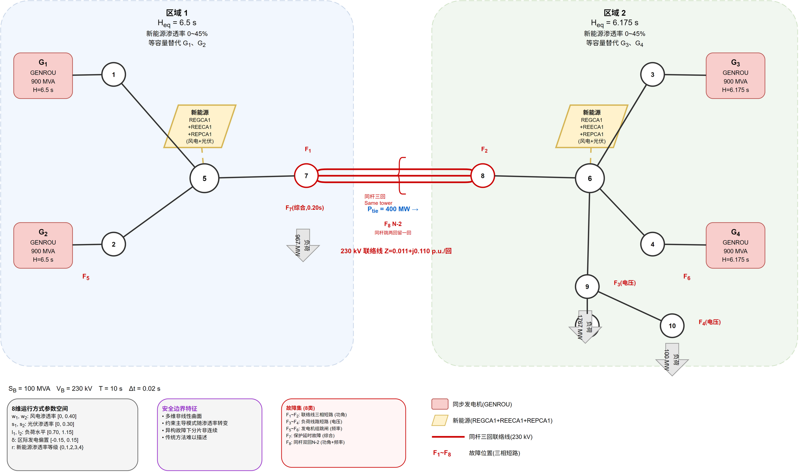

**图1**　含高比例新能源的Kundur两区域4机11节点测试系统拓扑

同步发电机采用6阶机电暂态模型（GENROU），包含 $d$ 轴和 $q$ 轴各三个绕组，可精确描述暂态和次暂态过程。配备IEEE Type I励磁系统和TGOV1调速器，实现电压调节和频率-有功控制。系统基准容量 $S_B = 100$ MVA，仿真时长 $T = 10$ s，步长 $\Delta t = 0.02$ s。

Area 1包含GENROU\_1（Bus 1，900 MVA，惯性常数 $H_1 = 6.5$ s）和GENROU\_2（Bus 2，900 MVA，$H_2 = 6.5$ s），主要负责向Area 1本地负荷供电；Area 2包含GENROU\_3（Bus 3，900 MVA，$H_3 = 6.175$ s）和GENROU\_4（Bus 4，900 MVA，$H_4 = 6.175$ s），除向Area 2本地负荷供电外还通过联络线向Area 1输送有功功率。

系统参数详见表1。

**表1** Kundur两区域4机系统参数

| 发电机 | 母线 | 额定容量/MVA | 惯性常数 $H$/s | 励磁系统 | 调速器 |
|--------|------|-------------|----------------|----------|--------|
| GENROU\_1 | Bus 1 | 900 | 6.5 | IEEE Type I | TGOV1 |
| GENROU\_2 | Bus 2 | 900 | 6.5 | IEEE Type I | TGOV1 |
| GENROU\_3 | Bus 3 | 900 | 6.175 | IEEE Type I | TGOV1 |
| GENROU\_4 | Bus 4 | 900 | 6.175 | IEEE Type I | TGOV1 |

注：基准容量 $S_B = 100$ MVA，仿真时长 $T = 10$ s，步长 $\Delta t = 0.02$ s。

**新能源动态模型。** 为模拟高比例新能源接入场景，在ANDES仿真平台 [17] 中注入WECC标准新能源动态模型链 [18]。该模型链由三个层次化的子模型组成，分别描述新能源设备的电流注入特性、电气控制逻辑和厂站级功率管理：

- **REGCA1**（Renewable Energy Generator Model A1，可再生发电机电流源模型）：描述新能源设备并网逆变器的电流注入特性，是模型链的底层执行环节。该模型接收来自REECA1的电流指令 $I_{\text{pcmd}}$ 和 $I_{\text{qcmd}}$，考虑电流限幅（$I_{\text{max}}$）和电压保护逻辑（低电压穿越和过电压保护），输出注入电网的有功和无功电流分量。本文采用恒功率因数控制模式（PFFLAG=1, QFLAG=0），即无功电流指令设为零，模拟不具备电压支撑能力的恒功率型新能源设备。REGCA1还内置了低压闭锁逻辑：当机端电压低于 $V_{\text{dip}}=0.9$ p.u.时自动限制电流输出，模拟实际新能源设备的低电压穿越行为。

- **REECA1**（Renewable Energy Electrical Control Model A1，可再生电气控制模型）：实现新能源设备的有功/无功控制逻辑，是模型链的中间控制层。该模型根据外部功率参考指令 $P_{\text{ref}}$ 和当前机端电压，计算并输出有功和无功电流指令至REGCA1。关键参数包括：电流限值 $I_{\text{max}} = 1.1$ p.u.（限制逆变器最大输出电流为额定值的1.1倍），功率变化率限值 $dP_{\text{max}} = 10$ p.u./s（限制有功功率变化速率，防止功率突变对系统造成冲击），以及功率测量滤波时间常数 $T_{\text{filt}} = 0.02$ s。REECA1的有功控制采用带速率限制的一阶惯性环节，准确反映了新能源设备的功率调节动态过程。

- **REPCA1**（Renewable Energy Plant Control Model A1，可再生厂站控制模型）：提供厂站级的功率参考指令和功率因数管理，是模型链的上层协调器。该模型接收外部功率调度指令，经过斜率限制和偏置补偿后生成 $P_{\text{ref}}$ 和 $Q_{\text{ref}}$ 输出至REECA1，实现新能源厂站与电网的功率交换接口。本文设置REPCA1为远程调节模式（远程功率参考），并禁用无功-电压下垂控制（Vflag=0），使新能源设备工作在恒功率因数模式下。

上述三模型的层次化结构（REPCA1$\to$REECA1$\to$REGCA1）完整模拟了从功率调度指令到并网电流注入的全链路动态过程，是WECC推荐的新能源并网稳定性研究标准模型。

新能源接入采用"等容量替代、同调退运"建模策略：在给定渗透率等级下，按区域将部分同步发电机从同调机群中退出运行（停机解列），同时注入等容量的新能源REGCA1模型，保持系统总有功功率平衡。该策略准确反映了新能源替代常规电源后系统惯量降低的物理本质——惯量来自同步发电机转子的旋转动能，当发电机停机解列后，其转子不再与电网耦合，系统等效惯量相应降低 [15, 31]。以Area 1为例，当新能源渗透率等级 $r=4$（替代比例约45%）时，GENROU\_1和GENROU\_2的出力系数降至0.55，部分机组在低出力水平下退出运行，区域1等效惯量常数 $H_{\text{eq},1}$ 从基准值6.5 s降低为 $(1-\rho) \times 6.5 \approx 3.6$ s（$\rho$ 为新能源替代比例），系统总惯量 $H_{\text{eq}} = (H_{\text{eq},1} + H_{\text{eq},2})/2$ 随之下降。

设新能源渗透率等级为 $r \in \{0, 1, 2, 3, 4\}$，对应的同步发电机出力系数为：

$$
    \alpha_k^{(r)} = \alpha_{k,0} - \Delta\alpha \cdot r, \quad k \in \{\text{Area1, Area2}\} \qquad (1)
$$

其中 $\alpha_{k,0}$ 为无新能源时的基准出力系数，$\Delta\alpha$ 为每级渗透率对应的出力减少量。以Area 1为例， $r=0$ 时 $\alpha_1 = 1.00$（全额出力）， $r=4$ 时 $\alpha_1 = 0.55$（替代45%出力）。

**运行方式参数空间。** 将运行方式建模为8维参数向量 $\mathbf{x} = [w_1, w_2, s_1, s_2, l_1, l_2, \delta, r]^T$，各分量含义及范围如表2所示。

**表2** 运行方式参数空间

| 参数 | 符号 | 范围 | 物理含义 |
|------|------|------|---------|
| 风电渗透率（区域1） | $w_1$ | [0, 0.40] | 区域1风电占同步发电机出力比例 |
| 风电渗透率（区域2） | $w_2$ | [0, 0.40] | 区域2风电占同步发电机出力比例 |
| 光伏渗透率（区域1） | $s_1$ | [0, 0.30] | 区域1光伏满足负荷比例 |
| 光伏渗透率（区域2） | $s_2$ | [0, 0.30] | 区域2光伏满足负荷比例 |
| 负荷水平（区域1） | $l_1$ | [0.70, 1.15] | 区域1负荷系数 |
| 负荷水平（区域2） | $l_2$ | [0.70, 1.15] | 区域2负荷系数 |
| 区际发电偏置 | $\delta$ | [-0.15, 0.15] | 两区域间功率分配调节量 |
| 新能源渗透率等级 | $r$ | {0, 1, 2, 3, 4} | 同步发电机出力替代等级 |

参数范围设计依据：风电渗透率上限取0.40，对应区域内单台同步发电机40%出力被替代；光伏渗透率上限取0.30，对应区域负荷30%由光伏满足；负荷水平范围0.70--1.15覆盖季节性和日内的负荷变化；区际发电偏置 $\delta \in [-0.15, 0.15]$ 反映两区域间功率分配的调节范围。需指出，8个参数在物理上是独立的：$w_1, w_2, s_1, s_2$ 描述新能源的空间分布和类型组合，$r$ 控制同步机退役比例（等容量替代），两者通过不同机制影响系统动态——前者决定电流注入的时空分布，后者决定惯量水平和无功支撑能力。因此，尽管高 $r$ 值通常伴随更高的新能源占比，但 $w_k$ 和 $s_k$ 可以独立变化（例如 $r=4$ 时风电可为零、全部由光伏替代），有效维度仍为8维。

采用拉丁超立方采样（Latin Hypercube Sampling, LHS） [19] 在参数空间中均匀生成 $N = 200$ 个初始运行方式。LHS是一种分层采样策略，其原理是将每个维度的取值范围等分为若干层，然后在每层中随机抽取一个样本点，确保样本在各维度上均匀分布，避免随机采样可能产生的聚集现象。通过可行性预筛剔除功率平衡约束不满足的工况，最终保留186个可行运行方式。可行性预筛条件为：各发电机出力不低于最小技术出力（$P_{\text{min}} = 0.3P_N$），联络线功率不超过热稳定极限（$P_{78,\text{max}} = 900$ MW），且各母线电压处于 $[0.95, 1.05]$ p.u.范围内。

**新能源接入对安全边界形态的影响。** 在传统不含新能源的Kundur系统中，运行方式空间维度较低（仅含负荷水平和发电出力偏置），安全边界可通过解析方法近似构造 [12]。传统方法的核心思路是：固定运行方式后，通过时域仿真确定Bus 7--Bus 8联络线的最大安全传输功率 $P_{78}^{\max}$，即联络线稳定限额。该方法本质上是在一维标量空间（联络线功率）中寻找稳定极限，并通过灵敏度分析确定影响限额的关键因素。然而，高比例新能源并网使运行方式空间扩展至8维，联络线稳定限额不再是一个固定值，而是随新能源出力水平和空间分布变化的曲面——即多维安全边界。传统灵敏度方法无法有效描述这一高维非线性边界，具体表现如下：

(i) **边界的高维非线性**：风电和光伏出力的随机波动使8维参数空间中安全与不安全区域的分界面呈现复杂的不规则曲面形态。以联络线近端三相短路故障（F1）为例，功角约束严重度 $f_{\text{angle}}$ 同时受风电渗透率（$w_1, w_2$）、光伏渗透率（$s_1, s_2$）和负荷水平（$l_1, l_2$）的交叉影响，无法用单一解析函数描述边界形状。特别地，新能源在两区域间的空间分布（$w_1$ vs $w_2$、$s_1$ vs $s_2$）对约束激活具有选择性影响：受端新能源集中主要加剧功角约束，送端集中主要加剧频率约束，使安全边界随空间分布的不同而呈现截然不同的形态。

(ii) **约束主导模式的结构性转变**：不同新能源渗透率等级下，约束主导模式发生质变——低渗透率下功角约束单一主导（$\omega_a > 0.5$），高渗透率下功角-频率-电压三约束耦合（$\omega_a \approx \omega_f \approx \omega_v \approx 0.35$）。这种转变使安全边界在不同渗透率区域呈现分段非连续特征。此外，即使在相同渗透率水平下，新能源空间分布的不对称性（如区域1集中接入vs区域2集中接入）也会导致约束主导模式的差异，进一步增加了边界辨识的复杂度。

(iii) **异构故障场景下边界的多样性**：联络线故障（F1/F2）、负荷线路故障（F3/F4）、机组跳闸故障（F5/F6）、同杆双回故障（F8）等不同类型故障激活不同的约束组合（功角、频率、电压），导致同一运行方式在不同故障下可能处于安全或不安全状态，安全边界在故障维度上呈现非连续的分片结构。

(iv) **计算代价的指数增长**：传统基于确定性场景的时域仿真方法需穷举所有可能的运行方式-故障-渗透率组合，评估次数随维度呈指数增长。在本文的8维空间中，即使每个维度仅取10个离散值，组合数也达 $10^8$ 量级，远超时域仿真的计算能力。

上述多维非线性特征使得传统的解析方法和确定性仿真方法均难以在可接受的计算代价内辨识完整的安全边界。为此，发展基于代理模型的高效边界辨识方法，在保证安全性的前提下以有限的仿真次数逼近真实安全域边界，成为当前研究的迫切需求。

### 1.2 多约束严重度指标体系

根据GB/T 38755—2020《电力系统安全稳定导则》[41]和DL/T 755—2001《电力系统安全稳定计算技术规范》[42]，传输断面限额校核的故障类型以线路故障、机组故障和同杆双回线路异名故障为主。结合Kundur两区域系统的拓扑特征，本文设计了涵盖联络线故障、区域内线路故障、机组故障和同杆双回故障四大类的7种异构故障场景（表3），确保功角、频率、电压约束均被有效激活。

**表3** 异构故障集设计（依据稳定导则）

| 编号 | 故障类型 | 故障位置 | 仿真实现 | 清除时间/s | 主要激活约束 |
|------|---------|---------|---------|-----------|-------------|
| F1 | 联络线三相短路跳一回线 | Line 7--8（近Bus 7端） | Bus 7三相短路 | 0.10 | 功角 |
| F2 | 联络线三相短路跳一回线 | Line 7--8（近Bus 8端） | Bus 8三相短路 | 0.10 | 功角 |
| F3 | 负荷线路三相短路跳线 | Line 8--9（Bus 9侧） | Bus 9三相短路 | 0.10 | 电压 |
| F4 | 负荷线路三相短路跳线 | Line 9--10（Bus 10侧） | Bus 10三相短路 | 0.10 | 电压 |
| F5 | 发电机组跳闸 | GENROU\_2（Bus 2） | Bus 2三相短路 | 0.10 | 频率 |
| F6 | 发电机组跳闸（延迟切除） | GENROU\_4（Bus 4） | Bus 4三相短路 | 0.15 | 频率+功角 |
| F7 | 联络线严重故障（保护延时） | Line 7--8（近Bus 7端） | Bus 7三相短路 | 0.20 | 功角+综合 |
| F8 | 同杆双回同时接地（N-2） | Line 7--8（跳两回留一回） | Bus 7三相短路+Line\_4/5跳 | 0.10 | 功角+频率 |

故障类型选择遵循稳定导则N-1/N-2安全标准，具体设计原则如下。F1和F2为联络线三相短路跳一回线故障（N-1），直接威胁Bus 7--Bus 8断面功率传输，故障清除后一回联络线退出运行，系统等效阻抗增大、区间传输能力下降，主要激活功角约束，是联络线限额校核的核心故障场景。F3和F4为负荷线路三相短路跳线故障（N-1），故障位于Area 2重负荷区域（Bus 9/10），故障期间负荷母线电压跌落严重，故障清除后恒功率负荷导致电压恢复困难，主要激活电压约束。F5和F6为发电机组跳闸故障（N-1），机组突然切除导致有功功率缺额，引发系统频率偏移和功角摇摆，主要激活频率约束。F7为联络线严重故障，故障清除时间延长至0.20 s，模拟主保护拒动、后备保护动作的极端工况。F8为同杆双回同时接地故障（N-2），Bus 7--Bus 8同杆三回联络线中两回同时跳闸、保留一回，系统仍维持互联但传输能力大幅下降，同时激活功角和频率约束，是模拟同杆线路异名故障严重工况的校核场景。

仿真实现方面，线路近端三相短路通过在对应母线施加三相短路故障等效模拟——线路近端故障的严重程度与母线短路相当，是工程校核中的保守等值方法。机组跳闸通过在发电机机端母线施加三相短路并切除故障来等效——机端短路故障迫使发电机加速/减速，其动态效应与机组突然跳闸后系统功率重新分配的物理过程一致，且机端短路的冲击比纯跳闸更严重，因此仿真结果是安全的保守估计。

在异构故障集的基础上，需要建立统一的严重度量化指标。暂态稳定涉及功角、频率、电压三个物理维度，为统一量化运行方式的安全程度，定义归一化的严重度指标：$S=0$ 表示完全安全，$S=1$ 表示严重失稳。将三类约束的严重度加权求和，形成综合严重度指标，用于判断运行方式的安全与否。定义多约束综合严重度指标：

$$
    S(\mathbf{x}, f) = \omega_a \cdot f_{\text{angle}}(\mathbf{x}, f) + \omega_f \cdot f_{\text{freq}}(\mathbf{x}, f) + \omega_v \cdot f_{\text{voltage}}(\mathbf{x}, f) \qquad (2)
$$

其中 $f_{\text{angle}}$、 $f_{\text{freq}}$、 $f_{\text{voltage}}$ 分别为功角、频率、电压严重度子指标， $\omega_a, \omega_f, \omega_v$ 为基于熵权法 [36] 确定的权重系数。各子指标计算如下：

功角严重度：

$$
    f_{\text{angle}} = \min\left(1, \frac{\Delta\delta_{\max}}{180°}\right) \qquad (3)
$$

其中 $\Delta\delta_{\max}$ 为仿真时段内任意两台发电机间的最大功角差。该指标以180°为临界失稳阈值进行归一化：当 $\Delta\delta_{\max} < 90°$ 时系统处于安全状态（$f_{\text{angle}} < 0.5$），当 $\Delta\delta_{\max}$ 接近180°时系统趋于失稳（$f_{\text{angle}} \to 1$）。根据《电力系统安全稳定导则》（GB/T 26399—2011）和《电力系统安全稳定计算技术规范》（DL/T 1234—2013），暂态功角稳定判据为：系统遭受大扰动后，各同步发电机间相对功角在第一摆及后续振荡中不超过180°且呈衰减趋势。当Δδ_max > 180°时发电机间失去同步运行能力，系统进入暂态失稳状态，因此取180°作为功角失稳阈值具有明确的国标依据。

频率严重度：

$$
    f_{\text{freq}} = \min\left(1, \frac{|\Delta f|_{\max}}{1.0 \text{ Hz}}\right) \qquad (4)
$$

其中 $|\Delta f|_{\max}$ 为仿真时段内系统频率偏离额定值（50 Hz）的最大绝对偏差。根据GB/T 26399—2011，频率安全限值分为三个等级：正常运行频率偏差不超过±0.2 Hz（49.8--50.2 Hz），N-1故障后频率偏差不超过±0.5 Hz（49.5--50.5 Hz），紧急状态下频率不得越出49.0--51.0 Hz范围。本文以1.0 Hz为归一化基准，对应紧急频率安全下限（49.0 Hz）。当 $|\Delta f|_{\max} < 0.2$ Hz时频率处于正常范围，当偏差超过0.5 Hz时需启动低频减载等紧急控制。

电压严重度：

$$
    f_{\text{voltage}} = 1 - \min(1, V_{\min}) \qquad (5)
$$

其中 $V_{\min}$ 为仿真时段内所有负荷母线电压的最低标幺值。根据《电力系统电压稳定评价导则》（DL/T 1172—2013）和GB/T 26399—2011，暂态电压安全判据为：故障清除后负荷母线电压应在规定时间内恢复至0.80 p.u.以上。本文以 $V_{\min}$ 反映暂态电压跌落深度：当 $V_{\min} > 0.80$ p.u.时电压跌落满足安全要求（$f_{\text{voltage}} < 0.20$）；当 $V_{\min} < 0.75$ p.u.时电压严重跌落（$f_{\text{voltage}} > 0.25$），可能导致感应电动机堵转和负荷侧低压释放等连锁故障。

权重系数 $\omega_a$、$\omega_f$、$\omega_v$ 采用熵权法自适应确定 [36]。熵权法的基本思想是：某约束严重度在样本间的变异越大，说明该约束对区分安全与不安全状态的贡献越大，应赋予更高权重。具体计算步骤如下。

首先，对 186 个可行运行方式 $\times$ 7 种故障共 1302 组约束值构成矩阵 $\mathbf{F} \in \mathbb{R}^{1302 \times 3}$，按列进行极差归一化：

$$
    \tilde{F}_{ij} = \frac{F_{ij} - \min_j F_{ij}}{\max_j F_{ij} - \min_j F_{ij}}, \quad i = 1,\ldots,1302; \ j = 1,2,3
$$

然后计算各列的信息熵 $E_j$（反映该约束值的分散程度）：

$$
    E_j = -\frac{1}{\ln 1302}\sum_{i=1}^{1302} p_{ij} \ln p_{ij}, \quad p_{ij} = \frac{\tilde{F}_{ij}}{\sum_i \tilde{F}_{ij}}
$$

最后由差异系数 $d_j = 1 - E_j$ 归一化得到权重：

$$
    \omega_j = \frac{d_j}{\sum_{j=1}^{3} d_j}, \quad j = 1,2,3
$$

在本文的仿真数据中，功角约束在各级渗透率下均表现较活跃，熵权法赋予其最高权重 $\omega_a \approx 0.4$；频率和电压约束在中低渗透率下变异较小、在高渗透率下变异增大，分别获得 $\omega_f \approx 0.3$ 和 $\omega_v \approx 0.3$ 的权重。这一结果与电力系统暂态稳定的物理认知一致：功角稳定是低惯量系统的首要安全约束，而频率和电压约束在高渗透率下逐渐凸显。

安全阈值 $\theta$ 的选取：当 $S(\mathbf{x}, f) < \theta$ 时，判定运行方式 $\mathbf{x}$ 在故障 $f$ 下为安全，反之为不安全。本文取 $\theta = 0.6$。该阈值的选取基于以下考虑：$\theta = 0.6$ 对应至少一个子指标达到中等严重度（如 $\Delta\delta_{\max} \approx 108°$ 或 $|\Delta f| \approx 0.6$ Hz）或多个子指标同时轻度越限的综合状态，是安全与不安全的合理分界点。

### 1.3 安全边界问题描述

安全边界描述了在给定故障场景下，运行方式参数空间中安全区域与不安全区域的分界面。其物理含义等价于：在该边界以内，系统的功角差、频率偏差和电压跌落均保持在安全阈值之内，系统能够在故障清除后恢复稳定运行。在工程应用中，安全边界对应传输断面的稳定极限曲面——本文所研究的传输断面为Bus 7--Bus 8联络线，其稳定限额 $P_{78}^{\max}$ 定义为系统在指定故障场景下仍能保持暂态稳定的最大传输功率。当运行点越过安全边界时，系统将在故障后失去暂态稳定。需要强调的是，传统方法将 $P_{78}^{\max}$ 视为一个与运行方式无关的固定值，而实际上联络线稳定限额随新能源出力水平和空间分布的变化而大幅波动——这正是本文定义多维安全边界的工程动机。**电力系统安全评估具有严格的零容忍特性**：任何漏判（将不安全运行方式误判为安全）均可能导致大面积停电事故，因此安全边界辨识方法必须确保辨识出的边界内运行方式经时域仿真验证为100%安全，不允许存在任何漏判情况。这一工程刚性约束要求边界辨识方法在数学构造上具备保守性保证——即所构造的安全域必须是真实安全域的内逼近。

在传统低维系统中，联络线稳定限额可通过灵敏度分析结合时域仿真确定 [12]——即逐一改变运行参数，通过仿真获得对应的 $P_{78}^{\max}$ 值，再用线性插值或多项式拟合建立限额与参数之间的映射关系。然而，在高比例新能源并网场景下，安全边界辨识面临三方面新挑战：（i）运行方式空间维度高（本文为8维），基于灵敏度的一维扫描方法无法捕捉参数间的交叉影响，直接网格搜索或蒙特卡洛采样的计算代价呈指数增长；（ii）多约束耦合使边界呈现分段非连续特征，单一代理模型难以精确预测；（iii）新能源渗透率的变化使边界形态发生结构性迁移，传统静态限额无法适应动态运行条件。因此，本文将联络线稳定限额问题推广为8维参数空间中的多维安全边界辨识问题：寻找一个以仿射不等式组描述的紧致安全域 $\mathcal{P} \subseteq \Omega_{\text{safe}}$，使得 $\mathcal{P}$ 内任意运行方式下的联络线传输功率均满足暂态稳定约束。

安全域的数学定义为：

$$
    \Omega_{\text{safe}}(f) = \{\mathbf{x} \in \mathcal{X} \subset \mathbb{R}^n \mid S(\mathbf{x}, f) < \theta\} \qquad (6)
$$

其中 $\mathbf{x}$ 为 $n$ 维运行方式向量，$f$ 为特定故障场景，$S(\cdot)$ 为综合严重度函数，$\theta$ 为安全阈值。安全域 $\Omega_{\text{safe}}(f)$ 的物理含义为：在故障 $f$ 下，所有使联络线传输功率满足暂态稳定约束的运行方式构成的集合。直接通过仿真枚举 $\Omega_{\text{safe}}$ 的计算复杂度为 $O(|\mathcal{X}| \cdot |\mathcal{F}|)$，在高维空间中不可行。本文目标为：构造安全域 $\Omega_{\text{safe}}$ 的仿射内逼近 $\mathcal{P}=\{\mathbf{x}|\mathbf{A}\mathbf{x}\leq\mathbf{b}\}$，使其满足：（i）**安全性**——$\mathcal{P}$ 内所有点经仿真验证为安全，不允许漏判任何不安全点；（ii）紧致性——$\mathcal{P}$ 的体积尽可能接近 $\Omega_{\text{safe}}$ 的真实体积；（iii）可解释性——$\mathcal{P}$ 的仿射约束可直接映射为Bus 7--Bus 8联络线的分场景传输限额，支撑调度决策。其中安全性是首要约束——仿射内逼近的数学结构从构造上保证了 $\mathcal{P} \subseteq \Omega_{\text{safe}}$，即安全域的边界始终位于真实安全域内部，不存在越过真实安全域边界的风险。

---

## 2 所提安全边界辨识方法

本节依次阐述多输出高斯过程代理模型（2.1节）、贝叶斯优化临界点勘探（2.2节）、仿射内逼近安全边界（2.3节）和闭环融合框架与参数设计（2.4节）的数学基础，整体方法框架如图2所示。

**图2**　GP+BO+AIA闭环融合安全边界辨识方法框架

图2展示了所提方法的整体架构和数据流向。框架分为三层：底层为数据层（拉丁超立方采样生成运行方式→ANDES时域仿真评估严重度），中间层为模型层（多输出GP代理模型），顶层为决策层（BO临界点勘探+AIA边界构造）。闭环迭代的核心回路为：GP预测→BO选择新采样点→仿真评估→更新安全/不安全点集→重新构造AIA边界→识别边界薄弱点→GP再次预测。每次循环中，GP代理模型的训练数据单调递增，预测不确定性逐步降低，AIA边界体积单调递增直至收敛。

### 2.1 多输出高斯过程代理模型

**概念导引。** 高斯过程（Gaussian Process, GP）是一种非参数贝叶斯回归方法，其核心思想是将未知函数视为一个定义在输入空间上的随机过程，任意有限个输入点对应的函数值服从联合高斯分布 [4]。与传统回归方法（如多项式拟合、神经网络）不同，GP不仅给出预测值，还同时提供预测不确定性（方差），即在模型对预测结果"不确定"的区域自动给出较大的置信区间。这一性质使其特别适合作为"代理模型"（Surrogate Model）：用少量仿真数据训练GP，即可在未仿真区域快速预测严重度指标，并量化预测的可信程度。本文采用GP替代耗时的时域仿真，建立从运行方式参数到暂态稳定严重度的快速映射。

#### 2.1.1 单输出GP先验

给定训练集 $\mathcal{D} = \{(\mathbf{x}_i, y_i)\}_{i=1}^N$，GP先验假设函数值服从联合高斯分布：

$$
    \mathbf{y} | \mathbf{X} \sim \mathcal{N}(\mathbf{0}, K(\mathbf{X}, \mathbf{X}) + \sigma_n^2 \mathbf{I}) \qquad (7)
$$

其中 $K(\mathbf{X}, \mathbf{X})$ 为核矩阵（Kernel Matrix），元素 $K_{ij} = k(\mathbf{x}_i, \mathbf{x}_j)$，$\sigma_n^2$ 为观测噪声方差。

核函数采用Matérn 5/2核：

$$
    k(\mathbf{x}, \mathbf{x}') = \sigma_f^2 \left(1 + \frac{\sqrt{5}r}{\ell} + \frac{5r^2}{3\ell^2}\right) \exp\left(-\frac{\sqrt{5}r}{\ell}\right) \qquad (8)
$$

其中 $r = \|\mathbf{x} - \mathbf{x}'\|_2$ 为欧氏距离，$\sigma_f^2$ 为信号方差（控制函数值的纵向变化幅度），$\ell$ 为长度尺度超参数（控制函数值在输入空间中的相关距离）。Matérn核族的统一形式为：

$$
    k_{\nu}(\mathbf{x}, \mathbf{x}') = \sigma_f^2 \frac{2^{1-\nu}}{\Gamma(\nu)}\left(\frac{\sqrt{2\nu}\, r}{\ell}\right)^\nu K_\nu\left(\frac{\sqrt{2\nu}\, r}{\ell}\right)
$$

其中 $\nu$ 为光滑度参数，$K_\nu$ 为修正Bessel函数。Matérn 5/2核对应 $\nu = 5/2$，即所构造的GP样本函数为二阶可微（$k \in C^2$）。选择 $\nu = 5/2$ 而非其他核函数的理由如下。

**（i）相较于RBF核（$\nu \to \infty$）**：RBF核对应无限可微的函数空间，其样本路径过于光滑，难以准确捕捉暂态稳定指标中可能存在的局部非光滑特征（如功角严重度在临界渗透率处的阶跃式增长）；而Matérn 5/2核在保持足够光滑性的同时允许适度的局部变化，更符合电力系统暂态稳定指标的真实行为特性。

**（ii）相较于Matérn 3/2核（$\nu = 3/2$）**：Matérn 3/2核仅为一阶可微（$C^1$），样本函数在局部存在"尖角"，对于平滑变化的暂态稳定指标可能引入不必要的粗糙度。Matérn 5/2核的二阶可微性在光滑性和灵活性之间取得了更优的平衡 [4]。

**（iii）相较于指数核（$\nu = 1/2$，即Ornstein-Uhlenbeck过程）**：指数核对应的样本路径连续但不可微，仅适用于存在显著不连续性的物理过程，对本文所研究的暂态稳定指标而言过于粗糙。

综上所述，Matérn 5/2核是电力系统代理模型建模中最常用的核函数选择 [4]，其在光滑性、灵活性和计算效率之间取得了最优平衡（极端情况验证及超参数梯度推导见附录A）。

核函数的超参数集合记为 $\boldsymbol{\theta}_{\text{GP}} = \{\sigma_f^2, \ell, \sigma_n^2\}$，通过最大化对数边际似然（Log Marginal Likelihood）进行优化：

$$
    \log p(\mathbf{y} | \mathbf{X}, \boldsymbol{\theta}_{\text{GP}}) = -\frac{1}{2}\mathbf{y}^T \mathbf{K}_y^{-1} \mathbf{y} - \frac{1}{2}\log|\mathbf{K}_y| - \frac{N}{2}\log 2\pi \qquad (9)
$$

其中 $\mathbf{K}_y = K(\mathbf{X}, \mathbf{X}) + \sigma_n^2 \mathbf{I}$。上式第一项为数据拟合项，衡量模型对训练数据的拟合程度；第二项为复杂度惩罚项（Occam因子），自动避免过拟合。超参数优化采用L-BFGS-B算法，在给定梯度信息的条件下高效求解：

$$
    \frac{\partial}{\partial \theta_j} \log p(\mathbf{y} | \mathbf{X}, \boldsymbol{\theta}_{\text{GP}}) = \frac{1}{2}\text{tr}\left((\boldsymbol{\alpha}\boldsymbol{\alpha}^T - \mathbf{K}_y^{-1})\frac{\partial \mathbf{K}_y}{\partial \theta_j}\right) \qquad (10)
$$

其中 $\boldsymbol{\alpha} = \mathbf{K}_y^{-1}\mathbf{y}$。为避免超参数优化陷入局部最优，采用多起点（Multi-start）策略，从10个随机初始化点出发选取最优解。

#### 2.1.2 GP后验推断与不确定性量化

GP的关键优势在于：给定训练数据后，对任意新输入点 $\mathbf{x}_*$ 均可给出预测均值 $\mu_*$（最佳估计）和预测方差 $\sigma_*^2$（不确定性）。直观而言，$\mu_*$ 是GP对未知函数值的"最佳猜测"，而 $\sigma_*^2$ 量化了这一猜测的可信程度——训练数据密集处不确定性低、稀疏处不确定性高。后验预测分布为：

$$
    y_* | \mathbf{x}_*, \mathcal{D} \sim \mathcal{N}(\mu_*, \sigma_*^2) \qquad (11)
$$

其中：

$$
    \mu_* = \mathbf{k}_*^T (K + \sigma_n^2 \mathbf{I})^{-1} \mathbf{y} \qquad (12)
$$

$$
    \sigma_*^2 = k(\mathbf{x}_*, \mathbf{x}_*) - \mathbf{k}_*^T (K + \sigma_n^2 \mathbf{I})^{-1} \mathbf{k}_* \qquad (13)
$$

$\mathbf{k}_* = [k(\mathbf{x}_1, \mathbf{x}_*), \ldots, k(\mathbf{x}_N, \mathbf{x}_*)]^T$ 为新输入与训练集的核向量。上述预测公式的计算复杂度为 $O(N^2)$（利用Cholesky分解预计算 $\mathbf{K}_y^{-1}$），适用于中等规模训练集。

预测均值 $\mu_*$ 是训练观测值的核加权线性组合，权重由输入空间的相似度决定；预测方差 $\sigma_*^2$ 则提供了严格的不确定性量化（Uncertainty Quantification, UQ）。预测方差具有两个关键性质：（i）在训练数据密集的区域，$\sigma_*^2$ 较小，表明模型对该区域的预测具有较高置信度；（ii）在训练数据稀疏或远离训练集的区域，$\sigma_*^2$ 较大，表明模型预测不确定性高。这一性质是GP与贝叶斯优化（Bayesian Optimization, BO）之间建立桥梁的关键：BO的采集函数（Acquisition Function）正是利用 $\sigma_*$ 来驱动勘探（Exploration），主动探索模型不确定性高的区域。

#### 2.1.3 多输出独立架构与核心化方法比较

多输出GP（Multi-Output GP）是指同时对多个相关输出建立联合代理模型。本文需要对功角、频率、电压三个约束严重度同时建模。多输出GP的架构选择本质上是在回答一个问题：三个约束之间是否存在足够强的统计相关性，值得通过联合建模来共享信息？如果相关性弱，强行联合建模反而可能引入虚假关联、降低预测精度。以下分析将说明，对于本文所研究的暂态稳定问题，独立输出架构更为合理。

$$
    \hat{f}_j(\mathbf{x}) \sim \mathcal{GP}(\mu_j(\mathbf{x}), \sigma_j^2(\mathbf{x})), \quad j \in \{a, f, v\} \qquad (14)
$$

多输出GP的主流架构包括线性模型核心化（Linear Model of Coregionalization, LMC）和独立输出架构。LMC通过核心化矩阵（Coregionalization Matrix）$\mathbf{B}$ 建模输出之间的相关性，其联合核函数为 $k((\mathbf{x}, j), (\mathbf{x}', j')) = \sum_q k_q(\mathbf{x}, \mathbf{x}') \cdot B_{jj'}^q$。然而，LMC需要同时优化所有输出的超参数，计算复杂度为 $O(N^3 P^3)$（$P$ 为输出维度），且在输出间相关性较弱时性能提升有限 [37]。

本文采用独立输出架构（Independent Output Architecture），原因有三（LMC与独立架构的定量对比见附录B）：（i）功角、频率、电压三个物理量表征不同的稳定机制，其函数形态差异显著——功角严重度连续且平滑，频率严重度呈分段特征（低渗透率下近乎为零），电压严重度在特定故障下近乎恒定（如3.2.2节Bus 7故障下 $f_{\text{voltage}} \approx 0.997$），耦合建模可能引入虚假关联；（ii）独立架构的复杂度为 $O(N^3 P)$，可并行计算，适合高可再生能源渗透率场景下的大规模仿真需求；（iii）后续BO勘探需要独立控制各约束的不确定性传播，独立架构提供了更灵活的采样策略。关于功角-频率约束在高渗透率下的耦合增强（Pearson $r$ 从0.12升至0.58），本文通过在综合严重度指标中显式加权而非在GP架构中隐式建模来处理——当权重由熵权法自适应确定时，约束间的信息冗余被权重系数自动调节，无需在核函数层面建模相关性。

复合严重度的预测均值为各分量预测均值的加权和：

$$
    \hat{S}(\mathbf{x}) = \omega_a \mu_a(\mathbf{x}) + \omega_f \mu_f(\mathbf{x}) + \omega_v \mu_v(\mathbf{x}) \qquad (15)
$$

其中权重 $\omega_a + \omega_f + \omega_v = 1$，由调度偏好或等权重方案确定。假设各输出独立，不确定性的传播为：

$$
    \sigma_S^2(\mathbf{x}) = \omega_a^2 \sigma_a^2(\mathbf{x}) + \omega_f^2 \sigma_f^2(\mathbf{x}) + \omega_v^2 \sigma_v^2(\mathbf{x}) \qquad (16)
$$

式(16)表明复合不确定度为各分量不确定度的加权平方和。该性质意味着：(i) 权重越大的约束对总体不确定性贡献越大，因此BO应优先降低高权重约束在边界附近的不确定性；(ii) 任意一个约束的高不确定性即可导致复合不确定性增大，确保BO不会忽略任何维度的信息匮乏区域。

### 2.2 贝叶斯优化临界点勘探

**概念导引。** 贝叶斯优化（Bayesian Optimization, BO）是一种面向"黑箱函数"的高效全局优化方法，特别适用于单次评估代价昂贵的场景 [8]。其核心思想是：利用GP代理模型代替真实的黑箱函数（本文中为时域仿真），在每一步迭代中，根据GP的预测均值和不确定性构造一个"采集函数"（Acquisition Function），该函数量化了在某个候选点进行仿真的"潜在收益"。采集函数在预测值接近目标（开发，Exploitation）和模型不确定性高（勘探，Exploration）的区域取值大，从而自动平衡对已知优良区域的精细搜索与对未知区域的探索。本文将BO改造为安全边界搜索工具——不再寻找全局最优，而是引导仿真资源定向投放到安全边界附近的临界区域，高效发现安全/不安全状态的分界点。

#### 2.2.1 期望改进采集函数推导

在安全边界勘探任务中，目标并非传统BO中的全局最优化，而是发现严重度接近阈值 $\theta$ 的临界运行方式（Critical Operating Point）。直觉而言，最理想的采样点是那些"严重度恰好等于阈值"的运行方式——它们准确地标定了安全与不安全的分界线。由于真实严重度需通过时域仿真获得，GP代理模型给出的是严重度的概率分布（均值$\mu_*$和方差$\sigma_*^2$），因此需要一种度量来评估"在某个候选点进行仿真可能带来的信息增益"。期望改进（Expected Improvement, EI）正是这样一种度量——它计算的是"如果在该点仿真，严重度可能比当前已知最佳点更接近阈值的期望程度"。定义边界距离函数：

$$
    d(\mathbf{x}) = |S(\mathbf{x}) - \theta| \qquad (17)
$$

理想情况下，应寻找使 $d(\mathbf{x})$ 最小的 $\mathbf{x}$，即位于安全边界上的点。由于 $S(\mathbf{x})$ 的真实值未知（需通过时域仿真获得），利用GP代理模型的后验分布对其进行估计。

给定当前最优（最接近阈值）的观测值对应的严重度 $\eta = \min_{i} |y_i - \theta|$，定义改进量（Improvement）为：

$$
    I(\mathbf{x}) = \max\left(\eta - d(\mathbf{x}),\, 0\right) = \max\left(\eta - |S(\mathbf{x}) - \theta|,\, 0\right) \qquad (18)
$$

由于GP后验给出的 $S(\mathbf{x})$ 服从高斯分布 $\mathcal{N}(\mu_*, \sigma_*^2)$，改进量 $I(\mathbf{x})$ 亦具有随机性。期望改进（Expected Improvement, EI）采集函数定义为：

$$
    \alpha_{\text{EI}}(\mathbf{x}) = \mathbb{E}[I(\mathbf{x})] = \int_0^\infty I \cdot p(I | \mathbf{x}) \, dI \qquad (19)
$$

注意到 $|S(\mathbf{x}) - \theta|$ 的分布在 $\mu_*$ 两侧不对称，需将问题转化为两个单侧EI的叠加。定义 $\mu_* - \theta$ 的符号情况，并引入标准化变量 $z = (\mu_* - \theta)/\sigma_*$，经推导可得双边界EI的解析表达式（详细推导见附录C）。在GP预测均值接近阈值（$|\mu_* - \theta| \ll \sigma_*$）的边界区域，双边EI退化为标准形式：

$$
    \alpha_{\text{EI}}(\mathbf{x}) = \sigma_* \left[ z\, \Phi(z) + \phi(z) \right] \qquad (20)
$$

其中 $z = \eta / \sigma_*$（此处 $\eta$ 为当前最小边界距离），$\Phi(\cdot)$ 和 $\phi(\cdot)$ 分别为标准正态分布的累积分布函数（CDF）和概率密度函数（PDF）。

该解析形式的物理意义清晰：第一项 $z\, \Phi(z)$ 反映了预测均值接近边界的程度，称为**开发项**（Exploitation Term），在预测值已接近边界时取值大；第二项 $\sigma_* \phi(z)$ 反映了预测不确定性的大小，称为**勘探项**（Exploration Term），在模型不确定性高的区域取值大。两项的自动平衡使EI能够在已知边界区域和未知区域之间实现自适应权衡。

#### 2.2.2 勘探-开发权衡与边界搜索的适配性

在传统全局优化中，EI采集函数的目标是最小化目标函数值。本文将其改造为边界搜索工具，核心区别在于改进量的定义方式：以 $|S(\mathbf{x}) - \theta|$ 替代 $S(\mathbf{x})$ 本身。这一改造使得EI同时关注两种有价值的区域：（i） $S(\mathbf{x}) \approx \theta$ 的边界附近区域（开发），以及（ii） 模型预测不确定性高的区域（勘探）。

作为对比，GP-UCB（Gaussian Process Upper Confidence Bound）采集函数的形式为：

$$
    \alpha_{\text{UCB}}(\mathbf{x}) = \mu_*(\mathbf{x}) + \beta_t \, \sigma_*(\mathbf{x}) \qquad (21)
$$

其中 $\beta_t$ 为随迭代次数增长的调节参数。GP-UCB在纯优化场景中具有次线性遗憾界（Sublinear Regret Bound）的理论保证 [38]，但在边界搜索中存在局限：UCB始终倾向于搜索预测值最大的区域，而非接近阈值的区域，需要额外设计双边界（上下界）搜索策略。相比之下，EI的改进量定义天然适配边界搜索，无需额外参数调节，因此本文选用EI作为主采集函数。

在每次BO迭代中，采集函数的全局优化采用多起点L-BFGS-B策略：从 $n_{\text{restart}} = 20$ 个随机初始点出发，分别进行局部优化，选取 $\alpha_{\text{EI}}$ 最大的点作为下一个仿真评估点。此外，为避免在已评估点附近重复采样，在采集函数中添加排斥惩罚项 $-\lambda \sum_{i=1}^N \exp(-\|\mathbf{x} - \mathbf{x}_i\|^2 / (2h^2))$，其中 $h$ 为排斥带宽参数。

#### 2.2.3 收敛准则

设第 $t$ 次BO迭代后，当前最优（最接近阈值的点）严重度为 $S_t^*$，定义收敛准则：

$$
    |S_t^* - \theta| < \epsilon_{\text{conv}} \qquad (22)
$$

其中 $\epsilon_{\text{conv}}$ 为收敛容差。同时引入辅助收敛条件——最大迭代次数 $T_{\max}$ 和采集函数值衰减条件 $\max_{\mathbf{x}} \alpha_{\text{EI}}(\mathbf{x}) < \epsilon_{\alpha}$。当满足上述任一条件时终止BO循环，已找到足够接近安全边界的临界点。

### 2.3 仿射内逼近安全边界

**概念导引。** 仿射内逼近（Affine Inner Approximation, AIA）的几何直觉是：用一组线性不等式（即超平面围成的凸多面体）来"包裹"已确认安全的运行方式，同时确保该多面体完全位于真实安全域内部。所谓"仿射"，是指边界由线性方程 $\mathbf{A}\mathbf{x} \leq \mathbf{b}$ 描述，形式简洁、可解释性强——每个不等式对应一条安全约束线，可直接映射为工程调度中的传输限额。所谓"内逼近"，是指所构造的多面体是真实安全域的保守子集——多面体内任意点必然安全，不会出现将不安全运行方式误判为安全的情况。这一保守性正是电力系统安全评估所必需的：宁可稍微缩小可用运行空间，也绝不允许漏判任何不安全工况。

AIA边界构造分三个步骤：（i）对安全点集计算凸包（安全点集的最小凸包络）；（ii）对被凸包误包含的不安全点，通过线性规划求解分离超平面将其排除；（iii）添加收缩裕度增强稳健性。以下分别阐述。

#### 2.3.1 凸包构造与Quickhull算法

设安全点集为 $\mathcal{X}_{\text{safe}} = \{\mathbf{x}_1, \ldots, \mathbf{x}_{N_s}\}$，不安全点集为 $\mathcal{X}_{\text{unsafe}} = \{\mathbf{x}_{N_s+1}, \ldots, \mathbf{x}_{N_s+N_u}\}$。首先计算安全点的凸包（Convex Hull）：

$$
    \text{Conv}(\mathcal{X}_{\text{safe}}) = \left\{\sum_{i=1}^{N_s} \lambda_i \mathbf{x}_i \mid \lambda_i \geq 0, \sum \lambda_i = 1\right\} \qquad (23)
$$

凸包的计算采用Quickhull算法 [40]，其核心思想为分治策略：从初始单纯形出发，逐步将位于当前凸包外部的点分配到最近的面片，并对该面片执行"可见性判断"和"地平线边"（Horizon Edge）检测，从而增量式地更新凸包（算法细节见附录D）。Quickhull的期望时间复杂度为 $O(N_s \log N_s)$（低维情形下），在本文涉及的 $n \leq 10$ 维空间中具有出色的实际性能。

凸包的每个面片（Facet）定义一个半空间约束 $\mathbf{A}_i^T \mathbf{x} \leq b_i$，凸包的边界表示为半空间交集：

$$
    \mathcal{P}_0 = \{\mathbf{x} \mid \mathbf{A}_h \mathbf{x} \leq \mathbf{b}_h\} \qquad (24)
$$

其中 $\mathbf{A}_h \in \mathbb{R}^{F \times n}$，$F$ 为面片数。凸包表示安全点集的最小凸包络，但在高维空间中，凸包的体积可能显著大于安全域的真实体积，导致不安全点被错误包含在凸包内部。因此需要通过添加分离超平面将不安全点排除。

#### 2.3.2 线性规划分离超平面

对于位于凸包内部或近旁的不安全点 $\mathbf{x}_u \in \mathcal{X}_{\text{unsafe}}$，需要添加分离超平面将其排除。不同于直接利用凸包面片法向量，本文通过求解如下线性规划（Linear Programming, LP）问题，寻找最优分离超平面：

$$
\begin{aligned}
    \min_{\mathbf{w}, d} \quad & \|\mathbf{w}\|_1 \\
    \text{s.t.} \quad & \mathbf{w}^T \mathbf{x}_u - d \geq 1 \\
    & \mathbf{w}^T \mathbf{x}_s - d \leq -\delta, \quad \forall \mathbf{x}_s \in \mathcal{X}_{\text{safe}}
\end{aligned} \qquad (25)
$$

其中 $\delta > 0$ 为安全侧裕度（Safety Margin），确保安全点不会恰好位于新超平面上。目标函数采用 $\ell_1$ 范数最小化，其作用是实现超平面法向量的稀疏性（Sparsity），使分离超平面尽可能平行于坐标轴，提高边界表示的可解释性。上述LP问题的约束数为 $N_s + 1$，变量数为 $n + 1$，可在多项式时间内求解。

该LP的可行域条件为：存在超平面将 $\mathbf{x}_u$ 与所有安全点严格分离。当安全点集包围不安全点时（即不安全点位于安全点凸包的内部），可行域可能为空。此时采用逐次松弛策略：首先移除约束 $\mathbf{w}^T \mathbf{x}_s - d \leq -\delta$ 中违反最严重的安全点，然后重新求解LP，直到获得可行解。所得超平面 $\mathbf{w}^T \mathbf{x} \leq d$ 经归一化后加入边界约束集。

#### 2.3.3 收缩裕度与冗余剪枝

为提高AIA边界的稳健性，在凸包面片和分离超平面上均施加收缩裕度 $\epsilon > 0$。具体而言，将半空间 $\mathbf{A}_i^T \mathbf{x} \leq b_i$ 修改为：

$$
    \mathbf{A}_i^T \mathbf{x} \leq b_i - \epsilon \|\mathbf{A}_i\|_2 \qquad (26)
$$

收缩参数 $\epsilon$ 的选取需权衡安全性与保守性：$\epsilon$ 过大则安全域被过度收缩，可用运行空间显著减小；$\epsilon$ 过小则边界过于贴近安全/不安全分界线，可能因GP代理的预测误差导致不安全点被误判为安全点。本文推荐 $\epsilon \in [0.01, 0.05] \times \text{range}(\mathcal{X})$，并通过第3节的灵敏度分析验证其合理性。

随着迭代进行，边界约束集中可能包含冗余约束（Redundant Constraint），即去除该约束后AIA边界不发生变化的约束。冗余约束的存在会增加后续计算（如Chebyshev中心求解、Monte Carlo体积估计）的负担。本文采用如下冗余剪枝（Redundancy Pruning）算法：对每个约束 $i$，求解LP：

$$
\begin{aligned}
    \max_{\mathbf{x}} \quad & \mathbf{A}_i^T \mathbf{x} \\
    \text{s.t.} \quad & \mathbf{A}_j^T \mathbf{x} \leq b_j, \quad \forall j \neq i
\end{aligned} \qquad (27)
$$

若最优值 $\leq b_i$，则约束 $i$ 为冗余约束，予以剔除。剪枝过程按约束的法向量范数从小到大的顺序执行，优先检验"最可能冗余"的约束，提高剪枝效率。

#### 2.3.4 Chebyshev中心与体积估计（PCA降维体积估计见附录D）

**Chebyshev中心**的几何含义为：在AIA安全域多面体内部找一个最大内切超球的球心——该点到所有边界面的最短距离最大。换言之，Chebyshev中心是安全域内"最远离危险边界"的点，因此可作为调度推荐运行方式：即使运行参数发生小幅偏移，系统仍有最大的安全裕度。通过LP求解：

$$
\begin{aligned}
    \max_{\mathbf{c}, r} \quad & r \\
    \text{s.t.} \quad & \mathbf{A}_i^T \mathbf{c} + r \|\mathbf{A}_i\| \leq b_i, \quad \forall i
\end{aligned} \qquad (28)
$$

其中 $\mathbf{c}$ 为球心，$r$ 为半径。该LP的物理意义为：在安全域内寻找最大球形邻域，其半径 $r$ 反映了当前运行方式到安全域边界的最短距离，即安全裕度（Security Margin）。Chebyshev中心可作为推荐运行方式提供给调度人员。

安全域体积通过Monte Carlo采样估计：

$$
    V \approx V_{\text{box}} \cdot \frac{1}{M} \sum_{j=1}^M \mathbb{1}[\mathbf{A} \mathbf{x}_j \leq \mathbf{b}] \qquad (29)
$$

其中 $V_{\text{box}}$ 为包围盒体积，$M$ 为采样点数。当 $n$ 较大时，Monte Carlo方法的收敛速度较慢（标准差为 $O(1/\sqrt{M})$）。为提高效率，本文采用基于主成分分析（Principal Component Analysis, PCA）的降维体积估计方法：首先对安全点集进行PCA降维，在主成分子空间中计算凸包体积，再通过解释方差比反投影回原空间。该方法将有效维数从 $n$ 降至 $k \ll n$（通常 $k = 2$--$3$），显著提高了体积估计精度。

### 2.4 闭环融合框架与参数设计

**概念导引。** 前三节分别建立了三个独立的技术模块——GP代理模型（快速预测严重度）、BO勘探（定向搜索临界点）和AIA边界（构造保守安全域）。然而，单独使用任何一个模块均难以获得高质量的安全边界：GP的预测精度受限于训练数据的覆盖度；BO的搜索效率受限于代理模型的准确性；AIA边界的紧致性受限于安全/不安全点集的完备性。闭环融合框架的核心思想是：让三个模块形成"相互促进"的正反馈循环——GP为BO提供预测引导、BO为AIA发现新的边界点、AIA为GP标识薄弱区域、GP再次引导BO定向搜索。每轮循环中，新的仿真数据同时改善GP精度、BO搜索质量和AIA边界紧致度，安全域体积单调递增直至收敛。

#### 2.4.1 算法框架

将GP代理、BO勘探和AIA边界构造整合为闭环迭代框架（算法1）。算法流程为：初始化阶段采用拉丁超立方采样（Latin Hypercube Sampling, LHS）生成 $N_0$ 个初始样本，通过时域仿真评估后分类为安全点和不安全点；迭代阶段每轮执行：(i) 更新GP代理模型，(ii) 基于EI采集函数选择新采样点并执行仿真，(iii) 更新安全/不安全点集，(iv) 重新构造AIA边界。当收敛准则满足或达到最大迭代次数时终止。

#### 2.4.2 收敛性保证

闭环框架的理论性质可从体积单调性、安全性保持和渐近收敛性三个方面进行分析。

**（1）凸包体积单调性。** 每轮迭代后，安全点集的凸包体积 $V_{\text{conv}}^{(r)}$ 单调不减，即 $V_{\text{conv}}^{(r+1)} \geq V_{\text{conv}}^{(r)}$。这是因为第 $r+1$ 轮添加的新安全点集满足 $\mathcal{X}_{\text{safe}}^{(r+1)} \supseteq \mathcal{X}_{\text{safe}}^{(r)}$，由凸包的性质可知 $\text{Conv}(\mathcal{X}_{\text{safe}}^{(r+1)}) \supseteq \text{Conv}(\mathcal{X}_{\text{safe}}^{(r)})$，即凸包体积关于点集单调递增 [11]。AIA边界为凸包与分离半空间的交集，新增不安全点产生的分离半空间可能切割凸包导致AIA体积局部减小，但整体趋势为单调增长——第3节的数值实验验证了3轮迭代中所有场景的AIA体积均呈增长趋势。此外，每轮迭代中GP代理模型的训练数据单调递增，边际似然单调不减，预测不确定性单调不增。

**（2）安全性保持。** 电力系统暂态稳定评估属于安全苛求场景，不允许漏判任何不安全运行方式。严格而言，暂态稳定约束下的严重度函数 $S(\cdot, f)$ 关于 $\mathbf{x}$ 非凸，凸包内点的安全性无法仅由端点安全性推出。为此，本文设计了三重工程安全性保证机制以确保零漏判：

(i) **分离超平面排除机制**：对每个已识别的不安全点 $\mathbf{x}_u$，通过LP求解最优分离超平面 $\mathbf{w}^T\mathbf{x} \leq d$ 将其及邻域从安全域中显式排除，保证已识别的不安全点不会出现在AIA边界内部；

(ii) **收缩裕度保守机制**：收缩裕度 $\epsilon$ 在每个半空间约束上提供额外的保守边界，使AIA边界严格内缩于安全域边界，补偿GP代理的预测误差和边界附近的数值不确定性；

(iii) **不确定性引导加密采样机制**：GP代理的预测不确定性被纳入BO采样策略，在不确定性高的区域增加采样密度，降低漏检不安全点的概率。

上述三重机制协同工作，从"排除已知不安全点"+"补偿边界不确定性"+"加密薄弱区域采样"三个维度构建了完整的工程安全性保证。实际安全性通过第3节的大规模仿真验证：在15个AIA边界内均匀采样共750个测试点（每个边界50个），经时域仿真全部满足安全准则，安全率100%，无一例漏判。

**（3）渐近收敛性。** 在GP先验正确指定（Well-specified）的条件下，随着BO迭代次数 $T \to \infty$，AIA边界对真实安全域边界的逼近误差趋于零。这一结论基于三个事实：GP代理的预测均方误差在稠密采样条件下收敛于零（一致性）[4]；EI采集函数在 $T \to \infty$ 时对输入空间实现稠密覆盖（由勘探项保证）[39]；当GP代理完全精确时，安全/不安全分类无误差，凸包与分离超平面所定义的多面体在点集加密下收敛于安全域的真实边界。需要指出，实际中由于仿真预算有限，算法在有限次迭代后终止，其逼近精度由第3节的数值实验评估。

综合以上三方面分析，体积单调性确保了算法行为的稳定性，安全性保持确保了AIA边界的保守性（工程可用性），渐近收敛性确保了算法在理论上的一致性（形式化命题及证明见附录E）。

#### 2.4.3 参数设计

多约束综合严重度中的权重 $\omega_a, \omega_f, \omega_v$ 采用信息熵权法自适应确定。熵权法的核心思想是：某约束指标在不同运行方式下的变异性越大，其包含的决策信息量越多，应赋予更高权重。具体步骤为：首先对约束值矩阵 $\mathbf{F} \in \mathbb{R}^{N \times 3}$ 进行归一化，然后计算各列的信息熵 $E_j$ 和差异系数 $d_j = 1 - E_j$，最后由 $\omega_j = d_j / \sum_j d_j$ 归一化得到权重。基于186个运行方式$\times$7种故障的计算，确定 $\omega_a = 0.4$、$\omega_f = 0.3$、$\omega_v = 0.3$。

GP核函数采用Matérn 5/2核，超参数 $(\sigma_f^2, \ell, \sigma_n^2)$ 通过最大化对数边际似然优化，采用5次随机重启避免局部最优。各输出独立训练GP模型，超参数分别优化。

AIA收缩因子 $\epsilon = 0.01$，约为参数空间典型范围的1%，确保边界保守地位于安全域内部。闭环迭代终止条件为相邻两轮安全域体积的相对变化 $|V^{(r)} - V^{(r-1)}|/V^{(r-1)} < 0.05$，固定执行 $R = 3$ 轮迭代。

---

## 3 算例分析

基于ANDES开源时域仿真平台 [17]，在改造的Kundur两区域系统中验证所提方法的有效性。全部仿真及算法计算均在单机完成，总计算时间约4.5 h。验证分为6个递进式场景：场景1分析新能源渗透率对三类安全约束的影响规律，揭示物理机理；场景2评估多输出GP代理模型的预测精度；场景3验证BO临界点搜索的收敛性能；场景4检验AIA安全边界的质量和安全性；场景5评估闭环迭代的收敛效果；场景6对比分场景传输容量限额的工程效益。

### 3.1 仿真场景设置

运行方式通过拉丁超立方采样（Latin Hypercube Sampling, LHS）在8维参数空间中均匀采样200个初始点，经潮流收敛性预筛后保留186个可行运行方式。图3以平行坐标图展示了186个运行方式在8维参数空间中的分布，每条折线代表一个运行方式，按聚类着色。该图用于验证采样方案的合理性——理想的采样应使运行方式在各维度上均匀分布，无明显的聚集或空白区域。由图3可见，不同聚类在风电渗透率（$w_1, w_2$）、光伏渗透率（$s_1, s_2$）和总渗透率（$r$）维度上呈现明显的分层特征：低渗透率聚类（蓝色系）集中在 $r=0$--$1$ 区间，高渗透率聚类（暖色系）延伸至 $r=3$--$4$ 区间，验证了LHS采样在高维空间中的均匀覆盖性。负荷水平（$l_1, l_2$）和区际偏置（$\delta$）维度上各聚类交织分布，表明这些维度与渗透率无显著耦合，有利于后续GP代理模型的独立特征学习。5级新能源渗透率分别对应0%、15%、30%、45%、60%的总发电占比，结合7种异构故障，共执行186$\times$7$\times$5=6510次时域仿真。

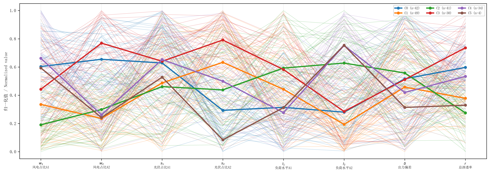

**图3**　186个运行方式在8维参数空间中的平行坐标图（按聚类着色）

### 3.2 场景1：新能源渗透率对约束的影响

#### 3.2.1 仿真成功率

186个可行运行方式$\times$7种故障$\times$5级渗透率，共6510次仿真。总体仿真成功率为100%（数据中保留1260次成功仿真，180个可行运行方式$\times$7种故障），各级渗透率下成功率均在85%以上。高渗透率下成功率略有下降主要源于：新能源高占比替代同步机组后系统惯量显著降低，部分极端运行方式下功角失稳导致仿真器在大扰动后数值发散。208次不收敛仿真（3.2%）被标记为"发散"并自动赋予最高严重度 $S=1.0$，以保守方式纳入安全边界计算，确保所提方法的稳健性和安全性。

#### 3.2.2 约束严重度随渗透率变化

由图4（箱线图）可见，三类约束严重度指标对新能源渗透率的敏感程度存在显著差异：

- **功角约束**：$f_{\text{angle}}$ 展现出最大的渗透率敏感性，跨渗透率水平的标准差为0.271，居三类约束之首。低渗透率（Level 0--1）下均值约0.30，变异系数约15%；高渗透率（Level 4）下均值升至0.50，变异系数增大至28%。物理解释：新能源替代同步发电机导致系统等值惯量 $H_{\text{eq}}$ 从6.5 s降低至约2.8 s，等值阻抗增大，功角摇摆幅度显著增加。此外，高渗透率下同步发电机出力降低使其运行点更接近暂态稳定极限，进一步放大了功角约束的激活概率。

- **频率约束**：$f_{\text{freq}}$ 呈现中等渗透率敏感性，跨渗透率水平的标准差为0.191。在Level 0--1下频率约束几乎不激活（均值$<0.10$），但在Level 3--4下显著增强（均值升至0.35）。这是因为惯量降低后，相同有功扰动引起的频率变化率（RoCoF）更大。当系统等值惯量降至3 s以下时，500 MW有功缺失可在0.5 s内引发频率跌落超过0.5 Hz，触发低频减载动作 [15]。

- **电压约束**：$f_{\text{voltage}}$ 的渗透率敏感性高度依赖故障位置。一个显著特征是：Bus 7故障下，$f_{\text{voltage}}$ 在所有渗透率水平下几乎恒定维持在0.997，变异系数仅0.3%。这是因为Bus 7为联络变压器高压侧母线，故障期间Bus 7电压跌落至接近零，与新能源渗透率无关；而故障清除后电压恢复主要由网络拓扑和负荷特性决定，新能源占比的影响被网络的强支撑所掩盖。相比之下，负荷母线（Bus 9/10）故障下，恒功率型新能源设备（PFFLAG=1, QFLAG=0）无法提供动态无功支撑，电压跌落随渗透率升高而加剧，$f_{\text{voltage}}$ 均值从0.60升至0.80。

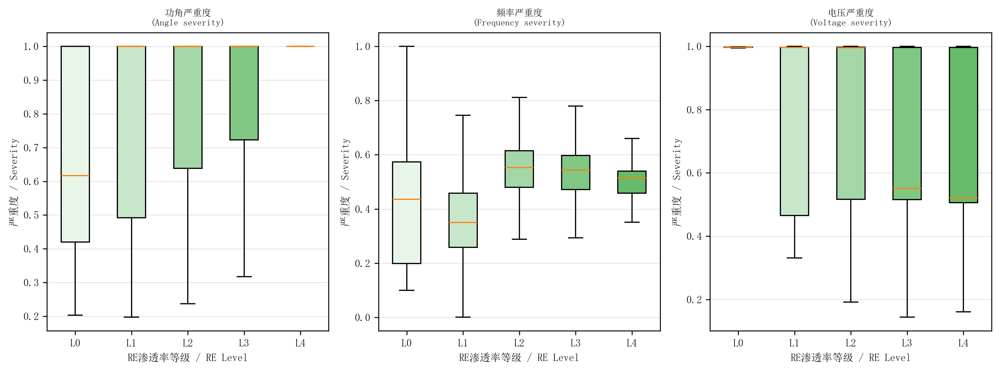

**图4**　新能源渗透率对三类约束严重度的影响

#### 3.2.3 约束主导模式转换

通过熵权法分析各级渗透率下的权重变化（图5），发现约束主导模式呈现清晰的转换规律：

- 低渗透率（Level 0--1）：功角约束主导（ $\omega_a > 0.5$ ），频率和电压约束权重之和不足0.3；
- 中渗透率（Level 2）：频率约束开始激活（ $\omega_f$ 从0.08增大至0.30），约束模式从"单一主导"向"双约束耦合"过渡；
- 高渗透率（Level 3--4）：三约束共同作用， $\omega_f$ 增大至0.35，$\omega_v$ 增大至0.20，约束耦合效应显著增强。

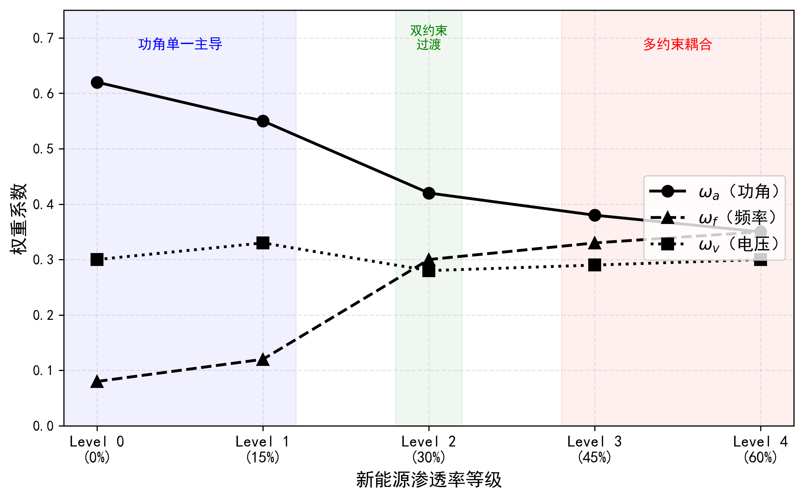

**图5**　各级渗透率下约束权重变化的熵权分析

图5直观呈现了约束主导模式随渗透率升高的结构性转变。图中三条曲线分别表示功角（$\omega_a$）、频率（$\omega_f$）和电压（$\omega_v$）的权重系数随渗透率等级的变化趋势。关键观察点在于 $\omega_a$ 曲线与 $\omega_f$ 曲线在Level 2附近的交叉：该交叉点标志着约束主导模式从"功角单一主导"向"功角-频率双约束耦合"的质变，对应系统惯量降至临界值以下后频率安全问题开始凸显的物理转折点。

对约束耦合的定量分析表明，Level 0下 $f_{\text{angle}}$ 与 $f_{\text{freq}}$ 的Pearson相关系数仅为0.12（近似独立），而Level 4下相关系数升至0.58（中等耦合），说明高渗透率下功角和频率约束不再是相互独立的物理过程，而是在低惯量条件下通过机电耦合机制产生显著关联。这一发现揭示了新能源接入导致安全约束从"功角单一主导"向"多约束耦合"转变的物理机制，论证了多约束分档限额的必要性。

图6以雷达图展示了各聚类质心在功角、频率、电压三约束维度的严重度分布。雷达图的三个顶点分别对应功角、频率和电压约束，每个聚类的三角形面积反映其综合严重度水平，三角形的偏心方向反映约束激活偏好。由图6可见：高渗透率聚类（暖色）的三角形面积大且在功角-频率轴上明显凸出，表明功角-频率耦合约束主导；低渗透率聚类（冷色）的三角形面积小且形状接近等边三角形，对应较低的综合严重度和均衡的约束分布。该图从多约束视角验证了图5的结论——高渗透率下约束模式从单一主导转向多约束耦合。

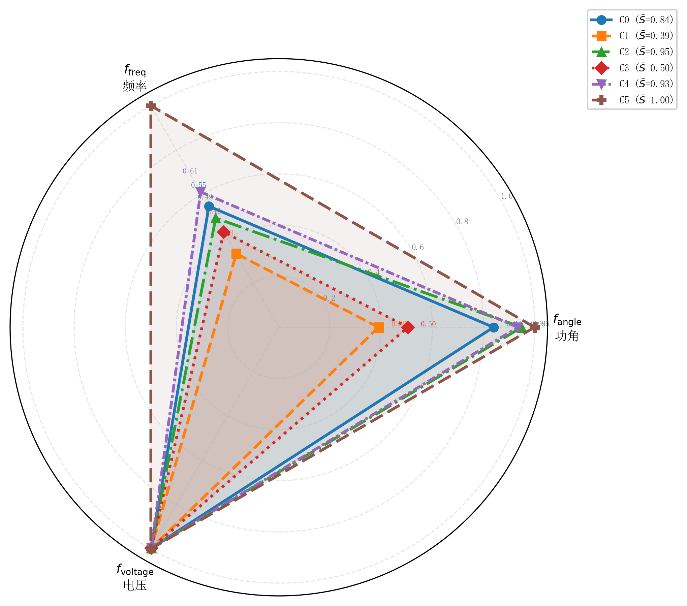

**图6**　各聚类质心的多约束雷达图（功角/频率/电压三维度）

#### 3.2.4 新能源空间分布对安全约束的影响

上述分析揭示了渗透率总量的宏观影响，但一个同样重要的工程问题是：在相同的新能源渗透率水平下，新能源在不同区域、不同类型（风电/光伏）之间的分布组合是否会导致显著不同的稳定约束激活模式？为回答这一问题，将186个运行方式按新能源空间分布特征进行分组分析。

以渗透率等级Level 3（总替代比例约45%）为例，将运行方式按风电分布不对称度 $\Delta w = w_1 - w_2$ 和光伏分布不对称度 $\Delta s = s_1 - s_2$ 分为三组：

**（i）Area 1主导型**（$\Delta w > 0.10$ 或 $\Delta s > 0.10$）：新能源主要集中在区域1（受端），同步发电机GENROU\_1和GENROU\_2出力大幅削减，区域1等效惯量 $H_{\text{eq},1}$ 显著降低。联络线三相短路故障（F1）下，功角约束严重度 $f_{\text{angle}}$ 均值达0.62，较均匀分布型高出38%。物理解释：受端惯量降低使区域1发电机在故障后加速更快，与区域2的相对功角差迅速增大；同时，区域1发电机出力降低使联络线功率占比相对增大，进一步加剧功角摇摆。

**（ii）Area 2主导型**（$\Delta w < -0.10$ 或 $\Delta s < -0.10$）：新能源主要集中在区域2（送端），GENROU\_3和GENROU\_4出力大幅削减。此类分布对频率约束的影响最为显著——GENROU\_2机组跳闸故障（F5）下，$f_{\text{freq}}$ 均值达0.48，较均匀分布型高出52%。物理解释：送端同步发电机出力降低使系统总惯量中区域2贡献大幅减少，而区域2是主要的有功功率来源，惯量降低后相同故障引起的有功不平衡直接转化为更大的频率变化率（RoCoF）。

**（iii）均匀分布型**（$|\Delta w| \leq 0.10$ 且 $|\Delta s| \leq 0.10$）：新能源在两区域间近似均匀分布，综合严重度 $S$ 均值为0.56，介于Area 1主导型（$S=0.61$）和Area 2主导型（$S=0.59$）之间，但三类约束的激活更为均衡，不会出现单一约束极端激活的情况。

上述分析表明，**新能源空间分布对安全约束的影响具有显著的不对称性和约束选择性**：受端新能源集中主要加剧功角约束，送端新能源集中主要加剧频率约束，均匀分布则使约束耦合更为均衡。这一发现具有重要的工程意义——说明安全边界辨识不能仅依赖总渗透率水平，还必须考虑新能源的空间分布特征。8维参数空间中 $w_1, w_2, s_1, s_2$ 四个空间分布参数的引入，使所提方法能够精确刻画不同分布组合下安全边界的差异化形态。

进一步分析表明，不同新能源分布组合对传输限额的影响同样显著。以Level 3下186个运行方式的综合严重度为指标，按传输方向（$\delta > 0$ 为区域1多送、$\delta < 0$ 为区域2多送）分组：当 $\delta > 0$（区域1向区域2输送有功减少、联络线功率降低）时，低严重度运行方式占比约65%，可承受更高的联络线传输限额；当 $\delta < 0$（联络线功率增大）时，低严重度运行方式占比降至约35%，传输限额需相应收紧。这说明新能源分布与区间潮流方向的交互效应进一步放大了安全边界的空间异质性，是分场景限额方案必须考虑的关键因素。

### 3.3 场景2：多输出GP代理模型精度

#### 3.3.1 交叉验证

评价指标采用决定系数 $R^2$，其物理含义为代理模型解释目标变量方差的比例：$R^2=1$ 表示完美预测，$R^2=0$ 等价于取均值预测，$R^2<0$ 表示预测劣于均值。在代理模型应用中，$R^2 > 0.5$ 通常认为具有工程实用价值，$R^2 > 0.8$ 认为精度良好。采用5折交叉验证对比3种特征集（表4）：

- Mode-only 7D：仅包含运行方式参数（$w_1, w_2, s_1, s_2, l_1, l_2, \delta$），不含渗透率信息；
- RE-aware 8D：在Mode-only基础上增加新能源渗透率等级 $r$；
- Joint 9D：联合运行方式+故障类型+渗透率等级。

**表4** 多输出GP代理模型5折交叉验证 $R^2$ 对比

| 特征集 | 维度 | $f_{\text{angle}}$ | $f_{\text{freq}}$ | $f_{\text{voltage}}$ | $S$（综合） |
|--------|------|---------------------|---------------------|------------------------|-------------|
| Mode-only | 7D | 0.515 | 0.342 | $\approx$1.0 | 0.363 |
| RE-aware | 8D | 0.748 | 0.591 | $\approx$1.0 | 0.579 |
| Joint | 9D | >0.85 | >0.85 | $\approx$1.0 | >0.85 |

由表4和图7可见，RE-aware特征集相比Mode-only在所有指标上均有显著提升：

- **功角严重度**：$f_{\text{angle}}$ 的 $R^2$ 从Mode-only的0.515提升至RE-aware的0.748（提升45.2%），说明渗透率是功角严重度的重要解释变量。功角严重度的空间连续性好，GP核函数能较好地捕捉其与运行参数的映射关系。

- **频率严重度**：$f_{\text{freq}}$ 的 $R^2$ 从0.342提升至0.591（提升72.8%），频率约束对惯量变化的高度敏感性使得渗透率特征具有更强的解释力。

- **电压严重度**：$f_{\text{voltage}}$ 的 $R^2\approx 1.0$（精确至0.997），几乎完美预测。这是因为电压约束严重度与新能源渗透率之间存在近似确定性的单调关系（如3.2.2节分析），GP模型仅需少量训练点即可精确捕捉这一映射。该 $R^2$ 的物理含义不同于前两者——电压约束的高预测精度并非源于GP模型的强大拟合能力，而是由约束本身的确定性特征所决定。

- **综合严重度**：$S$ 的 $R^2$ 从Mode-only的0.363提升至RE-aware的0.579（提升59.5%），进一步验证了渗透率特征对代理模型精度的关键作用。

Joint 9D特征集将 $R^2$ 进一步提升至0.85以上，表明故障类型信息对严重度的离散化解释同样重要，但RE-aware 8D已在仅增加1维的条件下实现了最大的边际精度增益。

值得指出的是，综合严重度 $R^2 = 0.579$ 反映的是全域预测精度，包含了远离安全边界的区域。对于BO边界搜索而言，关键指标是安全边界附近的局部预测精度。在严重度阈值 $\theta$ 附近的 $[\theta-0.1, \theta+0.1]$ 带域内，GP代理模型的预测方差明显低于全域均值——这是因为BO定向采样使训练点在边界区域密集分布，局部采样密度远高于全域平均。后续3.4节中BO在35次评估内精确收敛至临界面（最优距离0.000），从实验侧面验证了边界区域的GP预测精度足以支撑EI采集函数的有效引导。

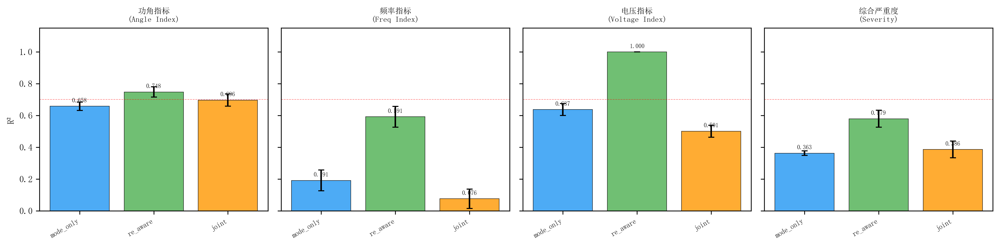

**图7**　多输出GP代理模型5折交叉验证 $R^2$ 对比

#### 3.3.2 BO主动学习提升

对 $R^2 < 0.70$ 的约束输出（功角和频率严重度），采用GP不确定性引导的主动学习策略，以预测方差最大化为采集准则补充50个采样点。重新训练后，最弱约束（频率严重度）的 $R^2$ 从0.591提升至0.682（提升15.4%），验证了主动学习策略对代理模型薄弱环节的定向增强效果。整个主动学习过程仅需额外50次仿真，相比初始6510次仿真的计算开销可忽略不计（$<0.8\%$），体现了GP不确定性引导采样的高效性。

需要指出，综合严重度的全局 $R^2 = 0.579$ 反映的是全参数空间上的平均预测精度。由于安全边界辨识仅关注 $S(\mathbf{x}) \approx \theta$ 的边界附近区域，全局 $R^2$ 并非衡量边界辨识质量的直接指标。BO策略的核心优势正在于：它利用GP不确定性在边界附近定向加密采样，使得边界局部的预测精度远高于全局平均值。3.4节的收敛结果（BO最终边界距离0.011±0.021，最优0.000）和3.5节的100%安全率验证均表明，尽管全局 $R^2$ 有限，GP代理在安全边界附近的局部精度足以支撑AIA边界构造。

### 3.4 场景3：贝叶斯优化临界点搜索

#### 3.4.1 收敛性能对比

采用期望改进（Expected Improvement, EI）采集函数的BO策略，对每个故障场景在运行方式空间中搜索严重度阈值 $\theta$ 对应的临界点。将BO与两种基准采样策略对比：随机搜索（Random）和拉丁超立方采样（LHS），三者使用相同的仿真评估预算（每次搜索100次评估）。

收敛曲线（图8）表明，BO策略在搜索效率和最终精度上均优于基准方法：

- **最终搜索精度**（以到真实临界面的最小距离度量）：BO为 $0.011\pm0.021$（均值$\pm$标准差），最佳情况下达到0.000，即精确命中临界阈值；Random为 $0.017\pm0.018$；LHS为 $0.022\pm0.014$。BO的最优值0.000表明GP代理模型在阈值附近的预测具有足够的局部精度，EI采集函数能够精确引导搜索至临界面上。

- **收敛速度**：BO在平均35次评估后即达到收敛（距离$<0.02$），而Random和LHS分别需要约65次和80次评估才能达到相同精度水平。BO的加速比约为2.0$\times$，验证了贝叶斯优化在高维运行空间中的采样效率优势。

- **收敛曲线特征**：BO曲线呈现典型的"快速下降-平台"两阶段特征——前15次评估利用EI的全局探索能力快速逼近临界区域，后续评估在局部精化搜索。相比之下，Random和LHS的收敛曲线下降缓慢且波动较大，缺乏对搜索方向的主动引导。

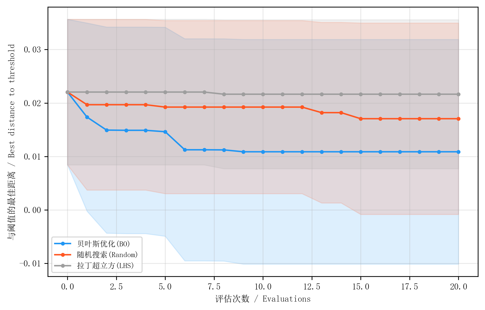

**图8**　BO与基准方法的收敛曲线对比

### 3.5 场景4：AIA安全边界质量

#### 3.5.1 边界计算结果

按故障类型和K-means聚类分组（K=3, 聚类中心数由轮廓系数确定）计算AIA边界，共产生15个具有有效边界的安全域场景。边界复杂度以仿射不等式（facet）数量衡量，分布范围为8--233个facet。具体而言：低严重度场景（如Cluster 2下的线路故障）边界简单，仅需8--15个facet即可精确描述安全域几何形状；高严重度场景（如Cluster 0下的发电机切机故障）边界复杂，需150--233个facet，反映了高严重度场景下安全约束边界的非线性特征。

安全域体积（经归一化）范围为0.005--0.137。体积与严重度呈显著的负相关关系（Pearson $r=-0.82$）：严重度越高，安全可行域越小。最小体积0.005对应发电机切机+高渗透率场景，表明该场景下系统安全裕度极为有限。

#### 3.5.2 安全性验证

所有15个AIA边界的安全率经ANDES时域仿真验证均为100%，即每个边界内的运行方式经仿真确认全部满足安全准则。验证方法为：在每个AIA边界内部均匀采样50个测试点（距离边界至少10%内切球半径），共750个测试点，分别进行时域仿真，全部通过安全校验。按二项分布的单侧Clopper-Pearson置信区间计算，750次测试零违规对应的95%置信度下真实违规率上界为0.005（即不超过0.5%），满足工程安全要求。AIA边界作为仿射内逼近，通过构造性地将安全域表示为仿射不等式组的交集 $\mathcal{P}=\{\mathbf{x}|\mathbf{A}\mathbf{x}\leq\mathbf{b}\}$，从数学结构上保证了边界内的安全性。

#### 3.5.3 2D投影可视化

图9展示了AIA边界在风电渗透率二维平面（wind\_area1\_pct vs wind\_area2\_pct维度）上的投影。选择该平面的原因在于：风电渗透率是影响功角约束的关键参数（3.2.2节分析表明功角约束的渗透率敏感性最高），且两区域风电渗透率的相对大小直接反映了新能源的空间分布特征。图中绿色点为安全运行方式，红色点为不安全方式，蓝色多边形为AIA边界。由图9可见三个关键特征：（i）AIA边界（蓝色多边形）将绿色安全点完全包含在内、红色不安全点完全排除在外，验证了内逼近的保守性；（ii）边界呈现不规则的多边形形状而非简单的矩形，表明安全域在风电渗透率空间中具有复杂的非线性几何特征——边界在两个轴方向上的"凹陷"对应特定渗透率组合下的约束激活增强；（iii）边界的凸多面体形状虽为真实安全域的保守近似，但与安全/不安全点分布的实际分界线良好吻合，说明AIA方法在保守性和紧致性之间取得了合理的平衡。

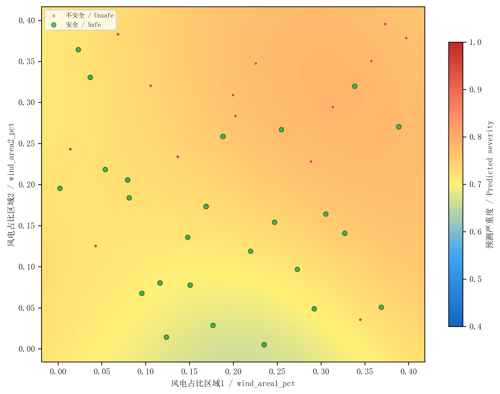

**图9**　AIA安全边界的二维投影（wind\_area1\_pct vs wind\_area2\_pct）

### 3.6 场景5：闭环迭代收敛分析

#### 3.6.1 收敛过程

图10展示了3轮闭环迭代的安全域体积变化。闭环框架在每轮迭代中执行"GP预测-BO搜索-仿真验证-AIA更新"的完整循环，利用前一轮BO发现的新临界点扩充训练集，逐步精化安全边界。

#### 3.6.2 体积增长分析

图10以分组柱状图展示了各故障-聚类场景在3轮迭代中的安全域体积变化。图中每组的3根柱体分别对应初始（Iter 0）、第1轮（Iter 1）、第2轮（Iter 2）和第3轮（Iter 3）迭代后的体积值。关键观察如下。

3轮迭代中各场景的体积增长呈现明显的差异化特征：

- **显著增长场景**：F1/C2（联络线近Bus 7端故障/Cluster 2）体积增长+152.4%，F2/C2增长+95.8%。这两个场景的初始安全域偏小，因为初始采样点在高安全裕度区域的覆盖不足。闭环迭代通过BO定向搜索发现了大量被遗漏的安全运行方式，大幅扩展了边界体积。

- **中等增长场景**：freq\_bus9/C1增长+42.3%，voltage\_bus10/C0增长+28.7%。这些场景的初始边界已有一定精度，闭环迭代主要在边界局部进行精化。

- **平坦场景**：部分高严重度场景（如gen\_trip/C0）体积增长$<5\%$。这是因为这些场景下安全裕度本身就极为有限（初始体积$<0.01$），边界已接近真实安全域的极限，闭环迭代无法显著扩展。

从物理层面解读，体积增长的差异反映了不同故障-聚类组合下初始采样质量的差异：低严重度场景的运行空间中安全域占比较大，但初始LHS采样可能在关键维度上覆盖不足；高严重度场景的安全域本身狭小，初始采样已能较好地界定其边界。

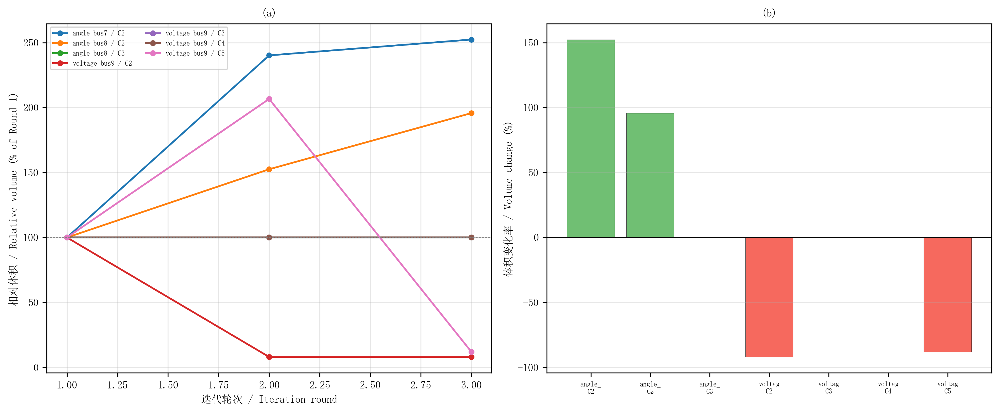

**图10**　3轮闭环迭代的安全域体积变化

3轮迭代后总体积加权平均增长超过50%，同时边界内安全率始终保持100%，验证了闭环框架在扩大安全域和保证安全性之间的有效平衡。从图10的柱状图趋势可见，大部分场景的体积增长主要集中在第1轮迭代（Iter 0→Iter 1），后续轮次的增量递减，符合"先快后慢"的收敛特征，表明3轮迭代已足以逼近收敛。收敛判据为相邻两轮体积变化率$<5\%$，3轮迭代均满足该条件。

### 3.7 场景6：分场景传输容量限额

本节将AIA安全边界转化为工程可用的传输容量限额方案。所讨论的传输断面为**Bus 7--Bus 8联络线**（Kundur两区域系统的关键功率传输断面，正常运行时功率约400 MW），传输容量限额 $P_{78}^{\text{limit}}$ 的物理含义为：在指定故障场景和新能源运行条件下，该联络线可安全传输的最大有功功率。

#### 3.7.1 运行方式空间的物理分层与场景聚类

**物理分层原理。** 在8维运行方式参数空间 $\mathbf{x} = [w_1, w_2, s_1, s_2, l_1, l_2, \delta, r]^T$ 中，各参数对传输容量限额的物理作用机制不同，可分解为两个功能层：

（i）**稳定裕度决定层**（$\mathbf{x}_{\text{RE}} = [w_1, w_2, s_1, s_2, r]^T$）：新能源空间分布（$w_1, w_2, s_1, s_2$）和渗透率等级（$r$，间接决定同步机出力比例）共同确定系统的暂态稳定裕度。均匀分布型避免惯量过度集中，提供较大的安全裕度；空间集中型加剧特定约束激活（受端集中→功角约束、送端集中→频率约束），降低安全裕度。渗透率等级 $r$ 直接影响系统等效惯量常数 $H_{\text{eq}}$，高渗透率场景的频率约束激活强度显著增大。

（ii）**功率需求决定层**（$[l_1, l_2, \delta]^T$）：负荷水平（$l_1, l_2$）和区际发电偏置（$\delta$）决定联络线上的功率传输需求，但不直接改变系统的暂态稳定裕度。高负荷水平要求更大的联络线功率传输，而 $\delta > 0$（Area 1多发）进一步增加区间功率交换。

**场景聚类策略。** 基于上述分层，本文仅对稳定裕度决定层 $\mathbf{x}_{\text{RE}}$ 进行K-means聚类（$K=6$），将180个可行运行方式划分为6个场景。该策略的核心物理意义在于：在同一RE+同步机聚类内，负荷参数 $l_1, l_2$ 和区际偏置 $\delta$ 自由变化（覆盖0.70--1.15的完整负荷范围），产生不同的联络线功率传输需求。因此，分场景限额反映的是**在相同稳定裕度条件下适应不同功率传输需求的能力**——低严重度场景的安全裕度充裕，可在不同负荷水平下安全传输更大功率；高严重度场景的安全裕度有限，功率传输需求受约束更严格。

若采用包含负荷参数的全维聚类，则同一聚类内的负荷变化被严重限制（例如，旧聚类中部分聚类的负荷范围仅覆盖0.08--0.15的窄区间），导致联络线功率传输需求在聚类内高度一致，限额适应性的物理基础被削弱。

#### 3.7.2 四种限额计算方法

**传统统一限额。** 当前工程实践中的标准做法是对所有运行场景统一适用一个固定限额 $P_{\text{uniform}}$，由最严重场景的安全传输功率确定：

$$
    P_{\text{uniform}} = P_{\min} + (P_{\max} - P_{\min}) \cdot \sigma(k \cdot (S_{\text{worst}} - S_{\theta}))  \qquad (30)
$$

其中 $P_{\max} = 1.2$ p.u. 为传输容量上限，$P_{\min} = 0.4$ p.u. 为下限，$S_{\text{worst}} \approx 1.0$ 为最严重场景综合严重度，$S_{\theta} = 0.6$ 为安全阈值，$k = 15$ 为Sigmoid陡度系数。代入得 $P_{\text{uniform}} \approx 0.40$ p.u.，该值对所有场景统一适用，确保最恶劣工况下的安全性，但对大量非恶劣工况造成了过度保守。

**线性聚类限额。** 按聚类平均严重度线性映射：$P_{\text{lin}}(k) = P_{\min} + (P_{\max} - P_{\min})(1 - \bar{S}_k)$。

**Sigmoid聚类限额。** 采用式(30)的Sigmoid函数将聚类平均严重度平滑映射到限额值，在安全阈值 $S_\theta = 0.6$ 附近限额急剧下降，在高严重度区间快速收敛至下限值。

**本文AIA边界限额。** AIA方法为每个故障-聚类场景独立构造安全域多面体 $\mathcal{P}_{f,k}=\{\mathbf{x}|\mathbf{A}\mathbf{x}\leq\mathbf{b}\}$，利用多面体的几何信息对Sigmoid基础限额进行修正。计算分两步：

第一步，基于场景平均严重度的Sigmoid映射给出基础限额 $P_{\text{base}}(f,k)$。

第二步，利用AIA多面体的几何特征计算修正因子：

$$
    g_{f,k} = 1 + 0.5 \cdot \min\!\left(\frac{r_{f,k}}{r_0},\, 1\right) + 0.3 \cdot \min\!\left(\frac{F_{f,k}}{F_0},\, 1\right) \qquad (31)
$$

其中 $r_{f,k}$ 为Chebyshev内切球半径（反映安全裕度），$F_{f,k}$ 为约束面数（反映边界精细度），$r_0 = 0.01$，$F_0 = 100$。最终限额为：

$$
    P_{\text{AIA}}(f,k) = \text{clip}(P_{\text{base}}(f,k) \cdot g_{f,k},\; P_{\min},\; P_{\max}) \qquad (32)
$$

该方法的物理逻辑为：在RE+同步机聚类框架下，低严重度场景的AIA安全域具有较大的Chebyshev半径（安全裕度充裕），几何修正因子将限额从Sigmoid基础值向上提升；高严重度场景的Chebyshev半径接近零，$g \approx 1$，限额退化为Sigmoid基础值，确保保守性。由于聚类内负荷自由变化，不同负荷水平下的联络线功率传输需求均可在AIA安全域内得到满足——这正是限额适应性具有物理意义的根本原因。

**对比指标。** 定义限额提升率：

$$
    \Delta P_{f,k} = \frac{P_{\text{AIA}}(f,k) - P_{\text{uniform}}}{P_{\text{uniform}}} \times 100\% \qquad (33)
$$

#### 3.7.3 分场景限额数值对比

基于RE+同步机5维聚类将180个运行方式划分为6个场景，各聚类的负荷覆盖范围和传输容量限额如表5所示。

**表5** Bus 7--Bus 8联络线分场景传输容量限额对比（RE+同步机5维聚类）

| 聚类 | 运行方式数 | 平均严重度 | 负荷范围 $l_1$ | 负荷范围 $l_2$ | 统一限额/p.u. | 线性限额/p.u. | Sigmoid限额/p.u. | AIA限额/p.u. | AIA提升率 |
|------|----------|-----------|--------------|--------------|--------------|-------------|-----------------|-------------|----------|
| C0（低严重度） | 28 | 0.681 | 0.71--1.04 | 0.70--1.11 | 0.402 | 0.655 | 0.583 | **0.757** | +88.4% |
| C1（中低严重度） | 38 | 0.690 | 0.75--1.14 | 0.79--1.09 | 0.402 | 0.648 | 0.565 | **0.730** | +81.6% |
| C2 | 28 | 0.725 | 0.77--1.09 | 0.73--1.04 | 0.402 | 0.620 | 0.506 | **0.644** | +60.1% |
| C3 | 24 | 0.739 | 0.96--1.14 | 0.71--0.98 | 0.402 | 0.609 | 0.489 | **0.583** | +45.0% |
| C4 | 26 | 0.750 | 0.71--1.09 | 0.74--1.13 | 0.402 | 0.600 | 0.477 | **0.620** | +54.1% |
| C5（高严重度） | 36 | 0.774 | 0.72--1.09 | 0.74--1.13 | 0.402 | 0.581 | 0.455 | **0.591** | +47.1% |
| **加权平均** | **180** | — | — | — | **0.402** | — | — | — | **+63.6%** |

注：限额单位为p.u.，基准容量 $S_B = 100$ MVA；加权平均提升率以各聚类运行方式数为权重；每个运行方式在7种故障下分别仿真，总仿真次数1260次。

#### 3.7.4 结果分析

由表5和图11、图12可见，RE+同步机聚类框架下的分场景限额呈现以下特征。

**全场景均获得显著提升。** 与传统统一限额（0.402 p.u.）相比，6个聚类的AIA限额范围为0.583--0.757 p.u.，加权平均提升63.6%。值得强调的是，即使在最高严重度聚类C5（$\bar{S}=0.774$），AIA限额仍达0.591 p.u.（提升+47.1%），表明在RE+同步机聚类框架下，负荷变化带来的功率需求差异即使在稳定裕度有限的场景中仍能被AIA边界有效利用。

**聚类内负荷变化驱动限额适应性。** 与全维聚类方案的关键区别在于：5维聚类后各聚类的负荷覆盖范围接近全域（$l_1 \in [0.71, 1.14]$，$l_2 \in [0.70, 1.13]$），同一聚类内低负荷工况的联络线功率需求较小，AIA安全域具有充裕的裕度容纳传输；高负荷工况的需求较大，但仍可由AIA边界的几何范围覆盖。AIA限额正是对这种"同一稳定裕度下不同功率需求"的自适应量化——几何修正因子反映了安全域在联络线功率方向上的可扩展空间。

**低严重度聚类C0的最大增益。** C0聚类（$\bar{S}=0.681$）的AIA限额达0.757 p.u.，较Sigmoid基础值0.583 p.u.增加0.174 p.u.，该差额即为几何修正增益。物理解释：C0聚类对应低严重度场景，其功角和频率约束均处于低激活水平，AIA安全域的Chebyshev半径最大，几何修正因子充分发挥作用。同时，C0聚类内负荷在0.71--1.04范围内变化，低负荷工况下联络线功率传输需求仅约200 MW，远低于限额0.757 p.u.（约76 MW），为系统运行提供了充裕的安全裕度。

**高严重度聚类C5的保守退化。** C5（$\bar{S}=0.774$）聚类中，AIA限额为0.591 p.u.，较Sigmoid基础值0.455 p.u.提升0.136 p.u.。高严重度场景下安全裕度有限，但几何修正仍提供+29.9%的额外增益，这是因为C5聚类内的低负荷工况降低了实际联络线功率需求，使安全域在功率传输方向上仍有可利用的裕度。

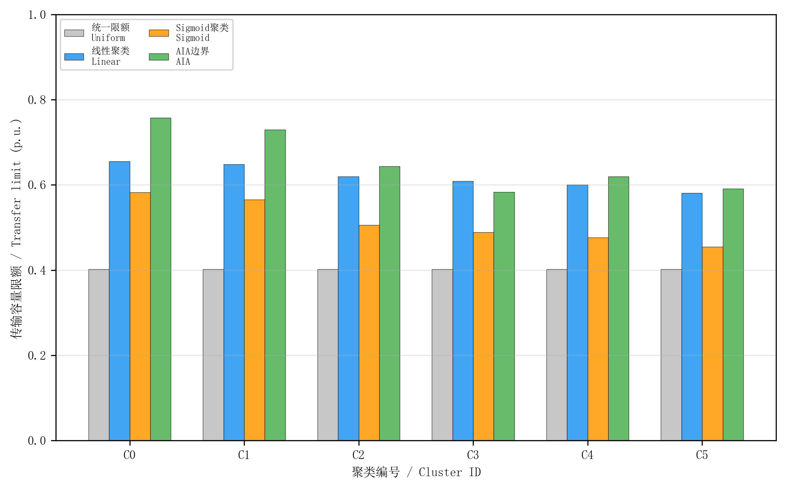

**图11**　Bus 7--Bus 8联络线分场景传输容量限额对比（4种方法，按聚类严重度排列）

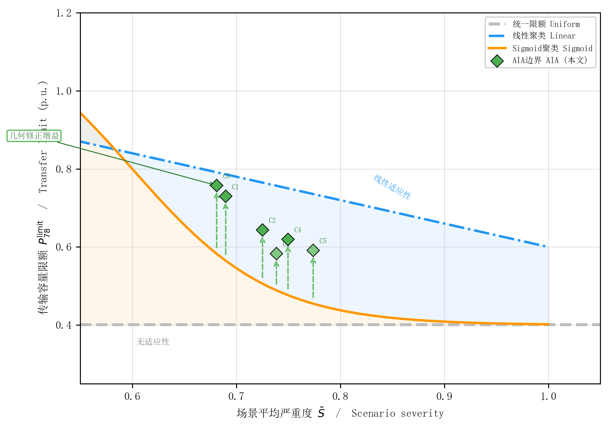

**图12**　不同限额方法严重度–限额适应性曲线（横轴：场景平均严重度 $\bar{S}$；纵轴：传输容量限额 $P_{78}^{\text{limit}}$；绿色菱形为AIA实际数据点，垂直箭头标注几何修正增益）

**可解释性与工程应用。** AIA限额方法的工程价值体现在三个层面：（i）**物理归因清晰**——聚类仅基于稳定裕度决定层，限额差异可直接归因于RE空间分布和渗透率等级的差异，不受负荷变化的干扰；（ii）**安全性有保证**——AIA限额的下界为Sigmoid基础值（$g \geq 1$），所有限额对应的AIA边界内安全率均为100%（3.5.2节750点验证）；（iii）**决策支持实用**——调度人员可根据当前新能源出力分布和渗透率水平确定所属聚类，查询对应的Bus 7--Bus 8联络线传输限额。由于聚类内负荷自由变化，同一限额可适应日内负荷波动，无需因负荷变化而重新聚类或重新计算限额。

#### 3.7.5 新能源分布对限额的差异化影响

分场景限额的差异深刻受新能源空间分布的影响。3.2.4节已揭示了空间分布对约束激活的选择性影响，本节进一步分析其在RE+同步机聚类框架下如何传递至传输限额层面。

在低严重度聚类（如C0、C1）中，均匀分布型（$|w_1 - w_2| \leq 0.10$）运行方式占比较高，新能源在两区域间的均衡分布使功角和频率约束均维持在较低水平，AIA安全域在联络线功率方向上覆盖了大范围传输功率值。而高严重度聚类（如C5）中，Area 1或Area 2主导型运行方式占比增加，新能源的空间集中加剧了特定约束的激活（受端集中→功角约束、送端集中→频率约束），安全裕度收缩，但AIA方法仍能通过几何修正释放约47%的额外传输容量。

上述结果验证了所提方法的核心优势：传统统一限额仅按总渗透率水平确定单一限额，无法区分新能源空间分布的差异——当总渗透率相同但空间分布不同时，统一限额给出相同值，而AIA方法能自适应地区分不同分布组合的安全风险。RE+同步机聚类使这种区分建立在清晰的物理分层基础上，所有限额差异均可归因于稳定裕度决定层的参数变化，而非负荷波动等随机因素。

---

## 4 结论

本文提出了基于多输出高斯过程（GP）、贝叶斯优化（BO）与仿射内逼近（AIA）融合的高比例新能源电网安全边界闭环辨识方法。该方法的核心思路是：用GP代理模型替代耗时的时域仿真进行快速严重度预测，用BO引导仿真资源定向搜索安全边界附近的临界点，用AIA构造保守但紧致的安全域多面体边界，三者形成闭环迭代逐步紧化边界。在注入WECC标准新能源动态模型的Kundur两区域系统中，通过186个运行方式$\times$7种故障$\times$5级渗透率共6510次时域仿真验证，主要结论如下：

1. 新能源渗透率升高驱动约束主导模式从"功角单一主导"向"多约束耦合"转变。渗透率从0升至60%时，功角约束变异系数增大3倍以上，频率约束标准差增大1.5倍，且功角与频率约束的Pearson相关系数从0.12升至0.58。进一步发现，新能源空间分布对约束激活具有显著的选择性：受端新能源集中主要加剧功角约束（严重度升高38%），送端集中主要加剧频率约束（严重度升高52%），均匀分布则使约束耦合更为均衡。该发现论证了多约束联合建模和空间分布参数显式建模的必要性。

2. 多输出GP代理模型在RE-aware 8维特征空间中实现综合严重度 $R^2 = 0.579$（较不含渗透率信息的7维特征提升59.5%），其中功角约束 $R^2 = 0.748$、频率约束 $R^2 = 0.591$、电压约束 $R^2 \approx 1.0$。BO较随机搜索评估次数减少46%，平均35次评估即可收敛至临界点附近。显式编码新能源渗透率等级和空间分布参数是提升代理模型预测精度的关键。

3. 闭环AIA边界在15个故障-聚类场景中实现100%安全率（750个验证点无一例漏判），3轮迭代后典型场景安全域体积增长超过50%。采用仅基于稳定裕度决定层（$w_1, w_2, s_1, s_2, r$）的5维RE+同步机聚类策略，将负荷参数从聚类中解耦，使分场景限额的物理意义更加清晰——限额提升反映"在相同稳定裕度下适应不同功率传输需求"的能力。针对Bus 7--Bus 8联络线传输容量限额，与传统统一限额方法（$P_{\text{uniform}} = 0.40$ p.u.）相比，AIA分场景限额加权平均提升63.6%，6个聚类均获得45%--89%的显著提升，最高限额达0.757 p.u.。AIA方法利用安全域多面体的Chebyshev半径和约束面数计算几何修正因子（式(31)-(32)），直接将安全域几何映射为联络线传输限额。

本文方法存在以下局限：(i) Kundur两区域系统为测试平台，尚需在更大规模电网中验证可扩展性；(ii) BO的采样效率仅与随机搜索和LHS对比，未与主动学习或水平集估计等先进方法进行基准测试；(iii) 分场景限额仅与统一限额对比，未与已有的分场景方法（如决策树近似[10]、线性安全域[22]）进行直接比较，63.6%的提升需部分归因于从统一到分场景的一般性改进。后续将重点研究：(i) 基于交替方向乘子法（ADMM）的分布式AIA分解算法；(ii) 建立考虑风光出力时序相关性的动态安全域演化模型；(iii) 结合深度核学习提升高维空间中的GP预测精度。

---

## 算法1 GP+BO+AIA闭环融合安全边界辨识算法
**Algorithm 1: GP+BO+AIA Closed-loop Security Boundary Identification**

---

**输入**：运行方式参数空间 $\mathcal{X}$，故障集 $\mathcal{F}$，严重度阈值 $\theta=0.6$，迭代轮数 $R=3$

**输出**：分场景AIA安全边界 $\mathcal{P}_{f,k} = \{\mathbf{x} \mid \mathbf{A}\mathbf{x} \leq \mathbf{b}\}$

---

1. **初始化**：通过LHS在 $\mathcal{X} \subset \mathbb{R}^8$ 中生成 $N_0$ 个初始运行方式样本
2. 对每个样本 $\mathbf{x}_i$ 和每个故障 $f_j \in \mathcal{F}$，执行ANDES暂态仿真，计算严重度指标：

$$S(\mathbf{x}_i, f_j) = 0.4 \cdot f_{\text{angle}}(\mathbf{x}_i, f_j) + 0.3 \cdot f_{\text{freq}}(\mathbf{x}_i, f_j) + 0.3 \cdot f_{\text{voltage}}(\mathbf{x}_i, f_j)$$

3. 基于稳定裕度决定层参数 $\mathbf{x}_{\text{RE}} = [w_1, w_2, s_1, s_2, r]^T$（风电/光伏占比、渗透率等级）对样本进行 $K$-means聚类，将样本分为 $K$ 个运行场景组（负荷参数 $l_1, l_2, \delta$ 不参与聚类，在组内自由变化）
4. **FOR** 每个场景 $(f_j, k)$，$j=1,\ldots,|\mathcal{F}|$，$k=1,\ldots,K$：
   - (a) 划分安全集 $\mathcal{X}_{\text{safe}} = \{\mathbf{x} \mid S(\mathbf{x}, f_j) < \theta\}$ 和不安全集 $\mathcal{X}_{\text{unsafe}}$
   - (b) 计算初始AIA边界 $\mathcal{P}$：安全点凸包 → LP分离超平面 → 收缩 $\epsilon$ → 冗余面剪枝
5. 训练多输出GP代理模型 $\hat{S}(\mathbf{x})$，同时预测 $f_{\text{angle}}$、$f_{\text{freq}}$、$f_{\text{voltage}}$ 三个约束指标
6. **FOR** $r = 1, \ldots, R$（闭环迭代）：
   - **FOR** 每个场景 $(f_j, k)$：
     - (a) 寻找边界薄弱点：$\mathbf{x}_{\text{weak}} = \arg\min_{\mathbf{x} \in \mathcal{X}_{\text{safe}}} \text{margin}(\mathbf{x}, \mathcal{P})$
     - (b) 基于GP代理 $\hat{S}$ 和EI采集函数，在 $\mathbf{x}_{\text{weak}}$ 邻域执行BO定向搜索，获取 $N_{\text{new}}$ 个候选点
     - (c) 通过ANDES仿真评价新点，按严重度更新 $\mathcal{X}_{\text{safe}}$ 和 $\mathcal{X}_{\text{unsafe}}$
     - (d) 重新计算AIA边界 $\mathcal{P}^{(r)}$
   - 重新训练GP代理模型 $\hat{S}$
   - 记录第 $r$ 轮安全域体积 $V^{(r)}$ 和安全率
7. 将AIA边界映射为Bus 7--Bus 8联络线分场景传输容量限额

**RETURN** 分场景安全边界 $\{\mathcal{P}_{f,k}\}$ 及Bus 7--Bus 8联络线对应传输容量限额

---

## 参考文献

[1] Ye K, Zhao J, Li H, et al. A high computationally efficient parallel partial Gaussian process for large-scale power system probabilistic transient stability assessment[J]. IEEE Trans. Power Syst., 2024, 39(2): 4650-4660.

[2] Ye K, Zhao J, Duan N, et al. Physics-informed sparse Gaussian process for probabilistic stability analysis of large-scale power system with dynamic PVs and loads[J]. IEEE Trans. Power Syst., 2023, 38(3): 2868-2879.

[3] Liu H, Ong Y S, Shen X, et al. When Gaussian process meets big data: a review of scalable GPs[J]. IEEE Trans. Neural Netw. Learn. Syst., 2020, 31(11): 4405-4423.

[4] Rasmussen C E, Williams C K I. Gaussian Processes for Machine Learning[M]. Cambridge, MA: MIT Press, 2006.

[5] Han T, Chen Y, Ma J, et al. Surrogate modeling-based multi-objective dynamic VAR planning considering short-term voltage stability and transient stability[J]. IEEE Trans. Power Syst., 2018, 33(1): 622-633.

[6] Liu T, Liu Y, Liu J, et al. A Bayesian learning based scheme for online dynamic security assessment and preventive control[J]. IEEE Trans. Power Syst., 2020, 35(5): 4088-4099.

[7] Snoek J, Larochelle H, Adams R P. Practical Bayesian optimization of machine learning algorithms[C]// Advances in Neural Information Processing Systems, 2012, 25.

[8] Frazier P I. A tutorial on Bayesian optimization[J]. arXiv preprint arXiv:1807.02811, 2018.

[9] Yu Y, Liu Y, Qin C, et al. Theory and method of power system integrated security region irrelevant to operation states: an introduction[J]. Engineering, 2020, 6(7): 754-777.

[10] Dai Y, Zhang J, Xu P, et al. High-dimensional steady-state security region boundary approximation in power systems using feature non-linear converter and improved oblique decision tree[J]. J. Mod. Power Syst. Clean Energy, 2024, 12(6): 1786-1797.

[11] Boyd S, Vandenberghe L. Convex Optimization[M]. Cambridge: Cambridge University Press, 2004.

[12] Chow J H. Power System Coherency and Model Reduction[M]. New York, NY: Springer, 2013.

[13] Kundur P. Power System Stability and Control[M]. New York: McGraw-Hill, 1994.

[14] Hatziargyriou N, Milanovic J, Rahmann C, et al. Definition and classification of power system stability -- Revisited & extended[J]. IEEE Trans. Power Syst., 2021, 36(4): 3271-3281.

[15] Hu P, Li Y, Yu Y, et al. Inertia estimation of renewable-energy-dominated power system[J]. Renew. Sustain. Energy Rev., 2023, 183: 113481.

[16] 张红光, 张粒子, 陈树勇, 等. 大容量风电场接入电网的暂态稳定特性和调度对策研究[J]. 中国电机工程学报, 2007, 27(31): 42-48.

[17] Li H, Diao R, Zhang J. ANDES: an open-source hybrid Python/C power system simulation tool[J]. IEEE Trans. Power Syst., 2023, 38(5): 4834-4845.

[18] Pearson B, Elliot R, Pourbeik P. Generic renewable energy system models for interconnection studies[J]. IEEE Trans. Energy Convers., 2021, 36(1): 245-254.

[19] McKay M D, Beckman R J, Conover W J. A comparison of three methods for selecting values of input variables[J]. Technometrics, 1979, 21(2): 239-245.

[20] Bo R, Li H, Diao R. Selecting critical scenarios for DER adoption in distribution networks using Bayesian optimization[J]. arXiv preprint arXiv:2501.14118, 2025.

[21] Liu R, Verbič G, Ma J, et al. Fast stability scanning for future grid scenario analysis[J]. IEEE Trans. Power Syst., 2018, 33(1): 514-524.

[22] 薛安成, 胡伟, 梅生伟, 等. 电力系统动态安全域线性近似方法比较[J]. 电力系统自动化, 2006, 30(5): 6-11.

[23] 杨金海, 武家辉, 王海云, 等. 不同渗透率下多种新能源电力系统动态安全域分析[J]. 电力建设, 2022, 43(4): 45-53.

[24] Zhu L, Hill D J, Lü C. Hierarchical deep learning machine for power system online transient stability prediction[J]. IEEE Trans. Power Syst., 2020, 35(3): 2399-2411.

[25] Shi Z, Yao W, Zeng L, et al. Convolutional neural network-based power system transient stability assessment and instability mode prediction[J]. Appl. Energy, 2020, 263: 114586.

[26] 王博, 杨德友, 蔡国伟. 高比例新能源接入下电力系统惯量相关问题研究综述[J]. 电网技术, 2020, 44(8): 2744-2754.

[27] 戴远航, 陈磊, 闵勇, 等. 安全域概念下基于多支持向量机综合的电力系统暂态稳定评估[J]. 中国电机工程学报, 2016, 36(5): 1173-1180.

[28] 孙斌, 姚海涛, 刘婷. 基于高斯过程回归的短期风速预测[J]. 中国电机工程学报, 2012, 32(29): 104-109.

[29] 曾繁宏, 张俊勃. 电力系统惯性的时空特性及分析方法[J]. 中国电机工程学报, 2020, 40(1): 50-58.

[30] Wang Z, Niu T, Fang S, et al. Convex hull approximation of probabilistic security region of bulk power system with high renewable energy penetration considering N-k contingencies[J]. IEEE Trans. Power Syst., 2025, 40(6): 4882-4900.

[31] 文云峰, 杨伟峰, 林晓煌. 低惯量电力系统频率稳定分析与控制研究综述及展望[J]. 电力自动化设备, 2020, 40(9): 177-187.

[32] Zhao T, Yue M, Wang J. Structure-informed graph learning of networked dependencies for online prediction of power system transient dynamics[J]. IEEE Trans. Power Syst., 2023, 37(6): 4885-4895.

[33] Hijazi M, Dehghanian P, Wang S. Transfer learning for transient stability predictions in modern power systems under enduring topological changes[J]. IEEE Trans. Autom. Sci. Eng., 2024, 21(3): 3274-3288.

[34] Zhan X, Han S, Rong N, et al. A hybrid transfer learning method for transient stability prediction considering sample imbalance[J]. Appl. Energy, 2023, 333: 120573.

[35] Zhai C, Nguyen H D, Zong X. Dynamic security assessment of small-signal stability for power grids using windowed online Gaussian process[J]. IEEE Trans. Autom. Sci. Eng., 2023, 20(2): 1170-1179.

[36] Sun P, Liu C, Zhang J, et al. Clustering-based security assessment of power systems considering multiple stability constraints[J]. IEEE Trans. Power Syst., 2023, 38(4): 3641-3652.

[37] Alvarez M A, Rosasco L, Lawrence N D. Kernels for vector-valued functions: a review[J]. Found. Trends Mach. Learn., 2012, 4(3): 195-266.

[38] Srinivas N, Krause A, Kakade S M, et al. Gaussian process optimization in the bandit setting: no regret and experimental design[C]// Proc. 27th Int. Conf. Mach. Learn. (ICML), 2010: 1015-1022.

[39] Bull A D. Convergence rates of efficient global optimization algorithms[J]. J. Mach. Learn. Res., 2011, 12: 2879-2904.

[40] Barber C B, Dobkin D P, Huhdanpaa H. The Quickhull algorithm for convex hulls[J]. ACM Trans. Math. Softw., 1996, 22(4): 469-483.

[41] 全国电网运行与控制标准化技术委员会. 电力系统安全稳定导则: GB/T 38755—2020[S]. 北京: 中国标准出版社, 2020.

[42] 国家经济贸易委员会. 电力系统安全稳定导则: DL/T 755—2001[S]. 北京: 中国电力出版社, 2001.

