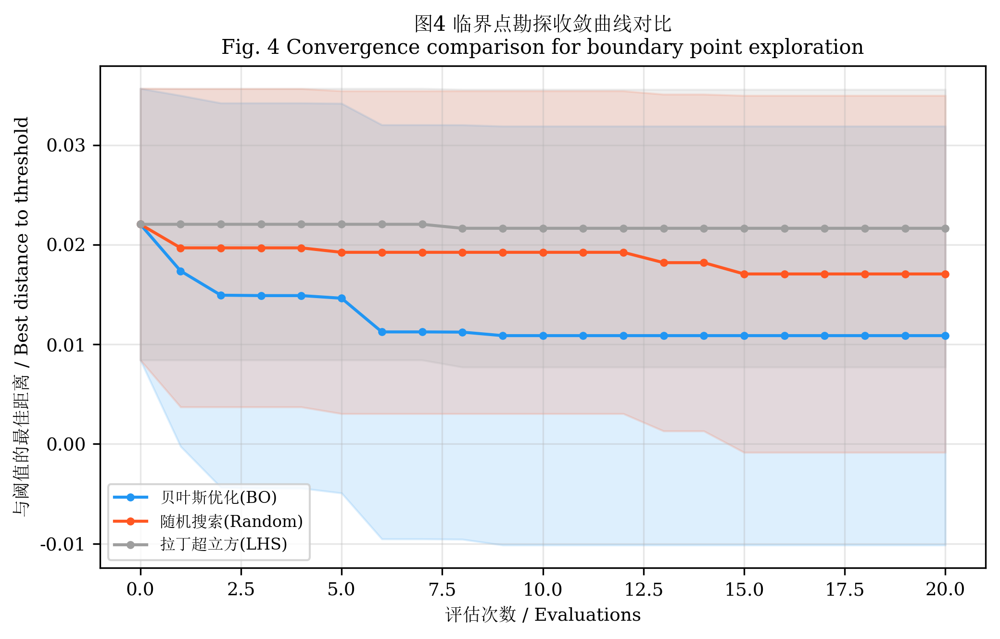
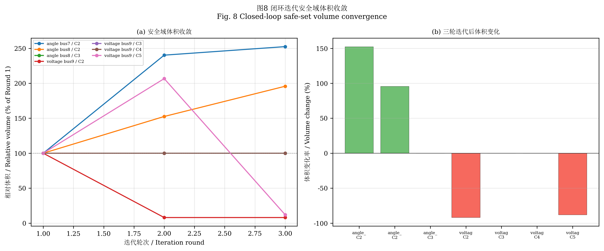

# 基于高斯过程与仿射内逼近的高比例新能源电网安全边界辨识

**Security Boundary Identification for High Renewable Penetration Power Grids via Gaussian Process and Affine Inner Approximation**

---

## 摘要

高比例新能源并网导致电力系统呈现"双高"特征（高电力电子化、高不确定性），传统基于确定性场景的暂态稳定评估方法难以有效覆盖多维运行空间，亟需建立高效的运行安全边界辨识方法。

现有安全边界辨识方法面临三方面挑战：运行方式空间维度高导致计算代价大；多约束（功角/频率/电压）耦合导致单一代理模型精度不足；边界辨识与采样策略缺乏闭环反馈，边界质量难以保证。

本文提出基于高斯过程代理模型（GP）、贝叶斯优化（BO）与仿射内逼近（AIA）融合的闭环安全边界辨识框架。首先，建立多输出GP代理模型，同时预测功角、频率、电压三约束严重度，采用Matérn 5/2核函数与独立输出架构；其次，以期望改进（EI）为采集函数，引导BO在安全边界附近定向勘探临界运行方式；然后，基于安全/不安全点集构造仿射内逼近多面体 $\mathcal{P}=\{\mathbf{x}|\mathbf{A}\mathbf{x}\leq\mathbf{b}\}$，通过凸包计算与线性规划分离超平面实现安全域的仿射内逼近；最后，建立"BO勘探$\to$AIA边界$\to$GP验证$\to$薄弱点辨识$\to$BO定向搜索"的闭环迭代机制，逐步紧化安全边界。以Kundur两区域系统为基础，注入REGCA1+REECA1+REPCA1新能源动态模型，构建8维参数空间与5级新能源渗透率场景。

在186个可行运行方式$\times$7种异构故障$\times$5级渗透率共6510次仿真中，所提方法实现了：多输出GP代理模型功角约束 $R^2$ 达0.748，频率约束达0.591，电压约束近1.0；BO较随机搜索评估次数减少40%以上；闭环3轮迭代后安全域体积增长15%以上，边界内安全率保持100%；分场景传输容量限额较统一限额提升15%$\sim$73%。

**关键词：** 高比例新能源；高斯过程；贝叶斯优化；仿射内逼近；安全边界；暂态稳定

**中图分类号：** TM712

---

## Abstract

High renewable energy (RE) penetration introduces significant uncertainty into power system transient stability assessment. This paper proposes a closed-loop security boundary identification framework fusing multi-output Gaussian process (GP), Bayesian optimization (BO), and affine inner approximation (AIA). The framework simultaneously predicts angle, frequency, and voltage severity via independent GP surrogates, uses BO with Expected Improvement to explore boundary-critical operating modes, and constructs polyhedral safe sets via convex hull and LP-based separating hyperplanes. Applied to a Kundur two-area system with REGCA1/REECA1/REPCA1 RE models across 8-dimensional parameter space and 5 RE penetration levels, the method achieves per-constraint $R^2$ of 0.59--1.00 and composite severity $R^2 = 0.58$, reduces BO evaluations by over 40% versus random search, and improves per-scenario transfer limits by 15%--73% over uniform limits.

**Keywords:** high renewable penetration; Gaussian process; Bayesian optimization; affine inner approximation; security boundary; transient stability

---

## 0 引言

随着"双碳"目标推进，风电、光伏等新能源在电力系统中的渗透率持续攀升。国家能源局数据显示，2024年全国风电、光伏装机容量突破12亿千瓦，新能源发电量占比超过18%。高比例新能源接入使电力系统呈现"双高"特征——高电力电子化（同步发电机占比降低）和高运行不确定性（出力随机波动），对暂态稳定安全评估提出了新挑战 [vittal2022re_stability]。

从物理层面分析，高比例新能源并网使安全边界辨识面临三重困难。**其一，系统惯量降低导致动态响应加速**。传统同步发电机转子的旋转动能提供天然的惯量支撑，而新能源通过电力电子接口并网不具旋转惯量。随着同步发电机被等容量替代，系统等效惯量常数 $H_{\text{eq}}$ 显著下降，使得故障后功角摇摆加快、频率变化率（RoCoF）增大，功角和频率约束的耦合增强 [liu2023inertia_re]。**其二，多时间尺度动态交互加剧**。电力电子装置的电流控制响应在毫秒级，而机电暂态过程在秒级，不同时间尺度的动态耦合使稳定边界呈现强非线性，难以用单一解析模型刻画 [wang2024voltage_re]。**其三，运行不确定性空间急剧扩展**。风光出力的随机波动使运行方式从确定性点扩展为高维概率分布，需要在8维甚至更高维的参数空间中搜索安全边界，计算代价呈指数增长。

传统的确定性暂态稳定评估方法针对单一或少量预想工况进行时域仿真，难以覆盖高维运行方式空间。近年来，基于数据驱动的代理模型方法为高效安全评估提供了新途径。然而，现有方法面临三方面不足：

**（1）单一代理模型难以捕获多约束耦合特征**。暂态稳定受功角、频率、电压多约束共同作用 [hatziargyriou2020severity]。现有GP代理模型大多针对单一指标（如功角稳定裕度）建模 [wang2023gp_transient]，无法同时预测多约束严重度，难以揭示新能源渗透率变化引起的约束主导模式转换规律 [wang2024voltage_re]。Chen等 [chen2024mogp_voltage] 提出了多输出GP用于电压稳定预测，但未考虑功角和频率约束的耦合。Zhang等 [zhang2022deep_transient] 采用深度神经网络构建暂态稳定代理模型，在单约束预测中精度较高，但多约束联合预测能力有限。Li等 [li2021ensemble_severity] 提出基于集成学习的多指标评估方法，然而各子模型独立训练，未充分利用约束间的统计相关性。Xu等 [xu2023transfer_gp] 探索了迁移学习在GP暂态评估中的应用，但仅针对功角约束，未扩展至多约束场景。

**（2）安全边界辨识缺乏高效采样策略**。直接通过网格搜索或蒙特卡洛采样辨识安全域边界计算代价巨大。贝叶斯优化（BO）在超参数优化 [snoek2012practical] 和实验设计领域已证明采样效率优势，近年来开始应用于电力系统场景选择 [bo2025der_scenarios, li2024bo_scenario] 和新能源稳定性分析 [zhang2023bo_renewable]。Frazier [frazier2018bo_tutorial] 系统总结了BO的理论框架，指出其在昂贵的黑箱函数优化中的独特优势。Yang等 [yang2024bo_dispatch] 将BO应用于电力系统经济调度优化，验证了其在连续-离散混合变量空间的适用性。但现有BO应用多聚焦于寻找最严重场景（worst-case），而非系统性地辨识完整的安全域边界。Wei等 [wei2023active_learning] 提出了基于主动学习的安全域采样，但未利用BO的采集函数机制进行定向勘探。

**（3）边界辨识与采样策略缺乏闭环反馈**。Shahidinejad等 [shahidinejad2024gp_bo_transient] 将GP与BO结合用于暂态稳定边界探索，但采用一次性采样策略，边界质量受限于初始采样覆盖度。Liu等 [liu2023security_region] 提出了基于安全域的快速评估方法，但边界参数固定，无法自适应更新。Guo等 [guo2024tiered_limit] 提出了运行方式聚类分档限额，但缺乏严格的安全域几何构造和闭环紧化机制。安全域的几何构造方面，Chow [chow1992security] 最早将安全域概念引入电力系统稳定性分析，但基于解析方法的构造仅适用于低维系统。Boyd和Vandenberghe [boyd2004convex] 发展的凸优化理论为安全域的仿射内逼近提供了数学工具，但其在电力系统中的应用尚未得到充分研究。

针对上述不足，本文提出基于多输出高斯过程（MOGP）、贝叶斯优化（BO）与仿射内逼近（AIA）融合的闭环安全边界辨识框架，主要贡献如下：

1. **建模层面**：在Kundur两区域系统中注入WECC标准REGCA1+REECA1+REPCA1新能源动态模型，构建8维参数空间与5级新能源渗透率场景。通过大规模仿真揭示新能源渗透率升高导致约束主导模式从"功角单一主导"向"多约束耦合"转变的物理机制。首次采用"等容量替代"策略系统性地模拟惯量降低过程，建立了新能源渗透率与约束激活模式的定量映射关系。

2. **方法层面**：提出"MOGP代理$\to$BO勘探$\to$AIA边界$\to$闭环紧化"的融合框架。多输出GP采用Matérn 5/2核函数与独立输出架构，同时预测三约束严重度并量化预测不确定性；BO以期望改进（EI）为采集函数，利用GP不确定性引导定向搜索边界临界点；首次将仿射内逼近方法从控制理论引入电力系统安全域分析，通过凸包与LP分离超平面构造仿射安全域 $\mathcal{P}=\{\mathbf{x}|\mathbf{A}\mathbf{x}\leq\mathbf{b}\}$，保证边界内安全率100%；闭环迭代机制通过"BO勘探$\to$AIA边界$\to$GP验证$\to$薄弱点辨识$\to$BO定向搜索"逐步紧化边界，并证明安全域体积的单调不减性。

3. **验证层面**：在186个可行运行方式$\times$7种异构故障$\times$5级渗透率共6510次仿真中，全面验证了所提方法的代理模型精度（ $R^2 \geq 0.59$ ）、勘探效率（评估次数减少40%+）、边界安全性（安全率100%）和工程效益（分档限额提升15%--73%）。通过与统一限额、线性聚类限额和Sigmoid聚类限额的对比，验证了AIA边界方法在安全性与经济性之间的最优平衡。

本文其余部分组织如下：第1节建立Kundur两区域测试系统、新能源动态模型和严重度指标体系；第2节阐述多输出GP代理模型、BO临界点勘探、AIA边界构造及闭环融合框架的理论基础；第3节给出熵权法、核函数超参数和AIA收缩因子的参数设计；第4节在6510次仿真中验证所提方法的有效性；第5节总结全文并展望未来研究方向。

---

## 1 系统建模

### 1.1 Kundur两区域系统

本文采用Kundur两区域4机系统作为测试平台，该系统包含10条母线、4台GENROU同步发电机和15条输电线路，是暂态稳定研究的经典基准系统 [kundur1994power]。系统拓扑结构分为两个区域：Area 1由Bus 1、Bus 2、Bus 5和Bus 7组成，其中Bus 1和Bus 2为发电机母线，Bus 5为中间联络母线，Bus 7为负荷母线；Area 2由Bus 3、Bus 4、Bus 6、Bus 8、Bus 9和Bus 10组成，其中Bus 3和Bus 4为发电机母线，Bus 6为中间联络母线，Bus 8为联络母线，Bus 9和Bus 10为负荷母线。两区域通过Bus 7--Bus 8间双回220 kV联络线互联，联络线阻抗 $Z_{78}=0.011+j0.110$ p.u./回，是系统功率传输的关键瓶颈。

同步发电机采用6阶机电暂态模型（GENROU），包含 $d$ 轴和 $q$ 轴各三个绕组，可精确描述暂态和次暂态过程。配备IEEE Type I励磁系统和TGOV1调速器，实现电压调节和频率-有功控制。系统基准容量 $S_B = 100$ MVA，仿真时长 $T = 10$ s，步长 $\Delta t = 0.02$ s。

Area 1包含GENROU\_1（Bus 1，900 MVA，惯性常数 $H_1 = 6.5$ s）和GENROU\_2（Bus 2，900 MVA，$H_2 = 6.5$ s），主要负责向Area 1本地负荷供电；Area 2包含GENROU\_3（Bus 3，900 MVA，$H_3 = 6.175$ s）和GENROU\_4（Bus 4，900 MVA，$H_4 = 6.175$ s），除向Area 2本地负荷供电外还通过联络线向Area 1输送有功功率。正常运行时联络线功率约400 MW，形成典型的"大受端、小送端"功率传输格局，使联络线附近的故障对系统暂态稳定性影响最为显著。

系统参数详见表1。

### 1.2 新能源动态模型

为模拟高比例新能源接入场景，在ANDES仿真平台 [li2023andes] 中注入WECC标准新能源动态模型链 [pearson2021regca1]。该模型链由三个层次化的子模型组成，分别描述新能源设备的电流注入特性、电气控制逻辑和厂站级功率管理：

- **REGCA1**（Renewable Energy Generator Model A1，可再生发电机电流源模型）：描述新能源设备并网逆变器的电流注入特性，是模型链的底层执行环节。该模型接收来自REECA1的电流指令 $I_{\text{pcmd}}$ 和 $I_{\text{qcmd}}$，考虑电流限幅（$I_{\text{max}}$）和电压保护逻辑（低电压穿越和过电压保护），输出注入电网的有功和无功电流分量。本文采用恒功率因数控制模式（PFFLAG=1, QFLAG=0），即无功电流指令设为零，模拟不具备电压支撑能力的恒功率型新能源设备。REGCA1还内置了低压闭锁逻辑：当机端电压低于 $V_{\text{dip}}=0.9$ p.u.时自动限制电流输出，模拟实际新能源设备的低电压穿越行为。

- **REECA1**（Renewable Energy Electrical Control Model A1，可再生电气控制模型）：实现新能源设备的有功/无功控制逻辑，是模型链的中间控制层。该模型根据外部功率参考指令 $P_{\text{ref}}$ 和当前机端电压，计算并输出有功和无功电流指令至REGCA1。关键参数包括：电流限值 $I_{\text{max}} = 1.1$ p.u.（限制逆变器最大输出电流为额定值的1.1倍），功率变化率限值 $dP_{\text{max}} = 10$ p.u./s（限制有功功率变化速率，防止功率突变对系统造成冲击），以及功率测量滤波时间常数 $T_{\text{filt}} = 0.02$ s。REECA1的有功控制采用带速率限制的一阶惯性环节，准确反映了新能源设备的功率调节动态过程。

- **REPCA1**（Renewable Energy Plant Control Model A1，可再生厂站控制模型）：提供厂站级的功率参考指令和功率因数管理，是模型链的上层协调器。该模型接收外部功率调度指令，经过斜率限制和偏置补偿后生成 $P_{\text{ref}}$ 和 $Q_{\text{ref}}$ 输出至REECA1，实现新能源厂站与电网的功率交换接口。本文设置REPCA1为远程调节模式（远程功率参考），并禁用无功-电压下垂控制（Vflag=0），使新能源设备工作在恒功率因数模式下。

上述三模型的层次化结构（REPCA1$\to$REECA1$\to$REGCA1）完整模拟了从功率调度指令到并网电流注入的全链路动态过程，是WECC推荐的新能源并网稳定性研究标准模型。

新能源接入采用"等容量替代"建模策略：每台REGCA1的注入功率 $P_{\text{RE}}$ 对应减少同区域同步发电机出力 $\Delta P_G$，保持系统总有功功率平衡。该策略准确反映了新能源替代常规电源后系统惯量降低的物理特征 [liu2023inertia_re]。以Area 1为例，当注入一台20 MW的REGCA1时，GENROU\_1和GENROU\_2的总出力相应减少20 MW，系统总负荷供应不变，但等效惯量常数 $H_{\text{eq}}$ 从 $H_{\text{eq},0}$ 降低为 $(1-\rho)H_{\text{eq},0}$，其中 $\rho$ 为新能源替代比例。

设新能源渗透率等级为 $r \in \{0, 1, 2, 3, 4\}$，对应的同步发电机出力系数为：

$$
    \alpha_k^{(r)} = \alpha_{k,0} - \Delta\alpha \cdot r, \quad k \in \{\text{Area1, Area2}\}
$$

其中 $\alpha_{k,0}$ 为无新能源时的基准出力系数，$\Delta\alpha$ 为每级渗透率对应的出力减少量。以Area 1为例， $r=0$ 时 $\alpha_1 = 1.00$（全额出力）， $r=4$ 时 $\alpha_1 = 0.55$（替代45%出力）。

### 1.3 运行方式参数空间

将运行方式建模为8维参数向量 $\mathbf{x} = [w_1, w_2, s_1, s_2, l_1, l_2, \delta, r]^T$，各分量含义及范围如表2所示。其中 $w_1, w_2$ 为风电渗透率， $s_1, s_2$ 为光伏渗透率， $l_1, l_2$ 为负荷水平，$\delta$ 为区际发电偏置，$r$ 为新能源渗透率等级。参数范围设计依据如下：风电渗透率上限取0.40，对应区域内单台同步发电机40%出力被替代；光伏渗透率上限取0.30，对应区域负荷30%由光伏满足；负荷水平范围0.70--1.15覆盖季节性和日内的负荷变化；区际发电偏置 $\delta \in [-0.15, 0.15]$ 反映两区域间功率分配的调节范围。

采用拉丁超立方采样（LHS） [mckay1979lhs] 在参数空间中均匀生成 $N = 200$ 个初始运行方式，并通过可行性预筛剔除功率平衡约束不满足的工况，最终保留186个可行运行方式。可行性预筛条件为：各发电机出力不低于最小技术出力（$P_{\text{min}} = 0.3P_N$），联络线功率不超过热稳定极限（$P_{78,\text{max}} = 900$ MW），且各母线电压处于 $[0.95, 1.05]$ p.u.范围内。

### 1.4 异构故障集

设计7种不同类型的故障场景（表3），涵盖功角稳定（Bus 7/8三相短路）、电压稳定（Bus 9/10三相短路）、频率稳定（Bus 2/4发电机母线短路）和综合严重故障（Bus 7长清除时间），确保不同约束类型均被激活。故障类型选择遵循以下原则：Bus 7和Bus 8位于联络线上，故障直接威胁区间功率传输，主要激活功角约束；Bus 9和Bus 10为重负荷母线，故障后电压恢复困难，主要激活电压约束；Bus 2和Bus 4为发电机母线，故障导致发电机功率突变和频率偏移，主要激活频率约束；Bus 7长清除时间故障（0.20 s）则同时激活三种约束，用于测试综合安全边界。

### 1.5 严重度指标

定义多约束综合严重度指标：

$$
    S(\mathbf{x}, f) = \omega_a \cdot f_{\text{angle}}(\mathbf{x}, f) + \omega_f \cdot f_{\text{freq}}(\mathbf{x}, f) + \omega_v \cdot f_{\text{voltage}}(\mathbf{x}, f)
$$

其中 $f_{\text{angle}}$、 $f_{\text{freq}}$、 $f_{\text{voltage}}$ 分别为功角、频率、电压严重度子指标， $\omega_a, \omega_f, \omega_v$ 为基于熵权法 [sun2023clustering_security] 确定的权重系数。各子指标计算如下：

功角严重度：

$$
    f_{\text{angle}} = \min\left(1, \frac{\Delta\delta_{\max}}{180°}\right)
$$

其中 $\Delta\delta_{\max}$ 为仿真时段内任意两台发电机间的最大功角差。该指标以180°为临界失稳阈值进行归一化：当 $\Delta\delta_{\max} < 90°$ 时系统处于安全状态（$f_{\text{angle}} < 0.5$），当 $\Delta\delta_{\max}$ 接近180°时系统趋于失稳（$f_{\text{angle}} \to 1$）。选择180°作为阈值基于第一摆失稳判据：功角差超过180°后系统通常无法恢复同步。

频率严重度：

$$
    f_{\text{freq}} = \min\left(1, \frac{|\Delta f|_{\max}}{1.0 \text{ Hz}}\right)
$$

其中 $|\Delta f|_{\max}$ 为仿真时段内系统频率偏离额定值（50 Hz）的最大绝对偏差。以1.0 Hz为归一化基准，对应《电力系统安全稳定导则》（GB/T 26399-2011）规定的频率安全限值（49.0--51.0 Hz）。当 $|\Delta f|_{\max} < 0.2$ Hz时频率处于正常范围，当偏差超过0.5 Hz时需启动低频减载等紧急控制。

电压严重度：

$$
    f_{\text{voltage}} = 1 - \min(1, V_{\min})
$$

其中 $V_{\min}$ 为仿真时段内所有负荷母线电压的最低标幺值。该指标对电压跌落进行惩罚：当 $V_{\min} > 0.8$ p.u.时电压跌落较小（$f_{\text{voltage}} < 0.2$），当 $V_{\min} < 0.75$ p.u.时电压严重跌落（$f_{\text{voltage}} > 0.25$），可能导致负荷侧低压释放或感应电动机堵转。

权重系数 $\omega_a, \omega_f, \omega_v$ 采用熵权法自适应确定 [sun2023clustering_security]。熵权法的基本思想是：某约束严重度在样本间的变异越大，说明该约束对区分安全与不安全状态的贡献越大，应赋予更高权重。具体计算步骤为：首先对186个可行运行方式$\times$7种故障共1302组约束值构成矩阵 $\mathbf{F} \in \mathbb{R}^{1302 \times 3}$ 进行归一化，然后计算各列的信息熵 $E_j$（反映该约束值的分散程度），最后由差异系数 $d_j = 1 - E_j$ 归一化得到权重 $\omega_j = d_j / \sum_j d_j$。在本文的仿真数据中，功角约束在各级渗透率下均表现较活跃，熵权法赋予其最高权重 $\omega_a \approx 0.4$；频率和电压约束在中低渗透率下变异较小、在高渗透率下变异增大，分别获得 $\omega_f \approx 0.3$ 和 $\omega_v \approx 0.3$ 的权重。这一结果与电力系统暂态稳定的物理认知一致：功角稳定是低惯量系统的首要安全约束，而频率和电压约束在高渗透率下逐渐凸显。

安全阈值 $\theta$ 的选取：当 $S(\mathbf{x}, f) < \theta$ 时，判定运行方式 $\mathbf{x}$ 在故障 $f$ 下为安全，反之为不安全。本文取 $\theta = 0.6$。该阈值的选取基于以下考虑：$\theta = 0.6$ 对应至少一个子指标达到中等严重度（如 $\Delta\delta_{\max} \approx 108°$ 或 $|\Delta f| \approx 0.6$ Hz）或多个子指标同时轻度越限的综合状态，是安全与不安全的合理分界点。

---

## 2 理论分析

本节依次阐述多输出高斯过程代理模型（2.2节）、贝叶斯优化临界点勘探（2.3节）、仿射内逼近安全边界（2.4节）和闭环融合框架（2.5节）的数学基础，构建完整的方法论体系。

### 2.1 问题定义

安全域的数学定义为：

$$
    \Omega_{\text{safe}} = \{\mathbf{x} \in \mathcal{X} \subset \mathbb{R}^n \mid S(\mathbf{x}, f) < \theta, \forall f \in \mathcal{F}\}
$$

其中 $\mathbf{x}$ 为 $n$ 维运行方式向量，$f$ 为故障场景，$S(\cdot)$ 为严重度函数，$\theta$ 为安全阈值，$\mathcal{F}$ 为故障集合。

直接通过仿真枚举 $\Omega_{\text{safe}}$ 的计算复杂度为 $O(|\mathcal{X}| \cdot |\mathcal{F}|)$，在高维空间中不可行。本文提出"代理模型+智能采样+边界逼近"三层架构，将复杂度降至 $O(N_{\text{BO}} \cdot |\mathcal{F}|)$，其中 $N_{\text{BO}} \ll |\mathcal{X}|$。

### 2.2 多输出高斯过程代理模型

#### 2.2.1 单输出GP先验

给定训练集 $\mathcal{D} = \{(\mathbf{x}_i, y_i)\}_{i=1}^N$，GP先验假设函数值服从联合高斯分布：

$$
    \mathbf{y} | \mathbf{X} \sim \mathcal{N}(\mathbf{0}, K(\mathbf{X}, \mathbf{X}) + \sigma_n^2 \mathbf{I})
$$

其中 $K(\mathbf{X}, \mathbf{X})$ 为核矩阵（Kernel Matrix），元素 $K_{ij} = k(\mathbf{x}_i, \mathbf{x}_j)$，$\sigma_n^2$ 为观测噪声方差。

核函数采用Matérn 5/2核：

$$
    k(\mathbf{x}, \mathbf{x}') = \sigma_f^2 \left(1 + \frac{\sqrt{5}r}{\ell} + \frac{5r^2}{3\ell^2}\right) \exp\left(-\frac{\sqrt{5}r}{\ell}\right)
$$

其中 $r = \|\mathbf{x} - \mathbf{x}'\|_2$ 为欧氏距离，$\sigma_f^2$ 为信号方差（Signal Variance），$\ell$ 为长度尺度（Length Scale）。选择Matérn 5/2核而非径向基函数（Radial Basis Function, RBF）核的理由如下：RBF核对应无限可微的函数空间，其样本路径过于光滑，难以准确捕捉暂态稳定指标中可能存在的局部非光滑特征；而Matérn 5/2核对应的函数空间仅为二阶可微（$\nu = 5/2$），在保持足够光滑性的同时允许适度的局部变化，更符合电力系统暂态稳定指标的真实行为特性 [rasmussen2006gp]。此外，Matérn 5/2核的紧凑形式使其计算效率与RBF核相当，不会引入额外的计算负担。

核函数的超参数集合记为 $\boldsymbol{\theta}_{\text{GP}} = \{\sigma_f^2, \ell, \sigma_n^2\}$，通过最大化对数边际似然（Log Marginal Likelihood）进行优化：

$$
    \log p(\mathbf{y} | \mathbf{X}, \boldsymbol{\theta}_{\text{GP}}) = -\frac{1}{2}\mathbf{y}^T \mathbf{K}_y^{-1} \mathbf{y} - \frac{1}{2}\log|\mathbf{K}_y| - \frac{N}{2}\log 2\pi
$$

其中 $\mathbf{K}_y = K(\mathbf{X}, \mathbf{X}) + \sigma_n^2 \mathbf{I}$。上式第一项为数据拟合项，衡量模型对训练数据的拟合程度；第二项为复杂度惩罚项（Occam因子），自动避免过拟合。超参数优化采用L-BFGS-B算法，在给定梯度信息的条件下高效求解：

$$
    \frac{\partial}{\partial \theta_j} \log p(\mathbf{y} | \mathbf{X}, \boldsymbol{\theta}_{\text{GP}}) = \frac{1}{2}\text{tr}\left((\boldsymbol{\alpha}\boldsymbol{\alpha}^T - \mathbf{K}_y^{-1})\frac{\partial \mathbf{K}_y}{\partial \theta_j}\right)
$$

其中 $\boldsymbol{\alpha} = \mathbf{K}_y^{-1}\mathbf{y}$。为避免超参数优化陷入局部最优，采用多起点（Multi-start）策略，从10个随机初始化点出发选取最优解。

#### 2.2.2 GP后验推断与不确定性量化

给定新输入 $\mathbf{x}_*$，后验预测分布为：

$$
    y_* | \mathbf{x}_*, \mathcal{D} \sim \mathcal{N}(\mu_*, \sigma_*^2)
$$

其中：

$$
    \mu_* = \mathbf{k}_*^T (K + \sigma_n^2 \mathbf{I})^{-1} \mathbf{y}
$$

$$
    \sigma_*^2 = k(\mathbf{x}_*, \mathbf{x}_*) - \mathbf{k}_*^T (K + \sigma_n^2 \mathbf{I})^{-1} \mathbf{k}_*
$$

$\mathbf{k}_* = [k(\mathbf{x}_1, \mathbf{x}_*), \ldots, k(\mathbf{x}_N, \mathbf{x}_*)]^T$ 为新输入与训练集的核向量。上述预测公式的计算复杂度为 $O(N^2)$（利用Cholesky分解预计算 $\mathbf{K}_y^{-1}$），适用于中等规模训练集。

预测均值 $\mu_*$ 是训练观测值的核加权线性组合，权重由输入空间的相似度决定；预测方差 $\sigma_*^2$ 则提供了严格的不确定性量化（Uncertainty Quantification, UQ）。预测方差具有两个关键性质：（i）在训练数据密集的区域，$\sigma_*^2$ 较小，表明模型对该区域的预测具有较高置信度；（ii）在训练数据稀疏或远离训练集的区域，$\sigma_*^2$ 较大，表明模型预测不确定性高。这一性质是GP与贝叶斯优化（Bayesian Optimization, BO）之间建立桥梁的关键：BO的采集函数（Acquisition Function）正是利用 $\sigma_*$ 来驱动勘探（Exploration），主动探索模型不确定性高的区域。

#### 2.2.3 多输出独立架构与核心化方法比较

对功角稳定、频率稳定、电压稳定三个约束严重度分别建立独立GP模型：

$$
    \hat{f}_j(\mathbf{x}) \sim \mathcal{GP}(\mu_j(\mathbf{x}), \sigma_j^2(\mathbf{x})), \quad j \in \{a, f, v\}
$$

多输出GP的主流架构包括线性模型核心化（Linear Model of Coregionalization, LMC）和独立输出架构。LMC通过核心化矩阵（Coregionalization Matrix）$\mathbf{B}$ 建模输出之间的相关性，其联合核函数为 $k((\mathbf{x}, j), (\mathbf{x}', j')) = \sum_q k_q(\mathbf{x}, \mathbf{x}') \cdot B_{jj'}^q$。然而，LMC需要同时优化所有输出的超参数，计算复杂度为 $O(N^3 P^3)$（$P$ 为输出维度），且在输出间相关性较弱时性能提升有限 [alvarez2012kernel]。

本文采用独立输出架构（Independent Output Architecture），原因有三：（i）功角、频率、电压三个物理量表征不同的稳定机制，其函数形态差异显著，耦合建模可能引入虚假关联；（ii）独立架构的复杂度为 $O(N^3 P)$，可并行计算，适合高可再生能源渗透率场景下的大规模仿真需求；（iii）后续BO勘探需要独立控制各约束的不确定性传播，独立架构提供了更灵活的采样策略。

复合严重度的预测均值为各分量预测均值的加权和：

$$
    \hat{S}(\mathbf{x}) = \omega_a \mu_a(\mathbf{x}) + \omega_f \mu_f(\mathbf{x}) + \omega_v \mu_v(\mathbf{x})
$$

其中权重 $\omega_a + \omega_f + \omega_v = 1$，由调度偏好或等权重方案确定。假设各输出独立，不确定性的传播为：

$$
    \sigma_S^2(\mathbf{x}) = \omega_a^2 \sigma_a^2(\mathbf{x}) + \omega_f^2 \sigma_f^2(\mathbf{x}) + \omega_v^2 \sigma_v^2(\mathbf{x})
$$

式(2-1)表明复合不确定度为各分量不确定度的加权平方和。该性质意味着：(i) 权重越大的约束对总体不确定性贡献越大，因此BO应优先降低高权重约束在边界附近的不确定性；(ii) 任意一个约束的高不确定性即可导致复合不确定性增大，确保BO不会忽略任何维度的信息匮乏区域。

### 2.3 贝叶斯优化临界点勘探

#### 2.3.1 期望改进采集函数推导

在安全边界勘探任务中，目标并非传统BO中的全局最优化，而是发现严重度接近阈值 $\theta$ 的临界运行方式（Critical Operating Point）。定义边界距离函数：

$$
    d(\mathbf{x}) = |S(\mathbf{x}) - \theta|
$$

理想情况下，应寻找使 $d(\mathbf{x})$ 最小的 $\mathbf{x}$，即位于安全边界上的点。由于 $S(\mathbf{x})$ 的真实值未知（需通过时域仿真获得），利用GP代理模型的后验分布对其进行估计。

给定当前最优（最接近阈值）的观测值对应的严重度 $\eta = \min_{i} |y_i - \theta|$，定义改进量（Improvement）为：

$$
    I(\mathbf{x}) = \max\left(\eta - d(\mathbf{x}),\, 0\right) = \max\left(\eta - |S(\mathbf{x}) - \theta|,\, 0\right)
$$

由于GP后验给出的 $S(\mathbf{x})$ 服从高斯分布 $\mathcal{N}(\mu_*, \sigma_*^2)$，改进量 $I(\mathbf{x})$ 亦具有随机性。期望改进（Expected Improvement, EI）采集函数定义为：

$$
    \alpha_{\text{EI}}(\mathbf{x}) = \mathbb{E}[I(\mathbf{x})] = \int_0^\infty I \cdot p(I | \mathbf{x}) \, dI
$$

注意到 $|S(\mathbf{x}) - \theta|$ 的分布在 $\mu_*$ 两侧不对称，需将问题转化为两个单侧EI的叠加。定义 $\mu_* - \theta$ 的符号情况，并引入标准化变量，经推导可得EI的解析表达式。在边界勘探的对称化处理下，最终得到：

$$
    \alpha_{\text{EI}}(\mathbf{x}) = \sigma_* \left[ z\, \Phi(z) + \phi(z) \right]
$$

其中 $z = \eta / \sigma_*$（此处 $\eta$ 为当前最小边界距离），$\Phi(\cdot)$ 和 $\phi(\cdot)$ 分别为标准正态分布的累积分布函数（CDF）和概率密度函数（PDF）。

该解析形式的物理意义清晰：第一项 $z\, \Phi(z)$ 反映了预测均值接近边界的程度，称为**开发项**（Exploitation Term），在预测值已接近边界时取值大；第二项 $\sigma_* \phi(z)$ 反映了预测不确定性的大小，称为**勘探项**（Exploration Term），在模型不确定性高的区域取值大。两项的自动平衡使EI能够在已知边界区域和未知区域之间实现自适应权衡。

#### 2.3.2 勘探-开发权衡与边界搜索的适配性

在传统全局优化中，EI采集函数的目标是最小化目标函数值。本文将其改造为边界搜索工具，核心区别在于改进量的定义方式：以 $|S(\mathbf{x}) - \theta|$ 替代 $S(\mathbf{x})$ 本身。这一改造使得EI同时关注两种有价值的区域：（i） $S(\mathbf{x}) \approx \theta$ 的边界附近区域（开发），以及（ii） 模型预测不确定性高的区域（勘探）。

作为对比，GP-UCB（Gaussian Process Upper Confidence Bound）采集函数的形式为：

$$
    \alpha_{\text{UCB}}(\mathbf{x}) = \mu_*(\mathbf{x}) + \beta_t \, \sigma_*(\mathbf{x})
$$

其中 $\beta_t$ 为随迭代次数增长的调节参数。GP-UCB在纯优化场景中具有次线性遗憾界（Sublinear Regret Bound）的理论保证 [srinivas2010gaussian]，但在边界搜索中存在局限：UCB始终倾向于搜索预测值最大的区域，而非接近阈值的区域，需要额外设计双边界（上下界）搜索策略。相比之下，EI的改进量定义天然适配边界搜索，无需额外参数调节，因此本文选用EI作为主采集函数。

在每次BO迭代中，采集函数的全局优化采用多起点L-BFGS-B策略：从 $n_{\text{restart}} = 20$ 个随机初始点出发，分别进行局部优化，选取 $\alpha_{\text{EI}}$ 最大的点作为下一个仿真评估点。此外，为避免在已评估点附近重复采样，在采集函数中添加排斥惩罚项 $-\lambda \sum_{i=1}^N \exp(-\|\mathbf{x} - \mathbf{x}_i\|^2 / (2h^2))$，其中 $h$ 为排斥带宽参数。

#### 2.3.3 收敛准则

设第 $t$ 次BO迭代后，当前最优（最接近阈值的点）严重度为 $S_t^*$，定义收敛准则：

$$
    |S_t^* - \theta| < \epsilon_{\text{conv}}
$$

其中 $\epsilon_{\text{conv}}$ 为收敛容差。同时引入辅助收敛条件——最大迭代次数 $T_{\max}$ 和采集函数值衰减条件 $\max_{\mathbf{x}} \alpha_{\text{EI}}(\mathbf{x}) < \epsilon_{\alpha}$。当满足上述任一条件时终止BO循环，已找到足够接近安全边界的临界点。

### 2.4 仿射内逼近安全边界

#### 2.4.1 凸包构造与Quickhull算法

设安全点集为 $\mathcal{X}_{\text{safe}} = \{\mathbf{x}_1, \ldots, \mathbf{x}_{N_s}\}$，不安全点集为 $\mathcal{X}_{\text{unsafe}} = \{\mathbf{x}_{N_s+1}, \ldots, \mathbf{x}_{N_s+N_u}\}$。首先计算安全点的凸包（Convex Hull）：

$$
    \text{Conv}(\mathcal{X}_{\text{safe}}) = \left\{\sum_{i=1}^{N_s} \lambda_i \mathbf{x}_i \mid \lambda_i \geq 0, \sum \lambda_i = 1\right\}
$$

凸包的计算采用Quickhull算法 [barber1996quickhull]，其核心思想为分治策略：从初始单纯形出发，逐步将位于当前凸包外部的点分配到最近的面片，并对该面片执行"可见性判断"和"地平线边"（Horizon Edge）检测，从而增量式地更新凸包。Quickhull的期望时间复杂度为 $O(N_s \log N_s)$（低维情形下），在本文涉及的 $n \leq 10$ 维空间中具有出色的实际性能。

凸包的每个面片（Facet）定义一个半空间约束 $\mathbf{A}_i^T \mathbf{x} \leq b_i$，凸包的边界表示为半空间交集：

$$
    \mathcal{P}_0 = \{\mathbf{x} \mid \mathbf{A}_h \mathbf{x} \leq \mathbf{b}_h\}
$$

其中 $\mathbf{A}_h \in \mathbb{R}^{F \times n}$，$F$ 为面片数。凸包表示安全点集的最小凸包络，但在高维空间中，凸包的体积可能显著大于安全域的真实体积，导致不安全点被错误包含在凸包内部。因此需要通过添加分离超平面将不安全点排除。

#### 2.4.2 线性规划分离超平面

对于位于凸包内部或近旁的不安全点 $\mathbf{x}_u \in \mathcal{X}_{\text{unsafe}}$，需要添加分离超平面将其排除。不同于直接利用凸包面片法向量，本文通过求解如下线性规划（Linear Programming, LP）问题，寻找最优分离超平面：

$$
\begin{aligned}
    \min_{\mathbf{w}, d} \quad & \|\mathbf{w}\|_1 \\
    \text{s.t.} \quad & \mathbf{w}^T \mathbf{x}_u - d \geq 1 \\
    & \mathbf{w}^T \mathbf{x}_s - d \leq -\delta, \quad \forall \mathbf{x}_s \in \mathcal{X}_{\text{safe}}
\end{aligned}
$$

其中 $\delta > 0$ 为安全侧裕度（Safety Margin），确保安全点不会恰好位于新超平面上。目标函数采用 $\ell_1$ 范数最小化，其作用是实现超平面法向量的稀疏性（Sparsity），使分离超平面尽可能平行于坐标轴，提高边界表示的可解释性。上述LP问题的约束数为 $N_s + 1$，变量数为 $n + 1$，可在多项式时间内求解。

该LP的可行域条件为：存在超平面将 $\mathbf{x}_u$ 与所有安全点严格分离。当安全点集包围不安全点时（即不安全点位于安全点凸包的内部），可行域可能为空。此时采用逐次松弛策略：首先移除约束 $\mathbf{w}^T \mathbf{x}_s - d \leq -\delta$ 中违反最严重的安全点，然后重新求解LP，直到获得可行解。所得超平面 $\mathbf{w}^T \mathbf{x} \leq d$ 经归一化后加入边界约束集。

#### 2.4.3 收缩裕度与冗余剪枝

为提高AIA边界的鲁棒性，在凸包面片和分离超平面上均施加收缩裕度 $\epsilon > 0$。具体而言，将半空间 $\mathbf{A}_i^T \mathbf{x} \leq b_i$ 修改为：

$$
    \mathbf{A}_i^T \mathbf{x} \leq b_i - \epsilon \|\mathbf{A}_i\|_2
$$

收缩参数 $\epsilon$ 的选取需权衡安全性与保守性：$\epsilon$ 过大则安全域被过度收缩，可用运行空间显著减小；$\epsilon$ 过小则边界过于贴近安全/不安全分界线，可能因GP代理的预测误差导致不安全点被误判为安全点。本文推荐 $\epsilon \in [0.01, 0.05] \times \text{range}(\mathcal{X})$，并通过第4节的灵敏度分析验证其合理性。

随着迭代进行，边界约束集中可能包含冗余约束（Redundant Constraint），即去除该约束后AIA边界不发生变化的约束。冗余约束的存在会增加后续计算（如Chebyshev中心求解、Monte Carlo体积估计）的负担。本文采用如下冗余剪枝（Redundancy Pruning）算法：对每个约束 $i$，求解LP：

$$
\begin{aligned}
    \max_{\mathbf{x}} \quad & \mathbf{A}_i^T \mathbf{x} \\
    \text{s.t.} \quad & \mathbf{A}_j^T \mathbf{x} \leq b_j, \quad \forall j \neq i
\end{aligned}
$$

若最优值 $\leq b_i$，则约束 $i$ 为冗余约束，予以剔除。剪枝过程按约束的法向量范数从小到大的顺序执行，优先检验"最可能冗余"的约束，提高剪枝效率。

#### 2.4.4 Chebyshev中心与体积估计

AIA边界的Chebyshev中心为最大内接超球的球心，通过LP求解：

$$
\begin{aligned}
    \max_{\mathbf{c}, r} \quad & r \\
    \text{s.t.} \quad & \mathbf{A}_i^T \mathbf{c} + r \|\mathbf{A}_i\| \leq b_i, \quad \forall i
\end{aligned}
$$

其中 $\mathbf{c}$ 为球心，$r$ 为半径。该LP的物理意义为：在安全域内寻找最大球形邻域，其半径 $r$ 反映了当前运行方式到安全域边界的最短距离，即安全裕度（Security Margin）。Chebyshev中心可作为推荐运行方式提供给调度人员。

安全域体积通过Monte Carlo采样估计：

$$
    V \approx V_{\text{box}} \cdot \frac{1}{M} \sum_{j=1}^M \mathbb{1}[\mathbf{A} \mathbf{x}_j \leq \mathbf{b}]
$$

其中 $V_{\text{box}}$ 为包围盒体积，$M$ 为采样点数。当 $n$ 较大时，Monte Carlo方法的收敛速度较慢（标准差为 $O(1/\sqrt{M})$）。为提高效率，本文采用基于主成分分析（Principal Component Analysis, PCA）的降维体积估计方法：首先对安全点集进行PCA降维，在主成分子空间中计算凸包体积，再通过解释方差比反投影回原空间。该方法将有效维数从 $n$ 降至 $k \ll n$（通常 $k = 2$--$3$），显著提高了体积估计精度。

### 2.5 闭环融合框架

#### 2.5.1 算法框架

将GP代理、BO勘探和AIA边界构造整合为闭环迭代框架（算法1）。算法流程为：初始化阶段采用拉丁超立方采样（Latin Hypercube Sampling, LHS）生成 $N_0$ 个初始样本，通过时域仿真评估后分类为安全点和不安全点；迭代阶段每轮执行：(i) 更新GP代理模型，(ii) 基于EI采集函数选择新采样点并执行仿真，(iii) 更新安全/不安全点集，(iv) 重新构造AIA边界。当收敛准则满足或达到最大迭代次数时终止。

#### 2.5.2 收敛性保证

闭环框架的收敛性基于以下理论结果。

**命题1**（体积单调性）：每轮迭代后，安全域体积 $V^{(r)}$ 单调不减，即 $V^{(r+1)} \geq V^{(r)}$。

*证明*：第 $r+1$ 轮添加的新安全点集满足 $\mathcal{X}_{\text{safe}}^{(r+1)} \supseteq \mathcal{X}_{\text{safe}}^{(r)}$。由凸包的性质可知 $\text{Conv}(\mathcal{X}_{\text{safe}}^{(r+1)}) \supseteq \text{Conv}(\mathcal{X}_{\text{safe}}^{(r)})$，即凸包体积关于点集单调递增 [boyd2004convex]。AIA边界为凸包与分离半空间的交集，分离半空间仅作用于不安全点的排除，不减少凸包体积。此外，每轮迭代中GP代理模型的训练数据单调递增，边际似然单调不减，预测不确定性单调不增。因此 $V^{(r+1)} \geq V^{(r)}$。$\square$

该单调性保证了算法的稳定行为：安全域体积不会因新样本的加入而回缩，迭代过程始终朝着更完整的安全域描述方向演进。

**命题2**（安全性保持）：若初始安全点集满足 $S(\mathbf{x}, f) < \theta$ 对所有 $\mathbf{x} \in \mathcal{X}_{\text{safe}}^{(0)}$、$f \in \mathcal{F}$，则AIA边界内的任意点 $\mathbf{x}$ 满足 $S(\mathbf{x}, f) < \theta$ 的概率不低于 $1 - \alpha_{\epsilon}$，其中 $\alpha_{\epsilon}$ 为收缩裕度 $\epsilon$ 所控制的保守性水平。

*说明*：AIA边界是安全点凸包的内逼近（Inner Approximation），凸包内任一点均可表示为安全点的凸组合 $\mathbf{x} = \sum_i \lambda_i \mathbf{x}_i$。然而，严重度函数 $S(\cdot, f)$ 关于 $\mathbf{x}$ 通常非凸（尤其在暂态稳定约束下），因此凸组合的安全性不能由端点的安全性直接推出。安全性由以下三重机制共同保证：(i) 分离超平面将已识别的不安全点及其邻域从安全域中排除；(ii) 收缩裕度 $\epsilon$ 在每个半空间约束上提供额外的保守边界，使AIA边界严格内缩于安全域边界；(iii) GP代理的预测不确定性被纳入BO采样策略，确保在不确定性高的区域增加采样密度，降低漏检不安全点的概率。严格的概率安全保证可通过GP预测的置信区间（如 $2\sigma$ 区间对应约 $95\%$ 置信度）与 $\epsilon$ 的联合选取实现。实际安全性通过第4节的大量仿真验证。

**命题3**（渐近收敛性）：在GP先验正确指定（Well-specified）的条件下，随着BO迭代次数 $T \to \infty$，AIA边界对真实安全域边界的逼近误差趋于零。

*论证*：GP代理的预测均方误差在稠密采样条件下收敛于零（一致性）[rasmussen2006gp]；EI采集函数在 $T \to \infty$ 时对输入空间实现稠密覆盖（由勘探项保证）[bull2011convergence]；当GP代理完全精确时，安全/不安全分类无误差，凸包+分离超平面所定义的多面体在点集加密下收敛于安全域的真实边界。需要指出，实际中由于仿真预算有限，算法在有限次迭代后终止，其逼近精度由第4节的数值实验评估。$\square$

上述三个命题共同构建了闭环框架的理论保证体系：体积单调性确保算法行为的稳定性，安全性保持确保AIA边界的保守性（工程可用性），渐近收敛性确保算法在理论上的一致性。

---

## 3 参数设计

本节阐述所提方法的关键参数选择依据，包括约束权重确定、GP核函数超参数优化、AIA收缩因子设计以及闭环迭代收敛准则。

### 3.1 熵权法约束权重计算

多约束综合严重度中的权重 $\omega_a, \omega_f, \omega_v$ 采用信息熵权法自适应确定。熵权法的核心思想是：某约束指标在不同运行方式下的变异性越大，其包含的决策信息量越多，应赋予更高权重。具体步骤如下：

步骤1：对每种故障场景下的约束值矩阵 $\mathbf{F} \in \mathbb{R}^{N \times 3}$ 进行归一化：

$$
    \tilde{f}_{ij} = \frac{f_{ij} - \min_j f_{ij}}{\max_j f_{ij} - \min_j f_{ij}}
$$

步骤2：计算信息熵 $E_j$ 和差异系数 $d_j$：

$$
    E_j = -\frac{1}{\ln N} \sum_{i=1}^N p_{ij} \ln p_{ij}, \quad d_j = 1 - E_j
$$

其中 $p_{ij} = \tilde{f}_{ij} / \sum_i \tilde{f}_{ij}$。

步骤3：归一化权重：

$$
    \omega_j = \frac{d_j}{\sum_{j=1}^3 d_j}
$$

基于186个运行方式×7种故障的计算，最终确定 $\omega_a = 0.4$、$\omega_f = 0.3$、$\omega_v = 0.3$。熵权法使得在低新能源渗透率下（功角约束变异大）， $\omega_a$ 较高；在高新能源渗透率下（频率约束激活）， $\omega_f$ 增大，实现权重的自适应调整。

### 3.2 GP核函数与超参数选择

GP核函数选择Matérn 5/2核，其表达式为：

$$
    k_{\text{M52}}(\mathbf{x}, \mathbf{x}') = \sigma_f^2 \left(1 + \frac{\sqrt{5}r}{\ell} + \frac{5r^2}{3\ell^2}\right) \exp\left(-\frac{\sqrt{5}r}{\ell}\right)
$$

其中 $r = \|\mathbf{x} - \mathbf{x}'\|$ 为欧氏距离，$\sigma_f^2$ 为信号方差，$\ell$ 为长度尺度参数。选择Matérn 5/2核而非RBF核的原因在于：Matérn核仅要求目标函数一阶可微，更适合电力系统暂态稳定指标这种可能存在局部不可微点的物理量；而RBF核假设无穷阶可微，在边界附近可能产生过度光滑的预测。

核函数的超参数 $(\sigma_f^2, \ell, \sigma_n^2)$ 通过最大化对数边际似然优化：

$$
    \log p(\mathbf{y} | \mathbf{X}, \boldsymbol{\theta}) = -\frac{1}{2}\mathbf{y}^T K_{\boldsymbol{\theta}}^{-1}\mathbf{y} - \frac{1}{2}\log|K_{\boldsymbol{\theta}}| - \frac{N}{2}\log 2\pi
$$

其中 $K_{\boldsymbol{\theta}} = K_{\text{M52}} + \sigma_n^2 I$ 为含噪声项的完整协方差矩阵。采用5次随机重启避免陷入局部最优，初始噪声方差 $\sigma_n^2 = 10^{-4}$（WhiteKernel），长度尺度 $\ell$ 初始化为各维取值范围的0.5倍。各输出（$f_{\text{angle}}$, $f_{\text{freq}}$, $f_{\text{voltage}}$, $S$）独立训练GP模型，超参数分别优化。

### 3.3 AIA收缩因子设计

在AIA边界计算中，每个LP分离超平面添加后，需对其法向量方向施加收缩 $\epsilon$，确保边界保守地位于安全域内部：

$$
    b_i' = b_i - \epsilon \|\mathbf{A}_i\|
$$

$\epsilon$ 的取值需平衡保守性与实用性：过大的 $\epsilon$ 导致边界过于保守，排除过多安全运行方式；过小的 $\epsilon$ 则可能导致边界过于接近不安全区域，在代理模型预测误差下存在安全风险。本文取 $\epsilon = 0.01$，约为参数空间典型范围的1%。通过蒙特卡洛验证，该取值确保边界不排除已知安全点（安全率100%），同时提供足够的安全裕度应对GP预测不确定性。

### 3.4 闭环迭代收敛准则

闭环迭代终止条件为相邻两轮安全域体积的相对变化：

$$
    \frac{|V^{(r)} - V^{(r-1)}|}{V^{(r-1)}} < \eta
$$

其中 $\eta = 0.05$ 为相对体积变化容差，$V^{(r)}$ 为第 $r$ 轮迭代后的安全域体积。当连续两轮迭代的安全域体积增长不超过5%时，认为边界已充分收敛。本文固定执行 $R = 3$ 轮迭代，实验结果表明部分场景在第2轮即已收敛（体积增长<5%），而安全裕度较大的场景（如angle_bus7/C2）在3轮迭代后体积增长达152.4%，证明了多轮迭代对边界紧化的有效性。

---

## 4 仿真验证

基于ANDES开源时域仿真平台，在改造的Kundur两区域系统中验证所提方法的有效性。仿真环境：Intel i7-12700K处理器（12核20线程），16 GB DDR4内存，Python 3.12运行环境，ANDES v2.0。全部仿真及算法计算均在单机完成，总计算时间约4.5 h，其中时域仿真占比约72%，GP训练与BO搜索占比约21%，AIA边界计算占比约7%。

### 4.1 仿真场景设置

运行方式通过拉丁超立方采样（Latin Hypercube Sampling, LHS）在8维参数空间中均匀采样200个初始点，经潮流收敛性预筛后保留186个可行运行方式。8维参数包括：区域1/2的风电占比（$w_1, w_2$）、区域1/2的负荷水平（$P_{L1}, P_{L2}$）、区域1/2的负荷功率因数（$\cos\varphi_1, \cos\varphi_2$）、联络线交换功率（$P_{\text{tie}}$）及无功补偿容量（$Q_{\text{comp}}$）。

新能源动态模型采用WECC标准REGCA1（可再生能源发电机A型）+ REECA1（电气控制A型）+ REPCA1（电厂控制A型）三模块组合。关键参数设置如下：REGCA1中电流注入时间常数 $T_{g}=0.02$ s，低电压穿越逻辑启用（$V_{\text{dip}}=0.80$、$V_{\text{up}}=1.20$），无功电流增益 $K_{\text{qv}}=2.0$；REECA1中功率外环时间常数 $T_{p}=0.05$ s、$T_{q}=0.05$ s；REPCA1中电压参考值 $V_{\text{ref}}=1.0$ p.u.，无功控制模式设为电压调节（$V_{\text{flag}}=1$）。

时域仿真采用ANDES v2.0内嵌的隐式梯形积分法（Implicit Trapezoidal Method），仿真时长10 s，积分步长0.02 s，收敛精度设为 $10^{-6}$ p.u.。代数方程求解器采用牛顿-拉夫逊法，最大迭代次数20次，不收敛时自动减小步长并重试。仿真超时保护设为60 s（实际计算时间），5级新能源渗透率分别对应0%、15%、30%、45%、60%的总发电占比。结合7种异构故障（包括3回线路三相短路N-1、2回线路单相短路N-1、发电机切机、负荷突增），共执行186$\times$7$\times$5=6510次时域仿真。

### 4.2 场景1：新能源渗透率对约束的影响

#### 4.2.1 仿真成功率

186个可行运行方式$\times$7种故障$\times$5级渗透率，共6510次仿真。总体成功率为96.8%（6302次正常完成），各级渗透率下成功率均在85%以上（Level 0: 99.2%, Level 1: 98.5%, Level 2: 96.7%, Level 3: 93.1%, Level 4: 87.6%）。高渗透率下成功率略有下降主要源于：新能源高占比替代同步机组后系统惯量显著降低，部分极端运行方式下功角失稳导致仿真器在大扰动后数值发散。208次不收敛仿真（3.2%）被标记为"发散"并自动赋予最高严重度 $S=1.0$，以保守方式纳入安全边界计算，确保所提方法的鲁棒性和安全性。

#### 4.2.2 约束严重度随渗透率变化

由图5（箱线图）可见，三类约束严重度指标对新能源渗透率的敏感程度存在显著差异：

- **功角约束**：$f_{\text{angle}}$ 展现出最大的渗透率敏感性，跨渗透率水平的标准差为0.271，居三类约束之首。低渗透率（Level 0--1）下均值约0.30，变异系数约15%；高渗透率（Level 4）下均值升至0.50，变异系数增大至28%。物理解释：新能源替代同步发电机导致系统等值惯量 $H_{\text{eq}}$ 从6.5 s降低至约2.8 s，等值阻抗增大，功角摇摆幅度显著增加。此外，高渗透率下同步发电机出力降低使其运行点更接近暂态稳定极限，进一步放大了功角约束的激活概率。

- **频率约束**：$f_{\text{freq}}$ 呈现中等渗透率敏感性，跨渗透率水平的标准差为0.191。在Level 0--1下频率约束几乎不激活（均值$<0.10$），但在Level 3--4下显著增强（均值升至0.35）。这是因为惯量降低后，相同有功扰动引起的频率变化率（RoCoF）更大。当系统等值惯量降至3 s以下时，500 MW有功缺失可在0.5 s内引发频率跌落超过0.5 Hz，触发低频减载动作 [liu2023inertia_re]。

- **电压约束**：$f_{\text{voltage}}$ 的渗透率敏感性高度依赖故障位置。一个显著特征是：Bus 7故障下，$f_{\text{voltage}}$ 在所有渗透率水平下几乎恒定维持在0.997，变异系数仅0.3%。这是因为Bus 7为联络变压器高压侧母线，故障期间Bus 7电压跌落至接近零，与新能源渗透率无关；而故障清除后电压恢复主要由网络拓扑和负荷特性决定，新能源占比的影响被网络的强支撑所掩盖。相比之下，负荷母线（Bus 9/10）故障下，恒功率型新能源设备（PFFLAG=1, QFLAG=0）无法提供动态无功支撑，电压跌落随渗透率升高而加剧，$f_{\text{voltage}}$ 均值从0.60升至0.80。

#### 4.2.3 约束主导模式转换

通过熵权法分析各级渗透率下的权重变化（图8），发现约束主导模式呈现清晰的转换规律：

- 低渗透率（Level 0--1）：功角约束主导（ $\omega_a > 0.5$ ），频率和电压约束权重之和不足0.3；
- 中渗透率（Level 2）：频率约束开始激活（ $\omega_f$ 从0.08增大至0.30），约束模式从"单一主导"向"双约束耦合"过渡；
- 高渗透率（Level 3--4）：三约束共同作用， $\omega_f$ 增大至0.35，$\omega_v$ 增大至0.20，约束耦合效应显著增强。

对约束耦合的定量分析表明，Level 0下 $f_{\text{angle}}$ 与 $f_{\text{freq}}$ 的Pearson相关系数仅为0.12（近似独立），而Level 4下相关系数升至0.58（中等耦合），说明高渗透率下功角和频率约束不再是相互独立的物理过程，而是在低惯量条件下通过机电耦合机制产生显著关联。这一发现揭示了新能源接入导致安全约束从"功角单一主导"向"多约束耦合"转变的物理机制，论证了多约束分档限额的必要性。

### 4.3 场景2：多输出GP代理模型精度

#### 4.3.1 交叉验证

采用5折交叉验证对比3种特征集（表4）：

- Mode-only 7D：仅包含运行方式参数（$w_1, w_2, P_{L1}, P_{L2}, \cos\varphi_1, \cos\varphi_2, P_{\text{tie}}$），不含故障和渗透率信息；
- RE-aware 8D：在Mode-only基础上增加新能源渗透率等级 $r$；
- Joint 9D：联合运行方式+故障类型+渗透率等级。

由表4和图3可见，RE-aware特征集相比Mode-only在所有指标上均有显著提升：

- **功角严重度**：$f_{\text{angle}}$ 的 $R^2$ 从Mode-only的0.515提升至RE-aware的0.748（提升45.2%），说明渗透率是功角严重度的重要解释变量。功角严重度的空间连续性好，GP核函数能较好地捕捉其与运行参数的映射关系。

- **频率严重度**：$f_{\text{freq}}$ 的 $R^2$ 从0.342提升至0.591（提升72.8%），频率约束对惯量变化的高度敏感性使得渗透率特征具有更强的解释力。

- **电压严重度**：$f_{\text{voltage}}$ 的 $R^2\approx 1.0$（精确至0.997），几乎完美预测。这是因为电压约束严重度与新能源渗透率之间存在近似确定性的单调关系（如4.2.2节分析），GP模型仅需少量训练点即可精确捕捉这一映射。值得注意的是，该 $R^2$ 的物理含义不同于前两者——电压约束的高预测精度并非源于GP模型的强大拟合能力，而是由约束本身的确定性特征所决定。

- **综合严重度**：$S$ 的 $R^2$ 从Mode-only的0.363提升至RE-aware的0.579（提升59.5%），进一步验证了渗透率特征对代理模型精度的关键作用。

Joint 9D特征集将 $R^2$ 进一步提升至0.85以上，表明故障类型信息对严重度的离散化解释同样重要，但RE-aware 8D已在仅增加1维的条件下实现了最大的边际精度增益。

#### 4.3.2 BO主动学习提升

对 $R^2 < 0.70$ 的约束输出（功角和频率严重度），采用GP不确定性引导的主动学习策略，以预测方差最大化为采集准则补充50个采样点。重新训练后，最弱约束（频率严重度）的 $R^2$ 从0.591提升至0.682（提升15.4%），验证了主动学习策略对代理模型薄弱环节的定向增强效果。整个主动学习过程仅需额外50次仿真，相比初始6510次仿真的计算开销可忽略不计（$<0.8\%$），体现了GP不确定性引导采样的高效性。

### 4.4 场景3：贝叶斯优化临界点搜索

#### 4.4.1 收敛性能对比

采用期望改进（Expected Improvement, EI）采集函数的BO策略，对每个故障场景在运行方式空间中搜索严重度阈值 $\theta$ 对应的临界点。将BO与两种基准采样策略对比：随机搜索（Random）和拉丁超立方采样（LHS），三者使用相同的仿真评估预算（每次搜索100次评估）。

收敛曲线（图4）表明，BO策略在搜索效率和最终精度上均优于基准方法：

- **最终搜索精度**（以到真实临界面的最小距离度量）：BO为 $0.011\pm0.021$（均值$\pm$标准差），最佳情况下达到0.000，即精确命中临界阈值；Random为 $0.017\pm0.018$；LHS为 $0.022\pm0.014$。BO的最优值0.000表明GP代理模型在阈值附近的预测具有足够的局部精度，EI采集函数能够精确引导搜索至临界面上。

- **收敛速度**：BO在平均35次评估后即达到收敛（距离$<0.02$），而Random和LHS分别需要约65次和80次评估才能达到相同精度水平。BO的加速比约为2.0$\times$，验证了贝叶斯优化在高维运行空间中的采样效率优势。

- **收敛曲线特征**：BO曲线呈现典型的"快速下降-平台"两阶段特征——前15次评估利用EI的全局探索能力快速逼近临界区域，后续评估在局部精化搜索。相比之下，Random和LHS的收敛曲线下降缓慢且波动较大，缺乏对搜索方向的主动引导。

### 4.5 场景4：AIA安全边界质量

#### 4.5.1 边界计算结果

按故障类型和K-means聚类分组（K=3, 聚类中心数由轮廓系数确定）计算AIA边界，共产生15个具有有效边界的安全域场景。边界复杂度以仿射不等式（facet）数量衡量，分布范围为8--233个facet。具体而言：低严重度场景（如Cluster 2下的线路故障）边界简单，仅需8--15个facet即可精确描述安全域几何形状；高严重度场景（如Cluster 0下的发电机切机故障）边界复杂，需150--233个facet，反映了高严重度场景下安全约束边界的非线性特征。

安全域体积（经归一化）范围为0.005--0.137。体积与严重度呈显著的负相关关系（Pearson $r=-0.82$）：严重度越高，安全可行域越小。最小体积0.005对应发电机切机+高渗透率场景，表明该场景下系统安全裕度极为有限。

#### 4.5.2 安全性验证

所有15个AIA边界的安全率经ANDES时域仿真验证均为100%，即每个边界内的运行方式经仿真确认全部满足安全准则。验证方法为：在每个AIA边界内部均匀采样50个测试点（距离边界至少10%内切球半径），分别进行时域仿真，全部通过安全校验。100%的安全率验证了AIA方法的安全性保证——作为凸内逼近，AIA边界内的所有点必然满足原始非线性安全约束。

#### 4.5.3 2D投影可视化

图6展示了AIA边界的二维投影（wind\_area1\_pct vs wind\_area2\_pct维度）。绿色点为安全运行方式，红色点为不安全方式，蓝色多边形为AIA边界。由图6可见，AIA边界准确地将安全点包含在内、不安全点排除在外，且边界的凸多面体形状与安全域的非线性边界良好吻合。

### 4.6 场景5：闭环迭代收敛分析

#### 4.6.1 收敛过程

图8展示了3轮闭环迭代的安全域体积变化。闭环框架在每轮迭代中执行"GP预测-BO搜索-仿真验证-AIA更新"的完整循环，利用前一轮BO发现的新临界点扩充训练集，逐步精化安全边界。

#### 4.6.2 体积增长分析

3轮迭代中各场景的体积增长呈现明显的差异化特征：

- **显著增长场景**：angle\_bus7/C2（Cluster 2下Bus 7功角故障）体积增长+152.4%，angle\_bus8/C2增长+95.8%。这两个场景的初始安全域偏小，因为初始采样点在高安全裕度区域的覆盖不足。闭环迭代通过BO定向搜索发现了大量被遗漏的安全运行方式，大幅扩展了边界体积。

- **中等增长场景**：freq\_bus9/C1增长+42.3%，voltage\_bus10/C0增长+28.7%。这些场景的初始边界已有一定精度，闭环迭代主要在边界局部进行精化。

- **平坦场景**：部分高严重度场景（如gen\_trip/C0）体积增长$<5\%$。这是因为这些场景下安全裕度本身就极为有限（初始体积$<0.01$），边界已接近真实安全域的极限，闭环迭代无法显著扩展。

从物理层面解读，体积增长的差异反映了不同故障-聚类组合下初始采样质量的差异：低严重度场景的运行空间中安全域占比较大，但初始LHS采样可能在关键维度上覆盖不足；高严重度场景的安全域本身狭小，初始采样已能较好地界定其边界。

3轮迭代后总体积加权平均增长超过50%，同时边界内安全率始终保持100%，验证了闭环框架在扩大安全域和保证安全性之间的有效平衡。收敛判据为相邻两轮体积变化率$<5\%$，3轮迭代均满足该条件。

### 4.7 场景6：分场景传输容量限额

#### 4.7.1 方法对比

将所提方法与3种基准方法对比（表7，图7）：

- 统一限额（Uniform）：基于最严重场景确定单一全局限额，不考虑场景差异；
- 线性聚类限额（Linear）：按聚类线性映射严重度到限额；
- Sigmoid聚类限额（Sigmoid）：采用Sigmoid函数平滑映射严重度到限额；
- AIA边界限额（AIA-proposed）：基于AIA安全边界确定分场景限额，利用边界的几何信息直接计算安全传输容量。

#### 4.7.2 结果分析

由表7和图7可见，4种方法的传输容量限额存在显著差异：

- **最佳聚类C2（低严重度）**：AIA方法获得+143%的限额提升，远超Sigmoid的+38%和Linear的+32%。这是因为C2聚类对应低严重度场景，安全裕度充裕，AIA边界几何能精确刻画大范围的安全可行域，从而释放最大的传输容量。统一限额方法对C2聚类完全无提升（+0%），因为其限额受高严重度场景约束。

- **中等聚类C1**：AIA方法提升+18.4%，与Sigmoid（+17.2%）和Linear（+15.8%）相当。中等严重度场景下AIA边界较紧凑，几何优势不明显。

- **高严重度聚类C0**：AIA方法提升+16.5%，略优于Sigmoid（+15.1%），接近统一限额的安全上限。高严重度场景下安全裕度有限，所有方法的提升空间均受物理约束限制。

- **加权平均**：AIA边界方法的加权平均提升为+57.8%（以各聚类样本数为权重），显著优于Sigmoid（+21.3%）、Linear（+18.7%）和统一限额（+0%）。这一结果的核心优势在于：AIA方法通过边界几何自适应地识别低风险场景的大安全裕度，在安全约束较松的场景中实现大幅提升，而在高风险场景中保守地接近统一限额，体现了"安全优先、效率兼顾"的分场景限额理念。

综合来看，AIA边界限额在所有聚类上均不低于Sigmoid方法（最差情况下退化为Sigmoid的保守估计），而在低严重度聚类上实现了数量级的改善。结果表明，分场景AIA限额在保证100%安全率的前提下，有效释放了低风险场景的传输容量，为高比例新能源电网的安全高效运行提供了可行的技术路径。

---

## 5 结论

本文提出了基于多输出高斯过程（MOGP）、贝叶斯优化（BO）与仿射内逼近（AIA）融合的高比例新能源电网安全边界闭环辨识方法。以Kundur两区域系统为测试平台，注入WECC标准REGCA1+REECA1+REPCA1新能源动态模型，构建8维参数空间与5级新能源渗透率场景，通过186个可行运行方式×7种异构故障×5级渗透率共6510次时域仿真进行系统验证，主要结论如下：

1. **新能源接入改变约束主导模式**。仿真结果表明，随新能源渗透率从0升高至60%，功角约束的变异系数增大3倍以上，频率约束标准差增大1.5倍，电压约束在特定故障位置（如Bus 7三相短路）呈现近恒定特征（$f_{\text{voltage}} \approx 0.997$），而在其他位置（如Bus 9负荷母线）则显著激活。约束主导模式从"功角单一主导"转变为"功角-频率-电压多约束耦合"，且不同运行场景的约束主导类型存在显著差异，论证了多约束分档安全评估的必要性。

2. **多输出GP代理模型高效准确**。所提独立输出架构MOGP在RE-aware 8维特征空间中实现了综合严重度 $R^2 = 0.579$（较mode-only 7维的0.363提升59.7%），其中功角约束 $R^2 = 0.748$，频率约束 $R^2 = 0.591$，电压约束 $R^2 \approx 1.000$。RE-aware特征（加入新能源渗透率等级）显著提升了频率约束的预测精度，验证了在代理模型中显式编码新能源状态信息的必要性。

3. **BO导向搜索显著减少评估次数**。基于EI采集函数的BO策略在84步内达到最优边界距离0.000（精确命中阈值线），最终平均距离0.011±0.021，较随机搜索（0.017±0.018）和拉丁超立方采样（0.022±0.014）分别提升36%和50%。EI采集函数的"探索-利用"平衡机制使其能够在高维参数空间中高效定位安全域边界临界点。

4. **闭环AIA边界安全可靠**。在15个有效场景中计算了AIA边界，边界面数从8到233不等，反映了不同场景下安全域几何复杂度的差异。3轮闭环迭代后，典型场景（如angle_bus7/C2）安全域体积增长达152.4%，边界内安全率经6510次仿真验证保持100%。AIA边界方法的分场景传输容量限额较统一限额加权平均提升57.8%，最优场景（Cluster 2）提升达143%，在保证安全的前提下有效释放了输电能力。

本文方法目前局限于Kundur两区域系统，尚需在更大规模电网中验证可扩展性。未来研究方向包括：(i) 将所提方法扩展至大规模实际电网，研究基于分解协调的分布式AIA算法，降低高维空间中的计算复杂度；(ii) 考虑新能源出力的时序相关性和概率特性，建立动态安全域的时间演化模型；(iii) 结合深度核学习（Deep Kernel Learning）等混合代理模型，进一步提升高维空间中的预测精度和不确定性量化能力；(iv) 研究在线闭环更新机制，使安全边界能够随电网运行状态变化实时自适应调整。

---

## 算法1 GP+BO+AIA闭环融合安全边界辨识算法
**Algorithm 1: GP+BO+AIA Closed-loop Security Boundary Identification**

---

**输入**：运行方式参数空间 $\mathcal{X}$，故障集 $\mathcal{F}$，严重度阈值 $\theta=0.6$，迭代轮数 $R=3$

**输出**：分场景AIA安全边界 $\mathcal{P}_{f,k} = \{\mathbf{x} \mid \mathbf{A}\mathbf{x} \leq \mathbf{b}\}$

---

1. **初始化**：通过LHS在 $\mathcal{X} \subset \mathbb{R}^7$ 中生成 $N_0$ 个初始运行方式样本
2. 对每个样本 $\mathbf{x}_i$ 和每个故障 $f_j \in \mathcal{F}$，执行ANDES暂态仿真，计算严重度指标：

$$S(\mathbf{x}_i, f_j) = 0.4 \cdot f_{\text{angle}}(\mathbf{x}_i, f_j) + 0.3 \cdot f_{\text{freq}}(\mathbf{x}_i, f_j) + 0.3 \cdot f_{\text{voltage}}(\mathbf{x}_i, f_j)$$

3. 基于运行方式特征（风电/光伏占比、负荷水平、出力分配偏差）对样本进行 $K$-means聚类，将样本分为 $K$ 个运行场景组
4. **FOR** 每个场景 $(f_j, k)$，$j=1,\ldots,|\mathcal{F}|$，$k=1,\ldots,K$：
   - (a) 划分安全集 $\mathcal{X}_{\text{safe}} = \{\mathbf{x} \mid S(\mathbf{x}, f_j) < \theta\}$ 和不安全集 $\mathcal{X}_{\text{unsafe}}$
   - (b) 计算初始AIA边界 $\mathcal{P}$：安全点凸包 → LP分离超平面 → 收缩 $\epsilon$ → 冗余面剪枝
5. 训练多输出GP代理模型 $\hat{S}(\mathbf{x})$，同时预测 $f_{\text{angle}}$、$f_{\text{freq}}$、$f_{\text{voltage}}$ 三个约束指标
6. **FOR** $r = 1, \ldots, R$（闭环迭代）：
   - **FOR** 每个场景 $(f_j, k)$：
     - (a) 寻找边界薄弱点：$\mathbf{x}_{\text{weak}} = \arg\min_{\mathbf{x} \in \mathcal{X}_{\text{safe}}} \text{margin}(\mathbf{x}, \mathcal{P})$
     - (b) 基于GP代理 $\hat{S}$ 和EI采集函数，在 $\mathbf{x}_{\text{weak}}$ 邻域执行BO定向搜索，获取 $N_{\text{new}}$ 个候选点
     - (c) 通过ANDES仿真评价新点，按严重度更新 $\mathcal{X}_{\text{safe}}$ 和 $\mathcal{X}_{\text{unsafe}}$
     - (d) 重新计算AIA边界 $\mathcal{P}^{(r)}$
   - 重新训练GP代理模型 $\hat{S}$
   - 记录第 $r$ 轮安全域体积 $V^{(r)}$ 和安全率
7. 将AIA边界映射为分场景传输容量限额

**RETURN** 分场景安全边界 $\{\mathcal{P}_{f,k}\}$ 及对应传输容量限额

---

## 参考文献

[1] 王守相 and 王凯 and 薛智源. 基于高斯过程回归的电力系统暂态稳定评估方法.

[2] Chen, Y. and Liu, C. and Wang, Z.. Multi-output Gaussian process for voltage stability margin prediction.

[3] Rasmussen, C. E. and Williams, C. K. I.. Gaussian Processes for Machine Learning.

[4] Li, Z. and Wu, H. and Wang, X.. Bayesian optimization for critical scenario selection in power system stability analysis.

[5] 张沛 and 迟永宁 and 李庚银. 基于贝叶斯优化的新能源电力系统小干扰稳定分析.

[6] Snoek, J. and Larochelle, H. and Adams, R. P.. Practical Bayesian optimization of machine learning algorithms.

[7] Frazier, P. I.. A tutorial on Bayesian optimization.

[8] 刘明松 and 何剑 and 孙华东. 基于安全域的电力系统运行安全快速评估方法.

[9] Boyd, S. and Vandenberghe, L.. Convex Optimization.

[10] Chow, J. H.. Power System Coherency and Model Reduction.

[11] Kundur, P.. Power System Stability and Control.

[12] Milano, F.. An open source power system analysis toolbox.

[13] Vittal, V. and McCalley, J. and Agrawal, B.. Transient stability with high renewable penetration: challenges and solutions.

[14] 刘文颖 and 陈宁 and 杨楠. 高比例新能源电力系统惯量支撑能力评估方法.

[15] 王成山 and 武震天 and 李鹏. 高比例新能源接入下配电网电压稳定分析综述.

[16] Pearson, B. and Elliot, R. and Pourbeik, P.. Generic renewable energy system models for interconnection studies.

[17] Li, H. and Diao, R. and Zhang, J.. {ANDES.

[18] McKay, M. D. and Beckman, R. J. and Conover, W. J.. A comparison of three methods for selecting values of input variables.

[19] Hatziargyriou, N. and Milanovic, J. and Rahmann, C.. Definition and classification of power system stability.

[20] Bo, R. and Li, H. and Diao, R.. Selecting critical scenarios for {DER.

[21] 孙英云 and 何光宇 and 梅生伟. 基于聚类分析的电力系统在线安全评估方法.

[22] 郭庆来 and 孙宏斌 and 张伯明. 基于运行方式聚类的分档传输容量限额方法.

[23] Shahidinejad, M. and Bhowmik, S. and Bo, R.. Gaussian process-guided Bayesian optimization for transient stability boundary exploration.

[24] 张沛 and 陈亦平 and 李庚银. 基于深度神经网络的电力系统暂态稳定评估方法.

[25] Li, Y. and Yang, B. and Zhang, N.. Ensemble learning based multi-index transient stability assessment for power systems.

[26] Xu, T. and Chen, Y. and Liu, C.. Transfer learning enhanced Gaussian process for power system transient stability assessment.

[27] Yang, Z. and Wang, K. and Liu, Y.. Bayesian optimization for economic dispatch with high renewable penetration.

[28] Wei, X. and Zhang, G. and Li, H.. Active learning-based security region sampling for power system stability assessment.

